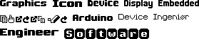

[tocstart]: # (toc start)

  * [Font Groups](#font-groups)
    * [Language Fonts](#language-fonts)
    * [Other](#other)

[tocend]: # (toc end)

# Font Groups

Each U8g2 font is part of a group. Groups are listed below together with a word cloud of the included fonts.
Click on the group name to see all details to the fonts.

## Language Fonts

[Adobe X11](fntgrpadobex11): Serif and sans serf fonts of different types and sizes.

[Angel](fntgrpangel)

[bitfontmaker2](fntgrpbitfontmaker2)

[ChristinaAntoinetteNeofotistou](fntgrpchristinaneofotistou)

[Codeman38](fntgrpcodeman38): 8x8 pixel fonts.

[Crox](fntgrpcrox): Cyrillic fonts.

[cu12](fntgrpcu12): ClearlyU Unicode Bitmap Font with support for many languages.

[dafont](fntgrpdafont): Serveral fonts from dafont.com.

[Efont](fntgrpefont): Japanese Font.

[Extant](fntgrpextant)

[Fontstruct](fntgrpfontstruct):  Bitmap fonts from fontstruct.com.

[Free Universal](fntgrpfreeuniversal): "Free Universal" font, different sizes.

[Geoff](fntgrpgeoff)

[GilesBooth](fntgrpgilesBooth)

[Inconsolata](fntgrpinconsolata): "Inconsolata" font, different sizes.

[JapanYoshi](fntgrpjapanyoshi)

[JayWright](fntgrpjaywright)

[JosephKnightcom](fntgrpjosephknightcom)

[Logisoso](fntgrplogisoso):  "Logisoso" font, different sizes.

[Lucida](fntgrplucida): "Lucida" font (X11 bitmap font).

[MistressEllipsis](fntgrpmistressellipsis)

[NBP](fntgrpnbp): Bitmap fonts from font author Nate547.

[Old School PC Fonts](fntgrpoldschoolpcfonts)

[Old Standard](fntgrpoldstandard): "Old Standard" font, different sizes.

[Open Game Art](fntgrpopengameart): 8x8 fonts from opengameart.org.

[Pentacom](fntgrppentacom)

[Persian](fntgrppersian): Serveral fonts for Persian languages

[Profont](fntgrpprofont): Monospace font

[Thai Fonts](fntgrptlwg)

[Tom-Thumb](fntgrptomthumb): Very small monospaced font.

[tulamide](fntgrptulamide)

[U8g](fntgrpu8g): Fonts for the u8g and u8g2 projects.

[Unifont](fntgrpunifont): GNU Unifont with support for many languages.

[UW-ttyp0](fntgrpttyp0) 

[WenQuanYi bitmap fonts](fntgrpwqy): Chinese font.

[X11](fntgrpx11): Monospace fonts from the X11 project.

## Other

[Siji Icon Font](fntgrpsiji) : Siji Icon Font

[Open Iconic](fntgrpiconic): Large number of icons with different sizes.

[Academia Sinica](fntgrpacademiasinica)

