[tocstart]: # (toc start)

  * [Reference](#reference)
  * [Copyright](#copyright)
  * [Font Details](#font-details)
    * [cu12](#cu12)

[tocend]: # (toc end)

# Reference

Name: **cu12**

Font download location is [here](http://sofia.nmsu.edu/~mleisher/Software/cu/).

# Copyright

Font Copyright Statement: (c) 2001 Computing Research Lab, New Mexico State University.

License (from bdf file):

Copyright 2002 Computing Research Labs, New Mexico State University

Permission is hereby granted, free of charge, to any person
obtaining a copy of this software and associated documentation
files (the "Software"), to deal in the Software without
restriction, including without limitation the rights to use,
copy, modify, merge, publish, distribute, sublicense, and/or
sell copies of the Software, and to permit persons to whom the
Software is furnished to do so, subject to the following
conditions:

The above copyright notice and this permission notice shall be
included in all copies or substantial portions of the Software.

THE SOFTWARE IS PROVIDED "AS IS", WITHOUT WARRANTY OF ANY KIND,
EXPRESS OR IMPLIED, INCLUDING BUT NOT LIMITED TO THE WARRANTIES
OF MERCHANTABILITY, FITNESS FOR A PARTICULAR PURPOSE AND
NONINFRINGEMENT.  IN NO EVENT SHALL THE COMPUTING RESEARCH LAB
OR NEW MEXICO STATE UNIVERSITY BE LIABLE FOR ANY CLAIM, DAMAGES
OR OTHER LIABILITY, WHETHER IN AN ACTION OF CONTRACT, TORT OR
OTHERWISE, ARISING FROM, OUT OF OR IN CONNECTION WITH THE
SOFTWARE OR THE USE OR OTHER DEALINGS IN THE SOFTWARE.

# Font Details

## cu12
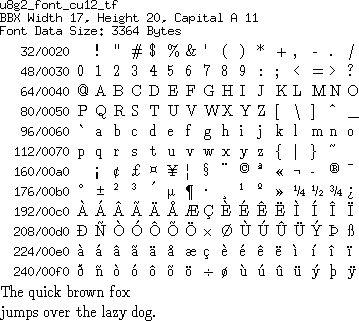

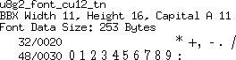
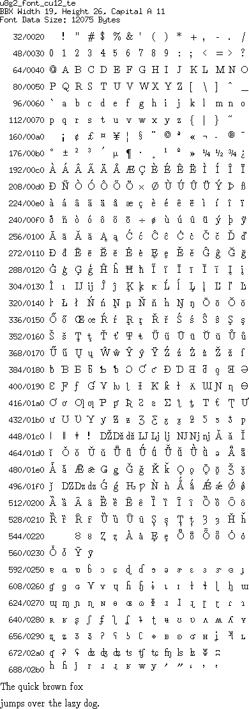

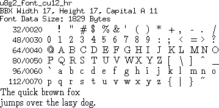
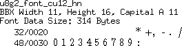

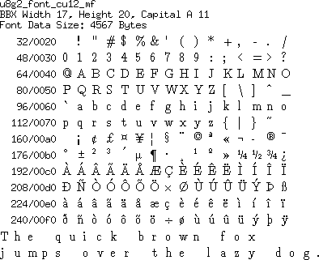
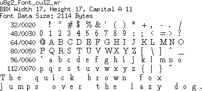

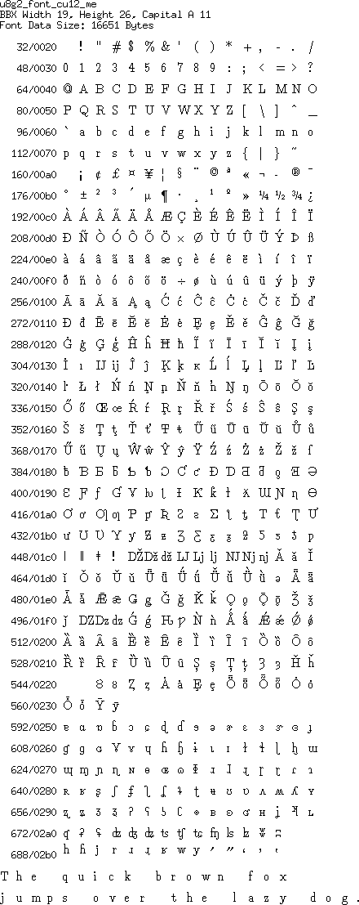

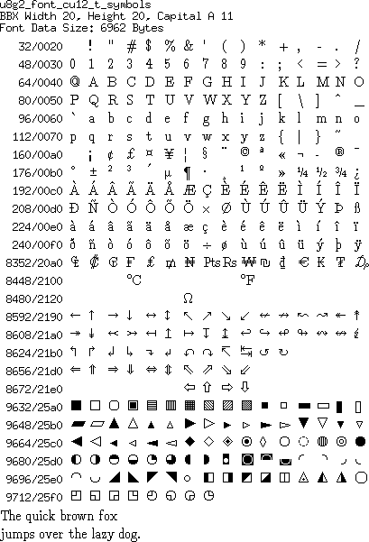

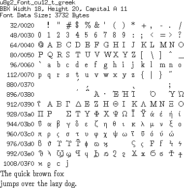

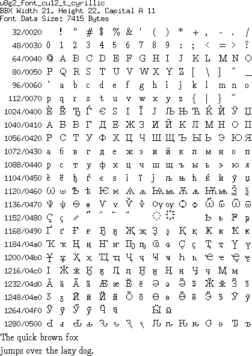

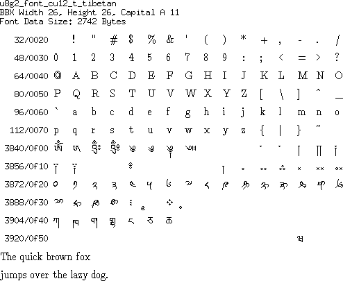

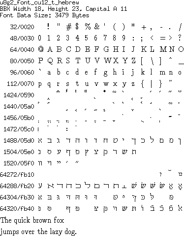

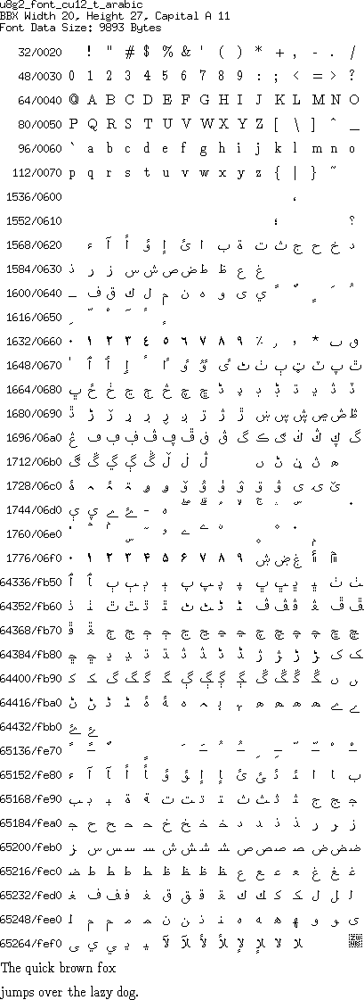
