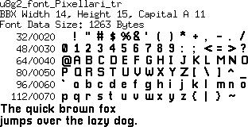

[tocstart]: # (toc start)

  * [Nokia Cellphone (nokiafc22)](#nokia-cellphone-nokiafc22)
    * [Reference](#reference)
    * [Copyright](#copyright)
    * [Author](#author)
  * [VCR OSD MONO](#vcr-osd-mono)
    * [Reference](#reference)
    * [Copyright](#copyright)
    * [Author](#author)
  * [pixellari](#pixellari)
    * [Reference](#reference)
    * [Copyright](#copyright)
    * [Author](#author)
  * [pixelpoiiz](#pixelpoiiz)
    * [Reference](#reference)
    * [Copyright](#copyright)
    * [Author](#author)
  * [DigitalDisco](#digitaldisco)
    * [Reference](#reference)
    * [Copyright](#copyright)
  * [pearfont](#pearfont)
    * [Reference](#reference)
    * [Copyright](#copyright)
    * [Author](#author)
  * [Font Details](#font-details)
    * [nokiafc22](#nokiafc22)
    * [VCR_OSD](#vcr_osd)
    * [Pixellari](#pixellari)
    * [pixelpoiiz](#pixelpoiiz)
    * [DigitalDiscoThin](#digitaldiscothin)
    * [DigitalDisco](#digitaldisco)
    * [pearfont](#pearfont)

[tocend]: # (toc end)

This page contains fonts from http://dafont.com .

# Nokia Cellphone (nokiafc22)

## Reference

Download: https://www.dafont.com/nokia-cellphone.font

## Copyright

This is a free font/file, distribute as you wish to who you wish. Do NOT sell
this font within a CD or any other media; it's not yours and you can't make
money of it. You'd rather ask me first via email, I may probably let you do it
as long as it's for a good cause.

I don't know if the original Nokia font has some copyright which prevents
people from making new fonts based on it. I hope not. Anyways, buy a Nokia,
and I think everything's gonna be alright.

Special thanks on this version go out to Carlos Bêla (www.goldenshower.gs) and
Diogo Kalil (www.sincolor.com.br) for helping me out with the Mac version of
the font. It has been extensively tested to ensure it's as smooth (hint,
kerning, spacing and aliasing-wise) as the pc one is.

## Author

This font was done by Zeh Fernando on Fontlab 4 (www.fontlab.com) on a PC.

# VCR OSD MONO

## Reference

Download: https://www.dafont.com/vcr-osd-mono.font

## Copyright

dafont.com: 100% free

## Author

Riciery Leal

# pixellari

## Reference

Download: https://www.dafont.com/pixellari.font

## Copyright

dafont.com: 100% free

TTF: "ZaccharyDempseyP"

## Author

Zacchary Dempsey-Plante

# pixelpoiiz

## Reference

Download: https://www.dafont.com/pixelpoiiz.font

## Copyright

dafont.com: 100% free

TTF: "(C) poiiz"

## Author

poiiz

# DigitalDisco

## Reference

Download: https://www.dafont.com/digital-disco.font

## Copyright

Copyright:  "Public domain / GPL / OFL - 2" according to dafont.com.

Note of the author
Digital Disco by jeti: A groovy, round typeface with chunky '70s charm and an optional thin style.
You are free to use this font for personal or commercial projects, all I ask is that you include credit.
Licensed under CC BY 4.0: https://creativecommons.org/licenses/by/4.0/
More info: https://fontenddev.com/fonts/digital-disco/

# pearfont

## Reference

Download: https://www.dafont.com/pearfont.font

## Copyright

Copyright:  "Public domain / GPL / OFL" according to dafont.com.

Note of the author:
A really really tiny font! Originally made for my game Pear Quest. Use at your own risk. Enjoy!

## Author

rubna

# Font Details

## nokiafc22

## VCR_OSD

## Pixellari

## pixelpoiiz

## DigitalDiscoThin

## DigitalDisco

## pearfont

