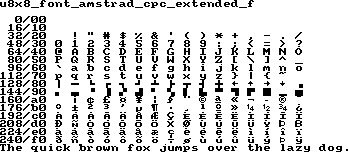
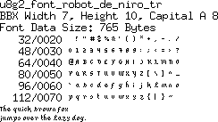

[tocstart]: # (toc start)

  * [Amstrad CPC extended](#amstrad-cpc-extended)
    * [Reference](#reference)
    * [Copyright](#copyright)
  * [Baby](#baby)
    * [Reference](#reference)
    * [Copyright](#copyright)
  * [Blipfest 07](#blipfest-07)
    * [Reference](#reference)
    * [Copyright](#copyright)
  * [Chikita](#chikita)
    * [Reference](#reference)
    * [Copyright](#copyright)
  * [Lucasfont Alternate](#lucasfont-alternate)
    * [Reference](#reference)
    * [Copyright](#copyright)
  * [P01type](#p01type)
    * [Reference](#reference)
    * [Copyright](#copyright)
  * [Pixelle (Micro)](#pixelle-micro)
    * [Reference](#reference)
    * [Copyright](#copyright)
  * [Robot de Niro](#robot-de-niro)
    * [Reference](#reference)
    * [Copyright](#copyright)
  * [Trixel Square](#trixel-square)
    * [Reference](#reference)
    * [Copyright](#copyright)
  * [HaxrCorp 4089](#haxrcorp-4089)
    * [Reference](#reference)
    * [Copyright](#copyright)
  * [Bubble](#bubble)
    * [Reference](#reference)
    * [Copyright](#copyright)
  * [Cardimon pixel](#cardimon-pixel)
    * [Reference](#reference)
    * [Copyright](#copyright)
  * [Maniac](#maniac)
    * [Reference](#reference)
    * [Copyright](#copyright)
  * [LucasArts SCUMM - Subtitle - Roman Outline](#lucasarts-scumm--subtitle--roman-outline)
    * [Reference](#reference)
    * [Copyright](#copyright)
  * [LucasArts SCUMM - Subtitle - Roman](#lucasarts-scumm--subtitle--roman)
    * [Reference](#reference)
    * [Copyright](#copyright)
  * [Font Details](#font-details)
    * [amstrad_cpc_extended](#amstrad_cpc_extended)
    * [baby](#baby)
    * [blipfest_07](#blipfest_07)
    * [chikita](#chikita)
    * [lucasfont_alternate](#lucasfont_alternate)
    * [p01type](#p01type)
    * [pixelle_micro](#pixelle_micro)
    * [robot_de_niro](#robot_de_niro)
    * [trixel_square](#trixel_square)
    * [haxrcorp4089](#haxrcorp4089)
    * [bubble](#bubble)
    * [cardimon_pixel](#cardimon_pixel)
    * [maniac](#maniac)
    * [lucasarts_scumm_subtitle_o](#lucasarts_scumm_subtitle_o)
    * [lucasarts_scumm_subtitle_r](#lucasarts_scumm_subtitle_r)
    * [lucasarts_scumm_subtitle_o_2x2](#lucasarts_scumm_subtitle_o_2x2)
    * [lucasarts_scumm_subtitle_r_2x2](#lucasarts_scumm_subtitle_r_2x2)

[tocend]: # (toc end)

This page contains fonts from http://fontstruct.com.

# Amstrad CPC extended

Additionally encodings 128 to 159 had been added to this font by this project.

## Reference

Link: http://fontstruct.com/fontstructions/show/25590

## Copyright

The FontStruction "Amstrad CPC extended"
(http://fontstruct.com/fontstructions/show/25590) by "ruboku" is licensed
under a Creative Commons Attribution license
(http://creativecommons.org/licenses/by/3.0/).

# Baby

## Reference

Link: http://fontstruct.com/fontstructions/show/baby_4

## Copyright

The `FontStruction` "Baby"
(http://fontstruct.com/fontstructions/show/35496) by "mrsbarrett" is
licensed under a Creative Commons Attribution Share Alike license
(http://creativecommons.org/licenses/by-sa/3.0/).

# Blipfest 07

## Reference

Link: http://fontstruct.com/fontstructions/show/blipfest_07

## Copyright

The `FontStruction` "Blipfest 07"
(http://fontstruct.com/fontstructions/show/45675) by "cwillmor" is licensed
under a Creative Commons Attribution Share Alike license
(http://creativecommons.org/licenses/by-sa/3.0/).

# Chikita

## Reference

Link: http://fontstruct.com/fontstructions/show/chikita

## Copyright

The `FontStruction` "Chikita"
(http://fontstruct.com/Ffontstructions/show/52325) by "southernmedia" is
licensed under a Creative Commons Attribution Share Alike license
(http://creativecommons.org/licenses/by-sa/3.0/).
"Chikita" was originally cloned (copied) from the `FontStruction`
"pixelspace 5x5" (http://fontstruct.com/FontStructions/show/42130) by David
Chiu, which is licensed under a Creative Commons Attribution Share Alike license
(http://creativecommons.org/licenses/by-sa/3.0/).

# Lucasfont Alternate

## Reference

Link: http://fontstruct.com/fontstructions/show/lucasfont_alternate

## Copyright

The `FontStruction` "Lucasfont Alternate"
(http://fontstruct.com/fontstructions/show/653734) by Patrick Lauke is licensed
under a Creative Commons Attribution license
(http://creativecommons.org/licenses/by/3.0/).
"Lucasfont Alternate" was originally cloned (copied) from the `FontStruction`
"Lucasfont" (http://fontstruct.com/FontStructions/show/653577) by Patrick
Lauke, which is licensed under a Creative Commons Attribution license
(http://creativecommons.org/licenses/by/3.0/).

# P01type

## Reference

Link: http://fontstruct.com/fontstructions/show/p01type

## Copyright

The `FontStruction` "P01type"
(http://fontstruct.com/fontstructions/show/668719) by Patrick Lauke is licensed
under a Creative Commons Attribution license
(http://creativecommons.org/licenses/by/3.0/).

# Pixelle (Micro)

## Reference

Link: http://fontstruct.com/fontstructions/show/pixelle_micro

## Copyright

The `FontStruction` "Pixelle (Micro)"
(http://fontstruct.com/fontstructions/show/91737) by "rdonaghy" is licensed
under a Creative Commons Attribution Share Alike license
(http://creativecommons.org/licenses/by-sa/3.0/).

# Robot de Niro

## Reference

Link: http://fontstruct.com/fontstructions/show/robot_de_niro_2

## Copyright

The `FontStruction` "Robot de Niro"
(http://fontstruct.com/fontstructions/show/52809) by "BMoser" is licensed
under a Creative Commons Attribution Share Alike license
(http://creativecommons.org/licenses/by-sa/3.0/).

# Trixel Square

## Reference

Link: http://fontstruct.com/fontstructions/show/trixel_square_1

## Copyright

The `FontStruction` "Trixel Square"
(http://fontstruct.com/fontstructions/show/54103) by "julischka" is licensed
under a Creative Commons Attribution Share Alike license
(http://creativecommons.org/licenses/by-sa/3.0/).

# HaxrCorp 4089

## Reference

Link: https://fontstruct.com/fontstructions/show/192981/haxrcorp_4089

## Copyright

The FontStruction “HaxrCorp 4089” 
(https://fontstruct.com/fontstructions/show/192981) by “sahwar” is licensed 
under a Creative Commons Attribution Share Alike 
license (http://creativecommons.org/licenses/by-sa/3.0/).

# Bubble

## Reference

Link: https://fontstruct.com/fontstructions/show/1533797/bubble-100

## Copyright

The FontStruction “Bubble”
(https://fontstruct.com/fontstructions/show/1533797) by “Omegaville” is
licensed under a Creative Commons Attribution Share Alike license
(http://creativecommons.org/licenses/by-sa/3.0/).

# Cardimon pixel

## Reference

Link: https://fontstruct.com/fontstructions/show/1266554/cardimon-pixel

## Copyright

The FontStruction “Cardimon pixel”
(https://fontstruct.com/fontstructions/show/1266554) by “helenadejuan” is
licensed under a Creative Commons Attribution Share Alike license
(http://creativecommons.org/licenses/by-sa/3.0/).

# Maniac

## Reference

Link: https://fontstruct.com/fontstructions/show/604350/maniac_2

## Copyright

The FontStruction “Maniac”
(https://fontstruct.com/fontstructions/show/604350) by “D-Sheep” is licensed
under a Creative Commons Attribution Share Alike license
(http://creativecommons.org/licenses/by-sa/3.0/).

# LucasArts SCUMM - Subtitle - Roman Outline

## Reference

Link: https://fontstruct.com/fontstructions/show/786126/lucasarts-scumm-subtitle-roman-outline

## Copyright

The FontStruction “LucasArts SCUMM - Subtitle - Roman Outline”
(https://fontstruct.com/fontstructions/show/786126) by “Goatmeal” is
licensed under a Creative Commons Attribution Non-commercial Share Alike license
(http://creativecommons.org/licenses/by-nc-sa/3.0/).
“LucasArts SCUMM - Subtitle - Roman Outline” was originally cloned (copied)
from the FontStruction “LucasArts SCUMM - Subtitle - Roman”
(https://fontstruct.com/fontstructions/show/778619) by “Goatmeal”, which is
licensed under a Creative Commons Attribution Non-commercial Share Alike license
(http://creativecommons.org/licenses/by-nc-sa/3.0/).

# LucasArts SCUMM - Subtitle - Roman

## Reference

Link: https://fontstruct.com/fontstructions/show/778619/lucasarts-scumm-subtitle-roman

## Copyright

The FontStruction “LucasArts SCUMM - Subtitle - Roman”
(https://fontstruct.com/fontstructions/show/778619) by “Goatmeal” is
licensed under a Creative Commons Attribution Non-commercial Share Alike license
(http://creativecommons.org/licenses/by-nc-sa/3.0/).

# Font Details

## amstrad_cpc_extended

## baby

## blipfest_07

## chikita

## lucasfont_alternate

## p01type

## pixelle_micro

## robot_de_niro

## trixel_square

## haxrcorp4089

## bubble

## cardimon_pixel

## maniac

## lucasarts_scumm_subtitle_o

## lucasarts_scumm_subtitle_r

## lucasarts_scumm_subtitle_o_2x2

## lucasarts_scumm_subtitle_r_2x2

