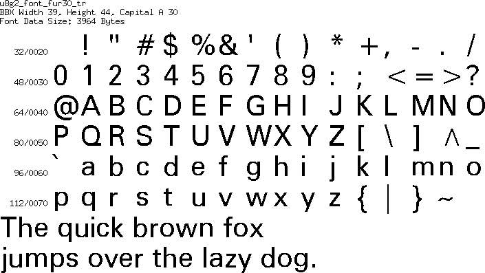

[tocstart]: # (toc start)

  * [Reference](#reference)
  * [Copyright](#copyright)
  * [Manual Updates](#manual-updates)
  * [Font Details](#font-details)
    * [fub11](#fub11)
    * [fub14](#fub14)
    * [fub17](#fub17)
    * [fub20](#fub20)
    * [fub25](#fub25)
    * [fub30](#fub30)
    * [fub35](#fub35)
    * [fub42](#fub42)
    * [fub49](#fub49)
    * [fub11](#fub11)
    * [fub14](#fub14)
    * [fub17](#fub17)
    * [fub20](#fub20)
    * [fub25](#fub25)
    * [fub30](#fub30)
    * [fub35](#fub35)
    * [fub42](#fub42)
    * [fub49](#fub49)
    * [fur11](#fur11)
    * [fur14](#fur14)
    * [fur17](#fur17)
    * [fur20](#fur20)
    * [fur25](#fur25)
    * [fur30](#fur30)
    * [fur35](#fur35)
    * [fur42](#fur42)
    * [fur49](#fur49)
    * [fur11](#fur11)
    * [fur14](#fur14)
    * [fur17](#fur17)
    * [fur20](#fur20)
    * [fur25](#fur25)
    * [fur30](#fur30)
    * [fur35](#fur35)
    * [fur42](#fur42)
    * [fur49](#fur49)

[tocend]: # (toc end)

# Reference

** FreeUniversal **

Download location at openfontlibrary.org: http://openfontlibrary.org/font/freeuniversal

# Copyright

License: [OFL (SIL Open Font License)](http://scripts.sil.org/OFL)

Font Copyright Statement: FreeUniveral (c) Stephen Wilson 2009    Original Font Sil-Sophia  Copyright (c) SIL International, 1994-2008.

# Manual Updates

`u8g_font_fub25n`: Numbers fixed by DooMMasteR (Arduino Forum)

# Font Details

## fub11

## fub14

## fub17

## fub20

## fub25

## fub30

## fub35

## fub42

## fub49

## fub11

## fub14

## fub17

## fub20

## fub25

## fub30

## fub35

## fub42

## fub49

## fur11

## fur14

## fur17

## fur20

## fur25

## fur30

## fur35

## fur42

## fur49

## fur11

## fur14

## fur17

## fur20

## fur25

## fur30

## fur35

## fur42

## fur49

