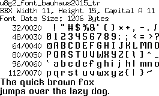
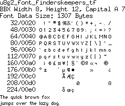
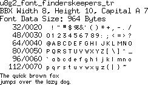
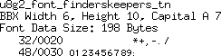
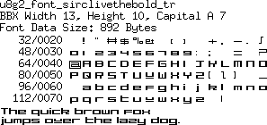
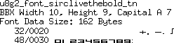
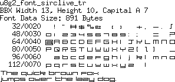
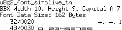

[tocstart]: # (toc start)

  * [Reference](#reference)
  * [Copyright](#copyright)
  * [Font Pictures](#font-pictures)
    * [bauhaus2015](#bauhaus2015)
    * [finderskeepers](#finderskeepers)
    * [sirclivethebold](#sirclivethebold)
    * [sirclive](#sirclive)

[tocend]: # (toc end)

# Reference

This page contains fonts from http://www.pentacom.jp/pentacom/bitfontmaker2/gallery

All fonts on this page are created by "GilesBooth".

Fonts will be available with U8g2 v2.25.

# Copyright

Bauhaus2015 by GilesBooth	
http://www.pentacom.jp/pentacom/bitfontmaker2/gallery/?id=2048
license : (Creative Commons Attribution)

FindersKeepers by GilesBooth	
http://www.pentacom.jp/pentacom/bitfontmaker2/gallery/?id=3809
license : (Creative Commons Attribution)

SirClive by GilesBooth	
http://www.pentacom.jp/pentacom/bitfontmaker2/gallery/?id=2051
license : (Public Domain)

SirClivetheBold by GilesBooth	
http://www.pentacom.jp/pentacom/bitfontmaker2/gallery/?id=2058
license : (Public Domain)

# Font Pictures

## bauhaus2015

## finderskeepers

## sirclivethebold

## sirclive

