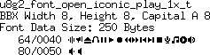
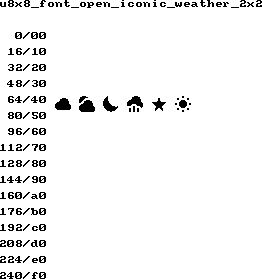

[tocstart]: # (toc start)

  * [Reference](#reference)
  * [Build Process](#build-process)
  * [Available Icon Collections](#available-icon-collections)
  * [Copyright](#copyright)
  * [Font Details](#font-details)
    * [open_iconic_all_1x](#open_iconic_all_1x)
    * [open_iconic_app_1x](#open_iconic_app_1x)
    * [open_iconic_arrow_1x](#open_iconic_arrow_1x)
    * [open_iconic_check_1x](#open_iconic_check_1x)
    * [open_iconic_email_1x](#open_iconic_email_1x)
    * [open_iconic_embedded_1x](#open_iconic_embedded_1x)
    * [open_iconic_gui_1x](#open_iconic_gui_1x)
    * [open_iconic_human_1x](#open_iconic_human_1x)
    * [open_iconic_mime_1x](#open_iconic_mime_1x)
    * [open_iconic_other_1x](#open_iconic_other_1x)
    * [open_iconic_play_1x](#open_iconic_play_1x)
    * [open_iconic_text_1x](#open_iconic_text_1x)
    * [open_iconic_thing_1x](#open_iconic_thing_1x)
    * [open_iconic_weather_1x](#open_iconic_weather_1x)
    * [open_iconic_www_1x](#open_iconic_www_1x)
    * [open_iconic_arrow_1x1](#open_iconic_arrow_1x1)
    * [open_iconic_check_1x1](#open_iconic_check_1x1)
    * [open_iconic_embedded_1x1](#open_iconic_embedded_1x1)
    * [open_iconic_play_1x1](#open_iconic_play_1x1)
    * [open_iconic_thing_1x1](#open_iconic_thing_1x1)
    * [open_iconic_weather_1x1](#open_iconic_weather_1x1)
    * [open_iconic_all_2x](#open_iconic_all_2x)
    * [open_iconic_app_2x](#open_iconic_app_2x)
    * [open_iconic_arrow_2x](#open_iconic_arrow_2x)
    * [open_iconic_check_2x](#open_iconic_check_2x)
    * [open_iconic_email_2x](#open_iconic_email_2x)
    * [open_iconic_embedded_2x](#open_iconic_embedded_2x)
    * [open_iconic_gui_2x](#open_iconic_gui_2x)
    * [open_iconic_human_2x](#open_iconic_human_2x)
    * [open_iconic_mime_2x](#open_iconic_mime_2x)
    * [open_iconic_other_2x](#open_iconic_other_2x)
    * [open_iconic_play_2x](#open_iconic_play_2x)
    * [open_iconic_text_2x](#open_iconic_text_2x)
    * [open_iconic_thing_2x](#open_iconic_thing_2x)
    * [open_iconic_weather_2x](#open_iconic_weather_2x)
    * [open_iconic_www_2x](#open_iconic_www_2x)
    * [open_iconic_arrow_2x2](#open_iconic_arrow_2x2)
    * [open_iconic_check_2x2](#open_iconic_check_2x2)
    * [open_iconic_embedded_2x2](#open_iconic_embedded_2x2)
    * [open_iconic_play_2x2](#open_iconic_play_2x2)
    * [open_iconic_thing_2x2](#open_iconic_thing_2x2)
    * [open_iconic_weather_2x2](#open_iconic_weather_2x2)
    * [open_iconic_all_4x](#open_iconic_all_4x)
    * [open_iconic_app_4x](#open_iconic_app_4x)
    * [open_iconic_arrow_4x](#open_iconic_arrow_4x)
    * [open_iconic_check_4x](#open_iconic_check_4x)
    * [open_iconic_email_4x](#open_iconic_email_4x)
    * [open_iconic_embedded_4x](#open_iconic_embedded_4x)
    * [open_iconic_gui_4x](#open_iconic_gui_4x)
    * [open_iconic_human_4x](#open_iconic_human_4x)
    * [open_iconic_mime_4x](#open_iconic_mime_4x)
    * [open_iconic_other_4x](#open_iconic_other_4x)
    * [open_iconic_play_4x](#open_iconic_play_4x)
    * [open_iconic_text_4x](#open_iconic_text_4x)
    * [open_iconic_thing_4x](#open_iconic_thing_4x)
    * [open_iconic_weather_4x](#open_iconic_weather_4x)
    * [open_iconic_www_4x](#open_iconic_www_4x)
    * [open_iconic_arrow_4x4](#open_iconic_arrow_4x4)
    * [open_iconic_check_4x4](#open_iconic_check_4x4)
    * [open_iconic_embedded_4x4](#open_iconic_embedded_4x4)
    * [open_iconic_play_4x4](#open_iconic_play_4x4)
    * [open_iconic_thing_4x4](#open_iconic_thing_4x4)
    * [open_iconic_weather_4x4](#open_iconic_weather_4x4)
    * [open_iconic_all_6x](#open_iconic_all_6x)
    * [open_iconic_app_6x](#open_iconic_app_6x)
    * [open_iconic_arrow_6x](#open_iconic_arrow_6x)
    * [open_iconic_check_6x](#open_iconic_check_6x)
    * [open_iconic_email_6x](#open_iconic_email_6x)
    * [open_iconic_embedded_6x](#open_iconic_embedded_6x)
    * [open_iconic_gui_6x](#open_iconic_gui_6x)
    * [open_iconic_human_6x](#open_iconic_human_6x)
    * [open_iconic_mime_6x](#open_iconic_mime_6x)
    * [open_iconic_other_6x](#open_iconic_other_6x)
    * [open_iconic_play_6x](#open_iconic_play_6x)
    * [open_iconic_text_6x](#open_iconic_text_6x)
    * [open_iconic_thing_6x](#open_iconic_thing_6x)
    * [open_iconic_weather_6x](#open_iconic_weather_6x)
    * [open_iconic_www_6x](#open_iconic_www_6x)
    * [open_iconic_all_8x](#open_iconic_all_8x)
    * [open_iconic_app_8x](#open_iconic_app_8x)
    * [open_iconic_arrow_8x](#open_iconic_arrow_8x)
    * [open_iconic_check_8x](#open_iconic_check_8x)
    * [open_iconic_email_8x](#open_iconic_email_8x)
    * [open_iconic_embedded_8x](#open_iconic_embedded_8x)
    * [open_iconic_gui_8x](#open_iconic_gui_8x)
    * [open_iconic_human_8x](#open_iconic_human_8x)
    * [open_iconic_mime_8x](#open_iconic_mime_8x)
    * [open_iconic_other_8x](#open_iconic_other_8x)
    * [open_iconic_play_8x](#open_iconic_play_8x)
    * [open_iconic_text_8x](#open_iconic_text_8x)
    * [open_iconic_thing_8x](#open_iconic_thing_8x)
    * [open_iconic_weather_8x](#open_iconic_weather_8x)
    * [open_iconic_www_8x](#open_iconic_www_8x)
    * [open_iconic_arrow_8x8](#open_iconic_arrow_8x8)
    * [open_iconic_check_8x8](#open_iconic_check_8x8)
    * [open_iconic_embedded_8x8](#open_iconic_embedded_8x8)
    * [open_iconic_play_8x8](#open_iconic_play_8x8)
    * [open_iconic_thing_8x8](#open_iconic_thing_8x8)
    * [open_iconic_weather_8x8](#open_iconic_weather_8x8)

[tocend]: # (toc end)

# Reference

Open Iconic fonts are generated from png files available from [https://github.com/iconic/open-iconic/tree/master/png](https://github.com/iconic/open-iconic/tree/master/png).

# Build Process

1. A toplevel script [https://github.com/olikraus/u8g2/blob/master/tools/font/png2bdf/test/do_iconic.sh](https://github.com/olikraus/u8g2/blob/master/tools/font/png2bdf/test/do_iconic.sh) handles the creation of .bdf file
2. The script calls png2bdf [https://github.com/olikraus/u8g2/tree/master/tools/font/png2bdf](https://github.com/olikraus/u8g2/tree/master/tools/font/png2bdf), which reads the 
png pictures and creates the .bdf files.
3. The .bdf files are now part of the u8g2 font build process
4. During the normal build process, the bdfconv tool creates the u8g2 fonts from the .bdf files.

# Available Icon Collections

The Open Iconic font collection will be available with U8g2 2.22.

The icon collection is split into smaller parts and one font with all icons.
Depending on the flash memory size of the target system, one or multiple sets can be selected. If flash memory is not a problem, then also the font with the complete list can be used.

 - check: Yes/no/tick marks
 - gui: Icons related to window mangers and other gui elements
 - other: Any other icons not fitting anywhere else
 - thing: Icon which show things
 - app: Applications
 - email: E-Mail related icons
 - human: People or other human related icons
 - play: Icons for meida and audio players
 - weather: Weather icons
 - arrow: All kind of arrows
 - embedded: Icons which might be suitable for a microcontroller project
 - mime: File data types
 - text: Text editing icons
 - www: Internet related icons
 - all: All icons

The .bdf file of the "all icon" set can be used to create a custom font with your own selection of icons.

All icon sets are avilable in sizes 1x (8x8 pixel), 2x (16x16 pixel), 4x (32x32 pixel), 6x (48x48 pixel) and 8x (64x64 pixel).

Open iconic fonts are transparent fonts. You can not use a background color and you must use transparent mode for drawing. The base line (reference point) for the icons is the lower left corner of the icons.

# Copyright

Open Iconic Icons are available under the SIL OPEN FONT LICENSE ([https://github.com/iconic/open-iconic](https://github.com/iconic/open-iconic)).

# Font Details

## open_iconic_all_1x

## open_iconic_app_1x

## open_iconic_arrow_1x

## open_iconic_check_1x

## open_iconic_email_1x

## open_iconic_embedded_1x

## open_iconic_gui_1x

## open_iconic_human_1x

## open_iconic_mime_1x

## open_iconic_other_1x

## open_iconic_play_1x

## open_iconic_text_1x

## open_iconic_thing_1x

## open_iconic_weather_1x

## open_iconic_www_1x

## open_iconic_arrow_1x1

## open_iconic_check_1x1

## open_iconic_embedded_1x1

## open_iconic_play_1x1

## open_iconic_thing_1x1

## open_iconic_weather_1x1

## open_iconic_all_2x

## open_iconic_app_2x

## open_iconic_arrow_2x

## open_iconic_check_2x

## open_iconic_email_2x

## open_iconic_embedded_2x

## open_iconic_gui_2x

## open_iconic_human_2x

## open_iconic_mime_2x

## open_iconic_other_2x

## open_iconic_play_2x

## open_iconic_text_2x

## open_iconic_thing_2x

## open_iconic_weather_2x

## open_iconic_www_2x

## open_iconic_arrow_2x2

## open_iconic_check_2x2

## open_iconic_embedded_2x2

## open_iconic_play_2x2

## open_iconic_thing_2x2

## open_iconic_weather_2x2

## open_iconic_all_4x

## open_iconic_app_4x

## open_iconic_arrow_4x

## open_iconic_check_4x

## open_iconic_email_4x

## open_iconic_embedded_4x

## open_iconic_gui_4x

## open_iconic_human_4x

## open_iconic_mime_4x

## open_iconic_other_4x

## open_iconic_play_4x

## open_iconic_text_4x

## open_iconic_thing_4x

## open_iconic_weather_4x

## open_iconic_www_4x

## open_iconic_arrow_4x4

## open_iconic_check_4x4

## open_iconic_embedded_4x4

## open_iconic_play_4x4

## open_iconic_thing_4x4

## open_iconic_weather_4x4

## open_iconic_all_6x

## open_iconic_app_6x

## open_iconic_arrow_6x

## open_iconic_check_6x

## open_iconic_email_6x

## open_iconic_embedded_6x

## open_iconic_gui_6x

## open_iconic_human_6x

## open_iconic_mime_6x

## open_iconic_other_6x

## open_iconic_play_6x

## open_iconic_text_6x

## open_iconic_thing_6x

## open_iconic_weather_6x

## open_iconic_www_6x

## open_iconic_all_8x

## open_iconic_app_8x

## open_iconic_arrow_8x

## open_iconic_check_8x

## open_iconic_email_8x

## open_iconic_embedded_8x

## open_iconic_gui_8x

## open_iconic_human_8x

## open_iconic_mime_8x

## open_iconic_other_8x

## open_iconic_play_8x

## open_iconic_text_8x

## open_iconic_thing_8x

## open_iconic_weather_8x

## open_iconic_www_8x

## open_iconic_arrow_8x8

## open_iconic_check_8x8

## open_iconic_embedded_8x8

## open_iconic_play_8x8

## open_iconic_thing_8x8

## open_iconic_weather_8x8

