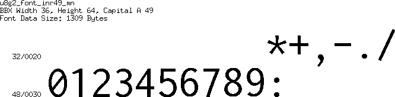
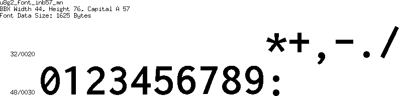
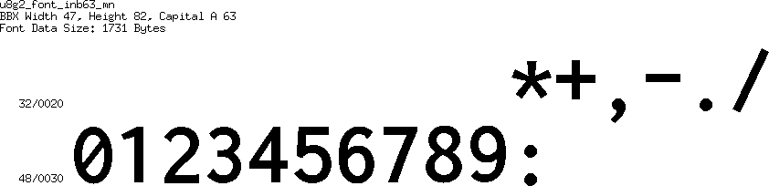

[tocstart]: # (toc start)

  * [Inconsolata LGC](#inconsolata-lgc)
    * [Reference](#reference)
    * [Copyright](#copyright)
  * [Font Details](#font-details)
    * [inr16](#inr16)
    * [inr19](#inr19)
    * [inr21](#inr21)
    * [inr24](#inr24)
    * [inr27](#inr27)
    * [inr30](#inr30)
    * [inr33](#inr33)
    * [inr38](#inr38)
    * [inr42](#inr42)
    * [inr46](#inr46)
    * [inr49](#inr49)
    * [inr53](#inr53)
    * [inr57](#inr57)
    * [inr62](#inr62)
    * [inr21_2x4](#inr21_2x4)
    * [inr33_3x6](#inr33_3x6)
    * [inr46_4x8](#inr46_4x8)
    * [inb16](#inb16)
    * [inb19](#inb19)
    * [inb21](#inb21)
    * [inb24](#inb24)
    * [inb27](#inb27)
    * [inb30](#inb30)
    * [inb33](#inb33)
    * [inb38](#inb38)
    * [inb42](#inb42)
    * [inb46](#inb46)
    * [inb49](#inb49)
    * [inb53](#inb53)
    * [inb57](#inb57)
    * [inb63](#inb63)
    * [inb21_2x4](#inb21_2x4)
    * [inb33_3x6](#inb33_3x6)
    * [inb46_4x8](#inb46_4x8)

[tocend]: # (toc end)

# Inconsolata LGC

## Reference

Download location at openfontlibrary.org: http://openfontlibrary.org/en/font/inconsolata-lgc

## Copyright

License (according to openfontlibrary.org): [OFL (SIL Open Font License)](http://scripts.sil.org/OFL)

Font Copyright Statement:

Original Roman version created by Raph Levien using his own tools and FontForge. Copyright 2006 Raph Levien. Hellenisation of the Roman font, by Dimosthenis Kaponis, using FontForge. Hellenic glyphs Copyright 2010-2012 Dimosthenis Kaponis. Released under the SIL Open Font License, http://scripts.sil.org/OFL.    Cyrillic glyphs added by MihailJP, using FontForge. Cyrillic glyphs Copyright 2012 MihailJP. Released under the SIL Open Font License, http://scripts.sil.org/OFL.    Some glyphs modified by Greg Omelaenko, using FontForge.

README from the zip archive:

Inconsolata is one of the most suitable font for programmers created by Raph
Levien. Since the original Inconsolata does not contain Cyrillic alphabet,
it was slightly inconvenient for not a few programmers from Russia.

Inconsolata LGC is a modified version of Inconsolata with added the Cyrillic
alphabet which directly descends from Inconsolata Hellenic supporting modern
Greek.

Inconsolata LGC is licensed under SIL OFL.

# Font Details

## inr16

## inr19

## inr21

## inr24

## inr27

## inr30

## inr33

## inr38

## inr42

## inr46

## inr49

## inr53

## inr57

## inr62

## inr21_2x4

## inr33_3x6

## inr46_4x8

## inb16

## inb19

## inb21

## inb24

## inb27

## inb30

## inb33

## inb38

## inb42

## inb46

## inb49

## inb53

## inb57

## inb63

## inb21_2x4

## inb33_3x6

## inb46_4x8

