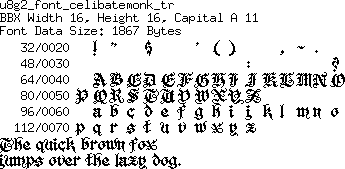
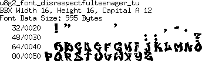
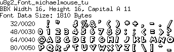
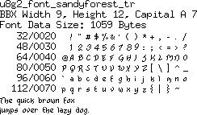
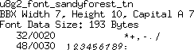
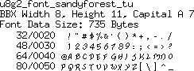

[tocstart]: # (toc start)

  * [Reference](#reference)
  * [Copyright](#copyright)
  * [Font Pictures](#font-pictures)
    * [celibatemonk](#celibatemonk)
    * [disrespectfulteenager](#disrespectfulteenager)
    * [michaelmouse](#michaelmouse)
    * [sandyforest](#sandyforest)

[tocend]: # (toc end)

# Reference

This page contains fonts from http://www.pentacom.jp/pentacom/bitfontmaker2/gallery

All fonts on this page are created by "JayWright".

Fonts will be available with U8g2 v2.25.

# Copyright

CelibateMonk by JayWright	
license : (Public Domain)
http://www.pentacom.jp/pentacom/bitfontmaker2/gallery/?id=911

DisrespectfulTeenager by JayWright	
license : (Public Domain)
http://www.pentacom.jp/pentacom/bitfontmaker2/gallery/?id=918

MichaelMouse by JayWright	
license : (Public Domain)
http://www.pentacom.jp/pentacom/bitfontmaker2/gallery/?id=913

SandyForest by JayWright		
license : (Public Domain)
http://www.pentacom.jp/pentacom/bitfontmaker2/gallery/?id=899

# Font Pictures

## celibatemonk

## disrespectfulteenager

## michaelmouse

## sandyforest

