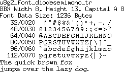
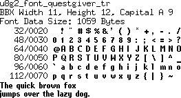
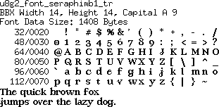

[tocstart]: # (toc start)

  * [Reference](#reference)
  * [Copyright](#copyright)
  * [Font Pictures](#font-pictures)
    * [diodesemimono](#diodesemimono)
    * [questgiver](#questgiver)
    * [seraphimb1](#seraphimb1)

[tocend]: # (toc end)

# Reference

This page contains fonts from http://www.pentacom.jp/pentacom/bitfontmaker2/gallery

All fonts on this page are created by "JosephKnightcom".

Fonts will be available with U8g2 v2.25.

# Copyright

Seraphimb1 by JosephKnightcom	
license : (Public Domain)
http://www.pentacom.jp/pentacom/bitfontmaker2/gallery/?id=946

Questgiver by JosephKnightcom	
license : (Public Domain)
http://www.pentacom.jp/pentacom/bitfontmaker2/gallery/?id=947

DiodeSemiMono by JosephKnightcom	
license : (Public Domain)
http://www.pentacom.jp/pentacom/bitfontmaker2/gallery/?id=1133

# Font Pictures

## diodesemimono

## questgiver

## seraphimb1

