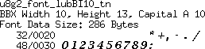
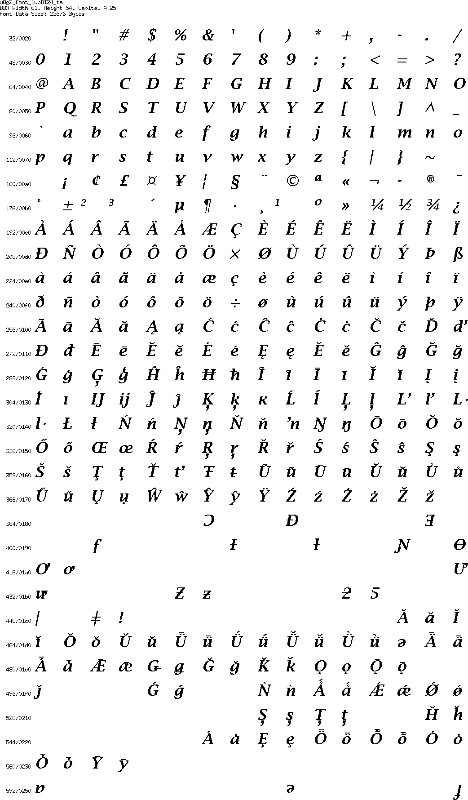
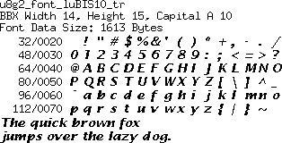
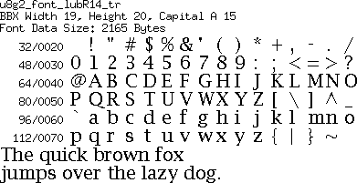
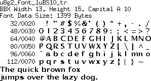
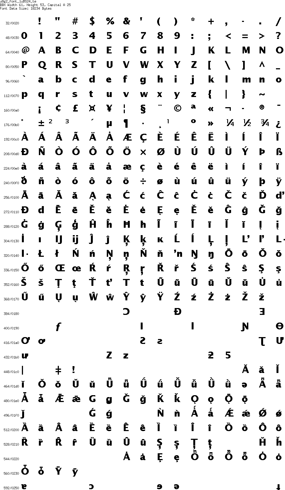
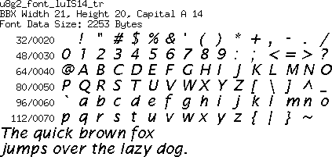

[tocstart]: # (toc start)

  * [Reference](#reference)
  * [Copyright](#copyright)
  * [Font Details](#font-details)
    * [lubB08](#lubb08)
    * [lubB10](#lubb10)
    * [lubB12](#lubb12)
    * [lubB14](#lubb14)
    * [lubB18](#lubb18)
    * [lubB19](#lubb19)
    * [lubB24](#lubb24)
    * [lubBI08](#lubbi08)
    * [lubBI10](#lubbi10)
    * [lubBI12](#lubbi12)
    * [lubBI14](#lubbi14)
    * [lubBI18](#lubbi18)
    * [lubBI19](#lubbi19)
    * [lubBI24](#lubbi24)
    * [lubI08](#lubi08)
    * [lubI10](#lubi10)
    * [lubI12](#lubi12)
    * [lubI14](#lubi14)
    * [lubI18](#lubi18)
    * [lubI19](#lubi19)
    * [lubI24](#lubi24)
    * [luBIS08](#lubis08)
    * [luBIS10](#lubis10)
    * [luBIS12](#lubis12)
    * [luBIS14](#lubis14)
    * [luBIS18](#lubis18)
    * [luBIS19](#lubis19)
    * [luBIS24](#lubis24)
    * [lubR08](#lubr08)
    * [lubR10](#lubr10)
    * [lubR12](#lubr12)
    * [lubR14](#lubr14)
    * [lubR18](#lubr18)
    * [lubR19](#lubr19)
    * [lubR24](#lubr24)
    * [luBS08](#lubs08)
    * [luBS10](#lubs10)
    * [luBS12](#lubs12)
    * [luBS14](#lubs14)
    * [luBS18](#lubs18)
    * [luBS19](#lubs19)
    * [luBS24](#lubs24)
    * [luIS08](#luis08)
    * [luIS10](#luis10)
    * [luIS12](#luis12)
    * [luIS14](#luis14)
    * [luIS18](#luis18)
    * [luIS19](#luis19)
    * [luIS24](#luis24)
    * [luRS08](#lurs08)
    * [luRS10](#lurs10)
    * [luRS12](#lurs12)
    * [luRS14](#lurs14)
    * [luRS18](#lurs18)
    * [luRS19](#lurs19)
    * [luRS24](#lurs24)

[tocend]: # (toc end)

# Reference

Fonts on this page are part of the [X11 distribution](http://www.x.org/). 
Download: https://gitlab.freedesktop.org/xorg/font/bh-100dpi

# Copyright

This is the LEGAL NOTICE pertaining to the Lucida fonts from Bigelow & Holmes:

NOTICE TO USER: The source code, including the glyphs or icons 
forming a par of the OPEN LOOK TM Graphic User Interface, on this 
tape and in these files is copyrighted under U.S. and international
laws. Sun Microsystems, Inc. of Mountain View, California owns
the copyright and has design patents pending on many of the icons. 
AT&T is the owner of the OPEN LOOK trademark associated with the
materials on this tape. Users and possessors of this source code 
are hereby granted a nonexclusive, royalty-free copyright and 
design patent license to use this code in individual and 
commercial software. A royalty-free, nonexclusive trademark
license to refer to the code and output as "OPEN LOOK" compatible 
is available from AT&T if, and only if, the appearance of the 
icons or glyphs is not changed in any manner except as absolutely
necessary to accommodate the standard resolution of the screen or
other output device, the code and output is not changed except as 
authorized herein, and the code and output is validated by AT&T. 
Bigelow & Holmes is the owner of the Lucida (R) trademark for the
fonts and bit-mapped images associated with the materials on this 
tape. Users are granted a royalty-free, nonexclusive license to use
the trademark only to identify the fonts and bit-mapped images if, 
and only if, the fonts and bit-mapped images are not modified in any
way by the user. 

Any use of this source code must include, in the user documentation 
and internal comments to the code, notices to the end user as  
follows:

(c) Copyright 1989 Sun Microsystems, Inc. Sun design patents
pending in the U.S. and foreign countries. OPEN LOOK is a 
trademark of AT&T. Used by written permission of the owners.

(c) Copyright Bigelow & Holmes 1986, 1985. Lucida is a registered 
trademark of Bigelow & Holmes. Permission to use the Lucida 
trademark is hereby granted only in association with the images 
and fonts described in this file.

SUN MICROSYSTEMS, INC., AT&T, AND BIGELOW & HOLMES 
MAKE NO REPRESENTATIONS ABOUT THE SUITABILITY OF
THIS SOURCE CODE FOR ANY PURPOSE. IT IS PROVIDED "AS IS" 
WITHOUT EXPRESS OR IMPLIED WARRANTY OF ANY KIND. 
SUN  MICROSYSTEMS, INC., AT&T AND BIGELOW  & HOLMES, 
SEVERALLY AND INDIVIDUALLY, DISCLAIM ALL WARRANTIES 
WITH REGARD TO THIS SOURCE CODE, INCLUDING ALL IMPLIED
WARRANTIES OF MERCHANTABILITY AND FITNESS FOR A
PARTICULAR PURPOSE. IN NO EVENT SHALL SUN MICROSYSTEMS,
INC., AT&T OR BIGELOW & HOLMES BE LIABLE FOR ANY
SPECIAL, INDIRECT, INCIDENTAL, OR CONSEQUENTIAL DAMAGES,
OR ANY DAMAGES WHATSOEVER RESULTING FROM LOSS OF USE, DATA 	
OR PROFITS, WHETHER IN AN ACTION OF  CONTRACT, NEGLIGENCE
OR OTHER TORTIOUS ACTION, ARISING OUT OF OR IN CONNECTION
WITH THE USE OR PERFORMANCE OF THIS SOURCE CODE.

# Font Details

## lubB08

## lubB10

## lubB12

## lubB14

## lubB18

## lubB19

## lubB24

## lubBI08

## lubBI10

## lubBI12

## lubBI14

## lubBI18

## lubBI19

## lubBI24

## lubI08

## lubI10

## lubI12

## lubI14

## lubI18

## lubI19

## lubI24

## luBIS08

## luBIS10

## luBIS12

## luBIS14

## luBIS18

## luBIS19

## luBIS24

## lubR08

## lubR10

## lubR12

## lubR14

## lubR18

## lubR19

## lubR24

## luBS08

## luBS10

## luBS12

## luBS14

## luBS18

## luBS19

## luBS24

## luIS08

## luIS10

## luIS12

## luIS14

## luIS18

## luIS19

## luIS24

## luRS08

## luRS10

## luRS12

## luRS14

## luRS18

## luRS19

## luRS24

