[tocstart]: # (toc start)

  * [Reference](#reference)
  * [Copyright](#copyright)
  * [Font Details](#font-details)
    * [osb18](#osb18)
    * [osb21](#osb21)
    * [osb26](#osb26)
    * [osb29](#osb29)
    * [osb35](#osb35)
    * [osb41](#osb41)
    * [osr18](#osr18)
    * [osr21](#osr21)
    * [osr26](#osr26)
    * [osr29](#osr29)
    * [osr35](#osr35)
    * [osr41](#osr41)

[tocend]: # (toc end)

# Reference

Description of [Old Standard Font Family](http://www.thessalonica.org.ru/en/oldstandard.html)

Download location at openfontlibrary.org: http://openfontlibrary.org/font/old-standard

# Copyright

License: [OFL (SIL Open Font License)](http://scripts.sil.org/OFL)

Font Copyright Statement:Copyright (C) 2006-2008 Alexey Kryukov

# Font Details

## osb18
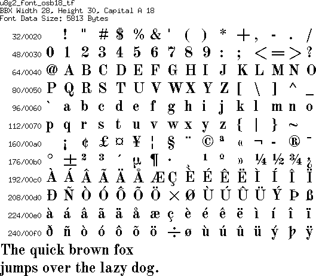
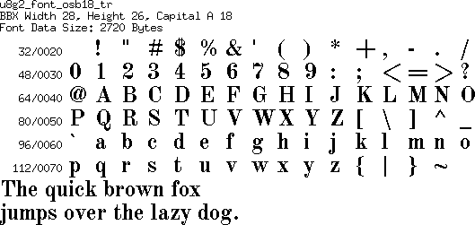
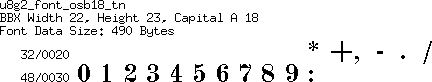

## osb21
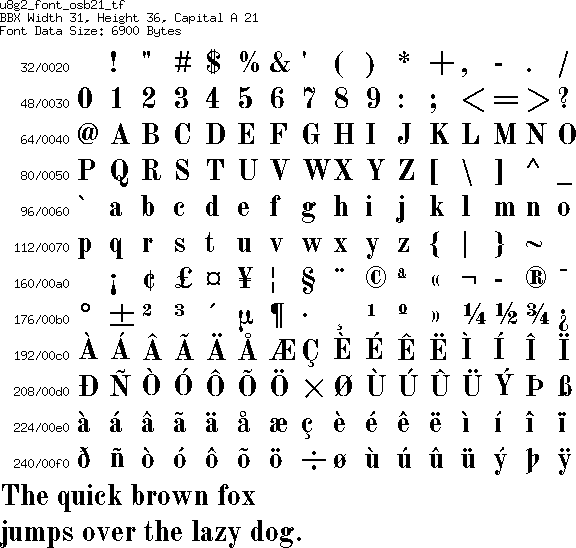
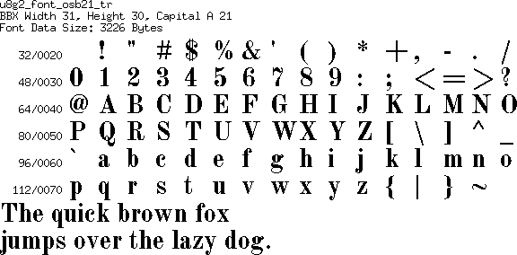
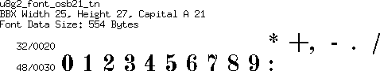

## osb26
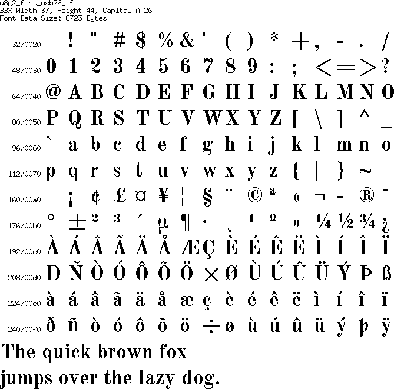
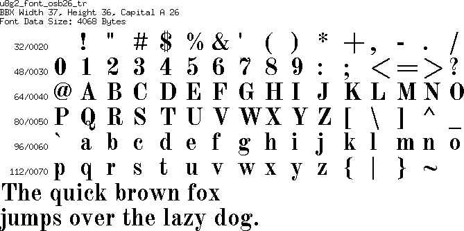
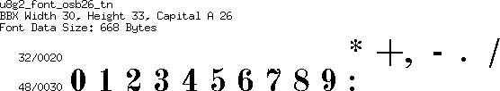

## osb29
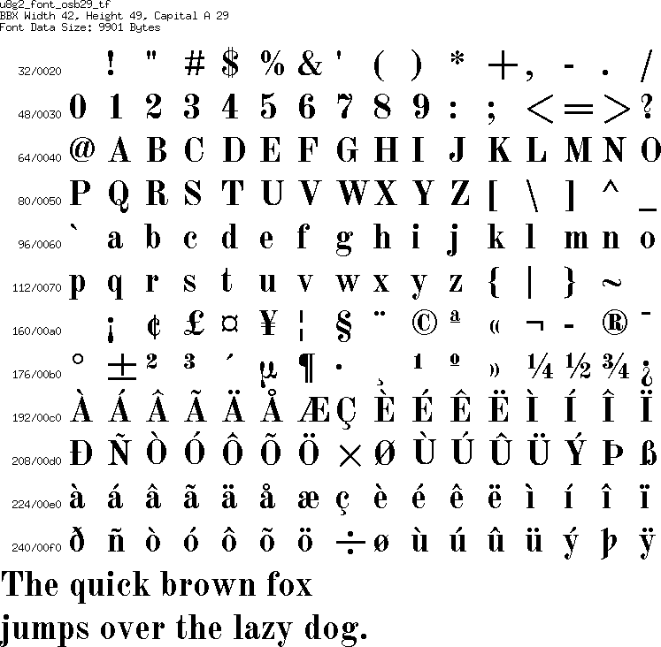
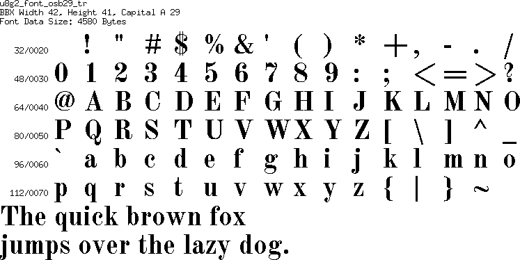
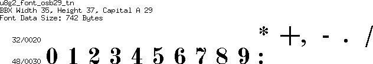

## osb35
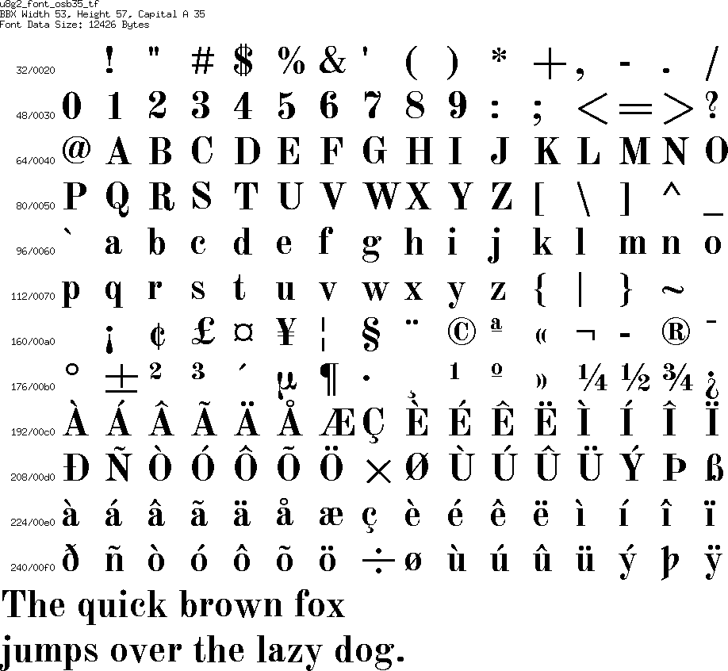

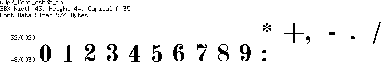

## osb41
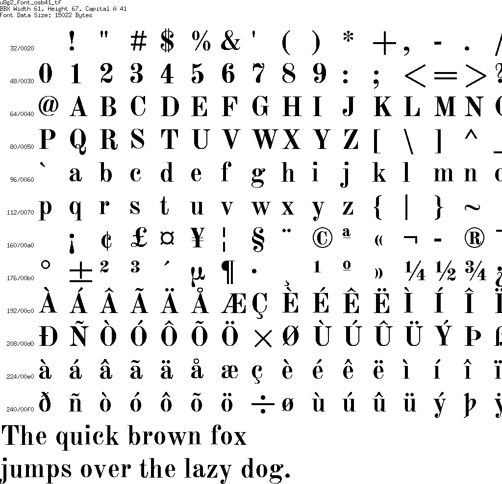

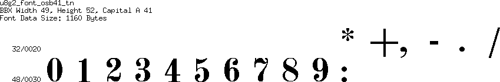

## osr18
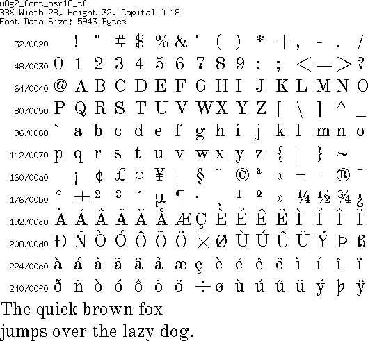
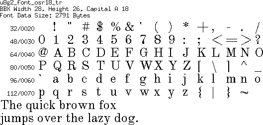
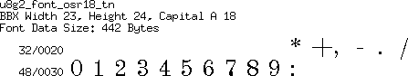

## osr21
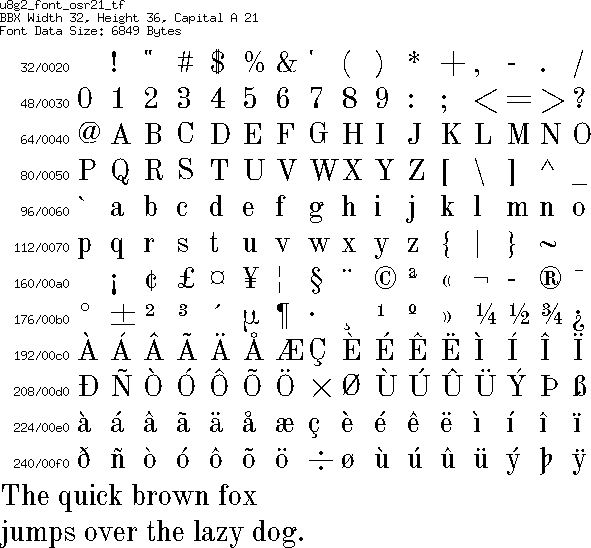
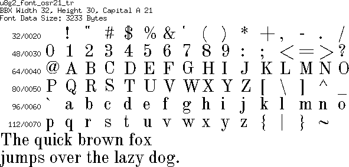
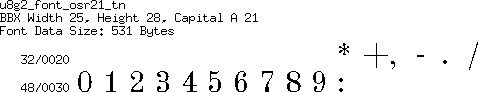

## osr26
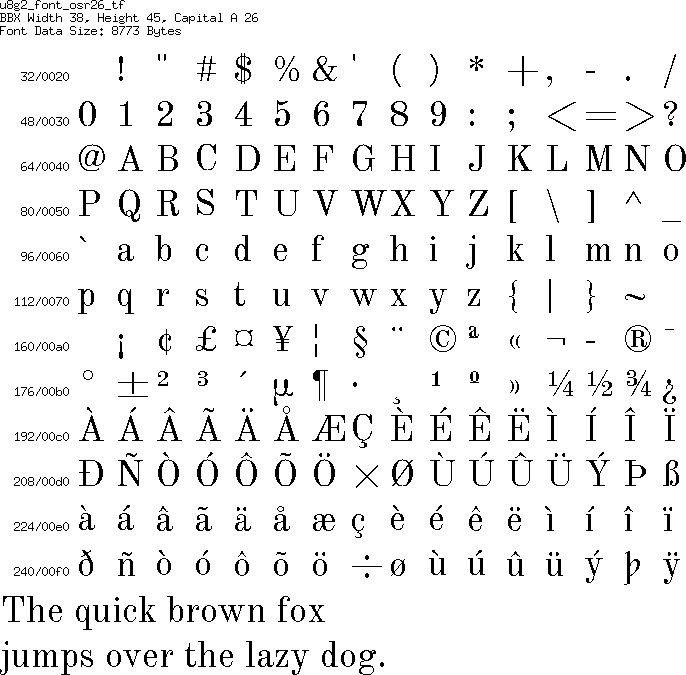

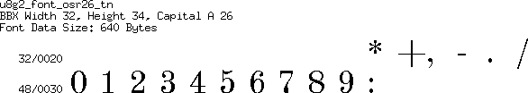

## osr29
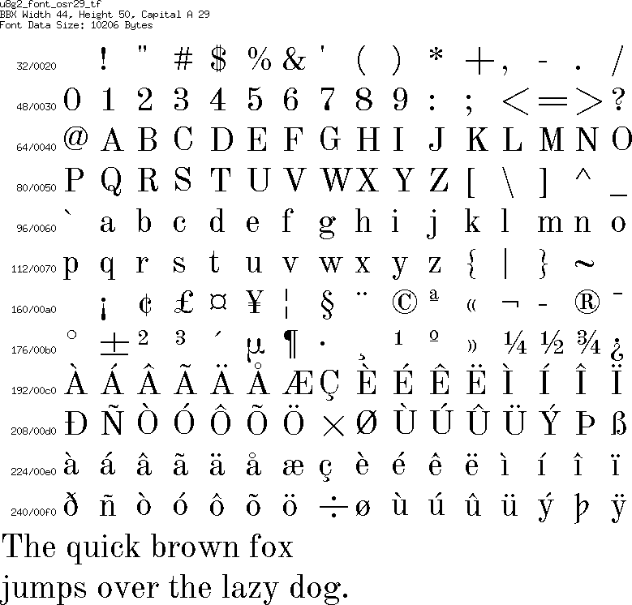
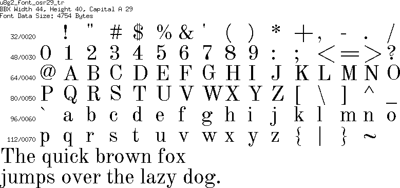
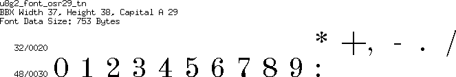

## osr35
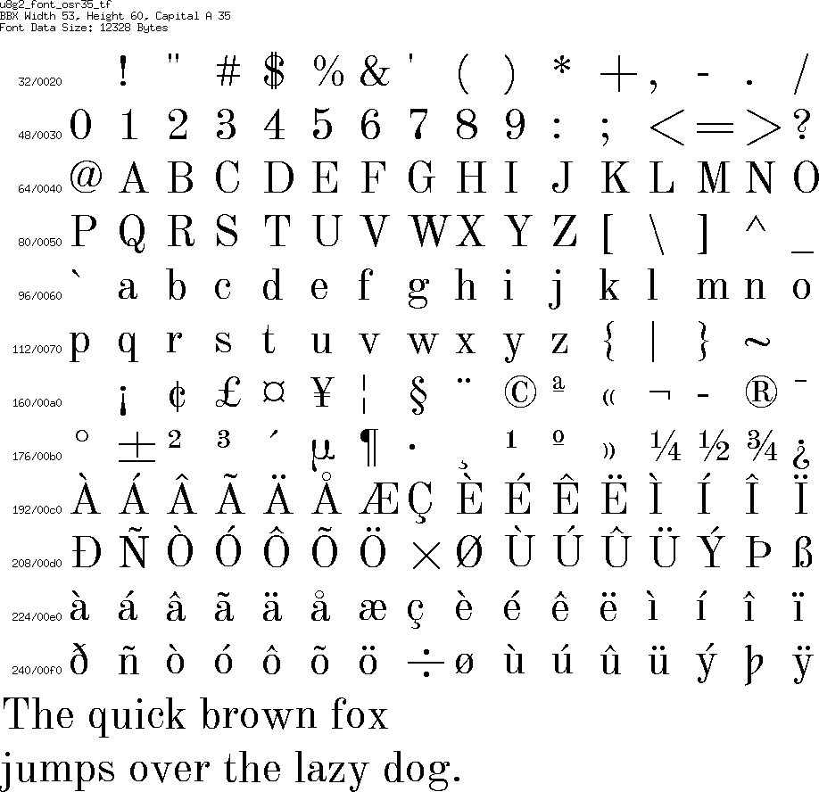

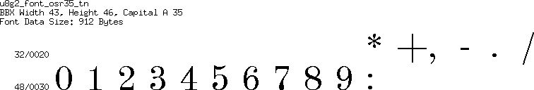

## osr41
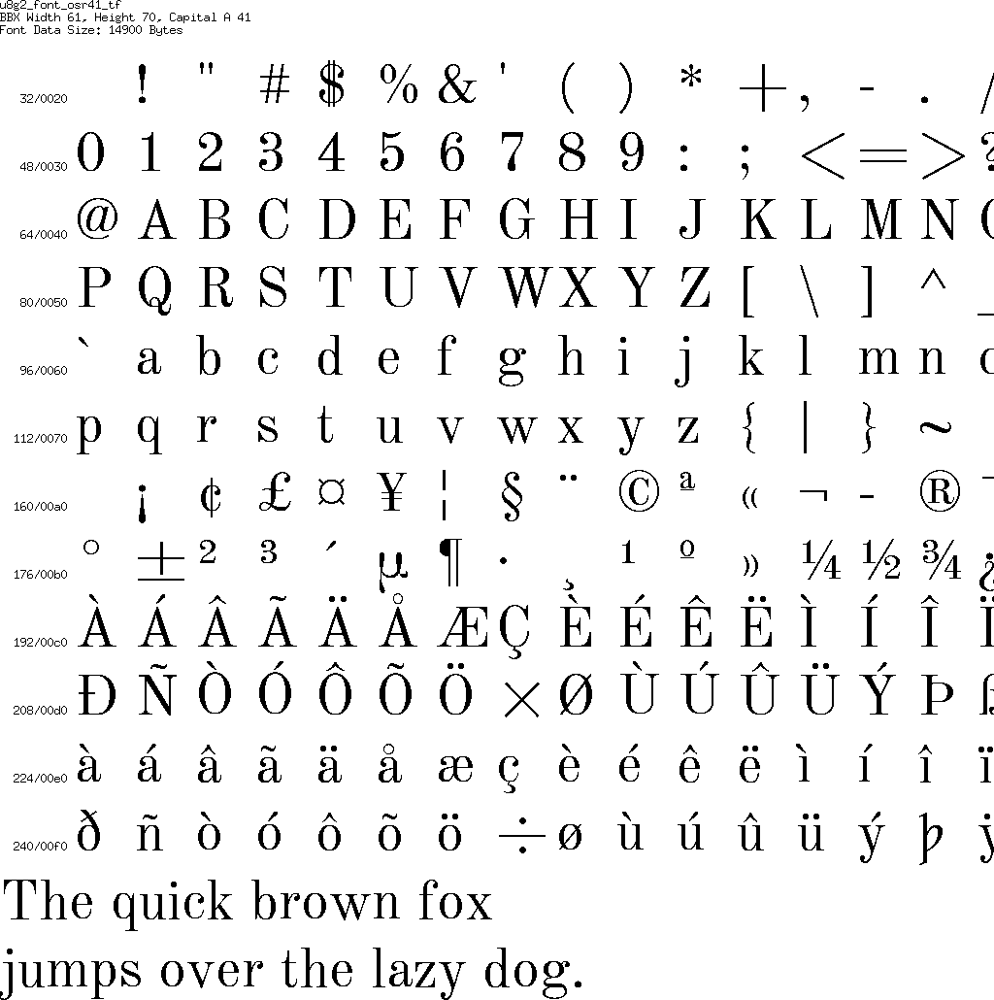
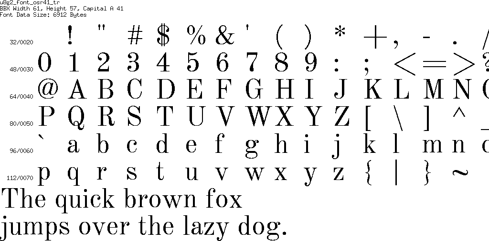
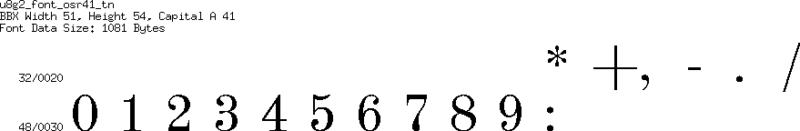
