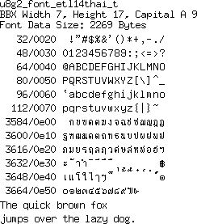
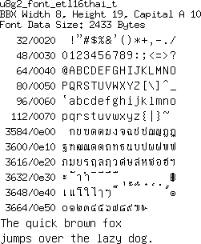
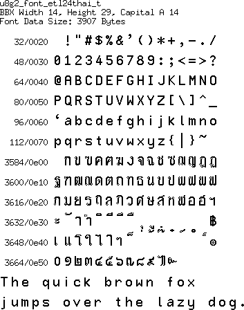

[tocstart]: # (toc start)

  * [Reference](#reference)
  * [Copyright](#copyright)
  * [Font Details](#font-details)
    * [etl14thai](#etl14thai)
    * [etl16thai](#etl16thai)
    * [etl24thai](#etl24thai)

[tocend]: # (toc end)

# Reference

etlthai from the `Fonts-TLWG` collection has been downloaded from 
https://github.com/tlwg/thaixfonts/tree/master/etlthai.

# Copyright

Fonts-TLWG (formerly ThaiFonts-Scalable) is a collection of Thai scalable 
fonts available in free licenses. Its goal is to provide fonts that conform 
to existing standards and recommendations, so that it can be a 
reference implementation.
(See: https://linux.thai.net/projects/fonts-tlwg)

Copyright statement of the BDF file:
"Public domain font. Share and enjoy."

# Font Details

## etl14thai

## etl16thai

## etl24thai

