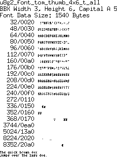

[tocstart]: # (toc start)

  * [Reference](#reference)
  * [Copyright](#copyright)
  * [Font Details](#font-details)
    * [tom_thumb_4x6](#tom_thumb_4x6)

[tocend]: # (toc end)

# Reference

Tom-Thumb font is available at [https://robey.lag.net/2010/01/23/tiny-monospace-font.html](https://robey.lag.net/2010/01/23/tiny-monospace-font.html).

# Copyright

From the above refered web site:

Brian’s page implies that his font was licensed under the MIT license, 
so since I did these modifications in my free time, the same license applies here. 
Feel free to download the BDF file below if you would find this useful, or would 
like to modify it further for some other nefarious purposes. 
(Update from 2015: As per comments below, Brian has authorized his 
font to be released under the CC0 or CC-BY 3.0 license. Therefore, this font 
may also be used under either CC0 or CC-BY 3.0 license.)

# Font Details

## tom_thumb_4x6

