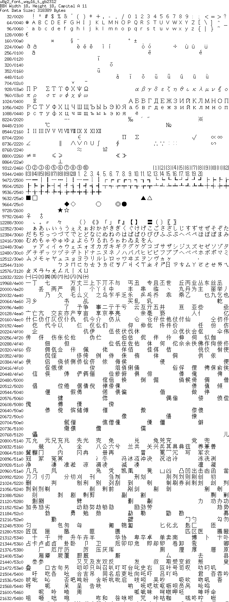
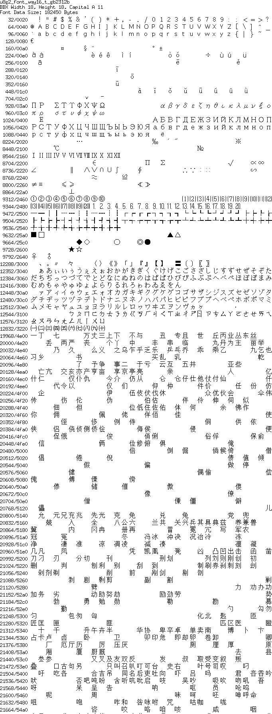

[tocstart]: # (toc start)

  * [Reference](#reference)
  * [Copyright](#copyright)
  * [Font Details](#font-details)
    * [wqy12](#wqy12)
    * [wqy13](#wqy13)
    * [wqy14](#wqy14)
    * [wqy15](#wqy15)
    * [wqy16](#wqy16)

[tocend]: # (toc end)

# Reference

The WenQuanYi bitmap fonts are maintained here: [http://wenq.org/wqy2/](http://wenq.org/wqy2/).

The u8g2 fonts are based on the bdf files from here: [https://github.com/larryli/u8g2_wqy](https://github.com/larryli/u8g2_wqy)


From the font files:

WenQuanYi bitmap fonts include all 20,932 Unicode 5.2 
CJK Unified Ideographs (U4E00 - U9FA5) and 6,582 
CJK Extension A characters (U3400 - U4DB5) at 
5 different pixel sizes (9pt-12X12, 10pt-13X13, 
10.5pt-14x14, 11pt-15X15 and 12pt-16x16 pixel).
Use of this bitmap font for on-screen display of Chinese 
(traditional and simplified) in web pages and elsewhere 
eliminates the annoying "blurring" problems caused by 
insufficient "hinting" of anti-aliased vector CJK fonts. 
In addition, Latin characters, Japanese Kanas and 
Korean Hangul glyphs (U+AC00~U+D7A3) are also included.


# Copyright

From the font files:

```
Copyright: (C)2004-2010, WenQuanYi Project 
Board of Trustees and Qianqian Fang
License  : GPL v2 (with font embedding exception)
```

# Font Details


## wqy12


## wqy13


## wqy14


## wqy15


## wqy16






