[tocstart]: # (toc start)

  * [29 Mar 2020:SSD1309 128x64 1.56 Transparent OLED](#29-mar-2020ssd1309-128x64-156-transparent-oled)
  * [3 Dec 2019: SSD1306 72x40 0.42" OLED](#3-dec-2019-ssd1306-72x40-042-oled)
  * [10 Jul 2019: MAX32620FTHR with SSD1306](#10-jul-2019-max32620fthr-with-ssd1306)
  * [15 Jun 2019:  ST75320 JLX320240 LCD](#15-jun-2019--st75320-jlx320240-lcd)
  * [19 May 2019: ESP8266 Hardware SPI and ST7920 Display](#19-may-2019-esp8266-hardware-spi-and-st7920-display)
  * [22 Apr 2019:  SH1107 128x128 Seeed Studio OLED](#22-apr-2019--sh1107-128x128-seeed-studio-oled)
  * [9 June 2018:  Step by Step Instructions for Atmel Studio 7](#9-june-2018--step-by-step-instructions-for-atmel-studio-7)
  * [19 May 2018:  ST7657 Transparent LCD ENH DG128064](#19-may-2018--st7657-transparent-lcd-enh-dg128064)
  * [13 Apr 2018:  SH1122 256x64 OLED](#13-apr-2018--sh1122-256x64-oled)
  * [2 Feb 2018:  HX1230 96x68](#2-feb-2018--hx1230-96x68)
  * [11 Dec 2017:  ESP32 and SSD1306 OLED](#11-dec-2017--esp32-and-ssd1306-oled)
  * [21 Oct 2017:  ST75256 JLX25664](#21-oct-2017--st75256-jlx25664)
  * [11 Oct 2017: ST75256 JLX256128](#11-oct-2017-st75256-jlx256128)
  * [11 Oct 2017: ST75256 JLX172104](#11-oct-2017-st75256-jlx172104)
  * [27 Aug 2017: IL3820 WaveShare 296x128 e Ink](#27-aug-2017-il3820-waveshare-296x128-e-ink)
  * [11 Aug 2017: SED1520 122x32 LCD](#11-aug-2017-sed1520-122x32-lcd)
  * [28 May 2017: MAX7219 32x8 LED Matrix](#28-may-2017-max7219-32x8-led-matrix)
  * [01 Apr 2017: SSD1306 & LPC824](#01-apr-2017-ssd1306--lpc824)
  * [24 Mar 2017: WEMOS OLED Shield](#24-mar-2017-wemos-oled-shield)
  * [5 Feb 2017: SSD1607 200x200 eInk](#5-feb-2017-ssd1607-200x200-eink)
  * [17 Jan 2017: ST7588 JLX12864](#17-jan-2017-st7588-jlx12864)
  * [13 Jan 2017: SSD1309 128x64](#13-jan-2017-ssd1309-128x64)
  * [7 Jan 2017: ST7565 DOGM132](#7-jan-2017-st7565-dogm132)
  * [6 Jan 2017: SSD1305 128x32](#6-jan-2017-ssd1305-128x32)
  * [2 Jan 2017: SSD1306 128x32 ](#2-jan-2017-ssd1306-128x32-)
  * [5 Jan 2017: SSD1327 96x96](#5-jan-2017-ssd1327-96x96)
  * [4 Jan 2017: NT7534 TG12864R](#4-jan-2017-nt7534-tg12864r)
  * [2 Jan 2017: ST7567 132x64](#2-jan-2017-st7567-132x64)
  * [31 Dec 2016: LC7981 160x80](#31-dec-2016-lc7981-160x80)
  * [30 Dec 2016: SSD1606 GDE021A1 172x72 eInk](#30-dec-2016-ssd1606-gde021a1-172x72-eink)
  * [18 Dec 2016: UC1604 JLX19264](#18-dec-2016-uc1604-jlx19264)
  * [16 Dec 2016: ST7565 128x64 LCD](#16-dec-2016-st7565-128x64-lcd)
  * [15 Dec 2016: PCD8544 84x48 (Nokia 5110) LCD](#15-dec-2016-pcd8544-84x48-nokia-5110-lcd)
  * [15 Dec 2016: KS0108 128x64 LCD ](#15-dec-2016-ks0108-128x64-lcd-)
  * [26 Nov 2016: ST7920 128x64 LCD in 8080 parallel mode](#26-nov-2016-st7920-128x64-lcd-in-8080-parallel-mode)
  * [22 Nov 2016: UC1608 240x64 LCD](#22-nov-2016-uc1608-240x64-lcd)
  * [20 Nov 2016: SSD1306 64x48 OLED (EastRising 0.66")](#20-nov-2016-ssd1306-64x48-oled-eastrising-066)
  * [13 Nov 2016: UC1611 (EA DOGXL240 Display)](#13-nov-2016-uc1611-ea-dogxl240-display)
  * [6 Nov 2016: SSD1306 Mirror Option](#6-nov-2016-ssd1306-mirror-option)
  * [15 Oct 2016: UC1610 160x104 DOGXL160](#15-oct-2016-uc1610-160x104-dogxl160)
  * [2 Oct 2016: SSD1322 256x64 NHD Display](#2-oct-2016-ssd1322-256x64-nhd-display)
  * [2 Oct 2016: SSD1325 128x64 NHD Display](#2-oct-2016-ssd1325-128x64-nhd-display)
  * [24 Sep 2016: RA8835 240x128 NHD Display](#24-sep-2016-ra8835-240x128-nhd-display)
  * [20 Aug 2016: SH1106 display](#20-aug-2016-sh1106-display)
  * [27 Jul 2016: A2 Micro Panel Thermal Printer](#27-jul-2016-a2-micro-panel-thermal-printer)
  * [16 Jul 2016: T6963 240x128 LCD](#16-jul-2016-t6963-240x128-lcd)
  * [25 Jun 2016: ST7920 128x64 LCD](#25-jun-2016-st7920-128x64-lcd)
  * [23 Jun 2016: LD7032 60x32 OLED](#23-jun-2016-ld7032-60x32-oled)
  * [23 Jun 2016: Arduboy (SSD1306 controller)](#23-jun-2016-arduboy-ssd1306-controller)
  * [3 Dec 2015: DOGS102 (UC1701 controller)](#3-dec-2015-dogs102-uc1701-controller)
  * [3 Dec 2015: SSD1306 Test board](#3-dec-2015-ssd1306-test-board)

[tocend]: # (toc end)

# 19 Apr 2020: UC1617 JLX128128

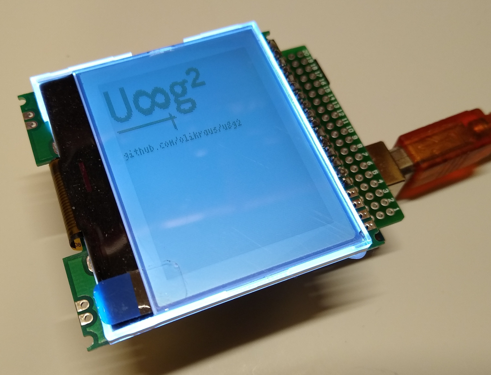

The UC1617 actually is a 4-level grayscale device, but u8g2 will only use black&white.
The display has 128x128 pixel and is rotated by 90 degree, so better use U8G2_R1.
Contrast is good, but appears a little bit bad on the above picture due to the camera angle and 
light conditions in my lab. Support will be there with v2.28.


Constructor:
```
U8G2_UC1617_JLX128128_1_4W_SW_SPI u8g2(U8G2_R0, /* clock=*/ 13, /* data=*/ 11, /* cs=*/ 10, /* dc=*/ 9, /* reset=*/ 8);
```


# 29 Mar 2020: SSD1309 128x64 1.56 Transparent OLED
sparkfun Transparent OLED (SSD1309) is OK.
Transparent Graphical OLED Breakout (Qwiic=I2C) RedBoard Turbo(SAMD21)

Constructor for this picture:
U8G2_SSD1309_128X64_NONAME0_F_HW_I2C u8g2(U8G2_R0, /* reset=*/U8X8_PIN_NONE, /* clock=*/21, /* data=*/20);

[DEMO_RUN_img](https://imgur.com/gallery/VnoS7io)


# 3 Dec 2019: SSD1306 72x40 0.42" OLED

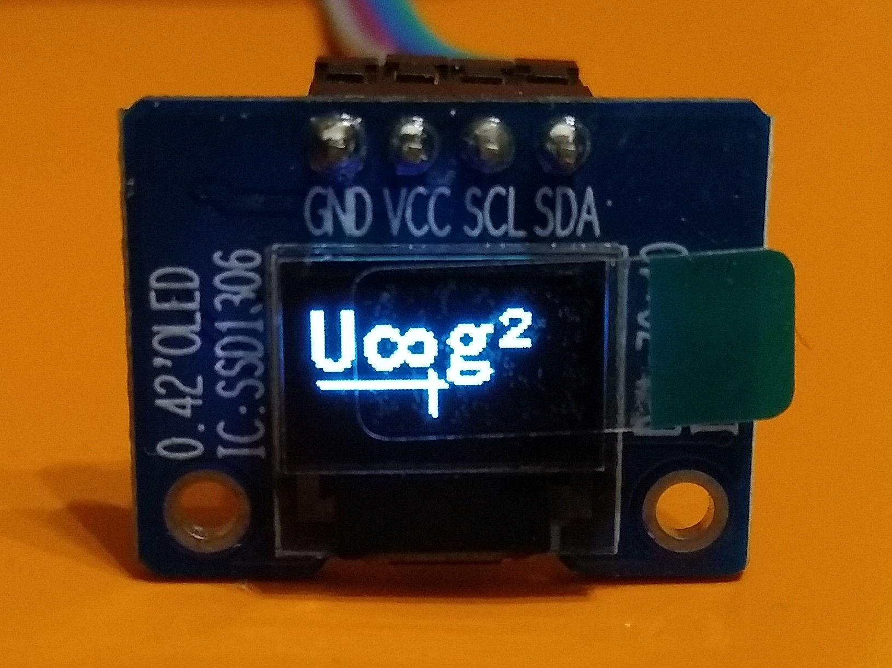

Added support for the "East Rising" 0.42" OLED. This display is very small but still
very bright.

Constructor for this picture:
```
U8G2_SSD1306_72X40_ER_1_HW_I2C u8g2(U8G2_R0, /* reset=*/ U8X8_PIN_NONE);
```


# 10 Jul 2019: MAX32620FTHR with SSD1306

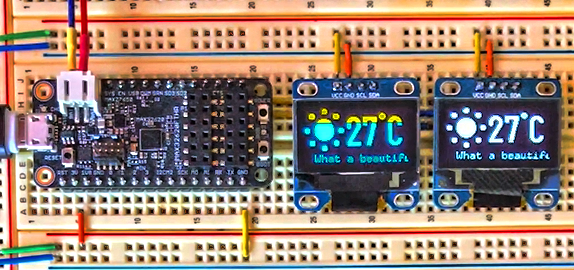

Maxim supports the MAX32620FTHR 
controller with a suitable Arduino Board Software (https://github.com/MaximIntegratedMicros/arduino-max326xx).
The Arduino HAL for this controller works with U8g2 as seen in the picture above 
(thanks to MagSem for the picture).


# 15 Jun 2019:  ST75320 JLX320240 LCD

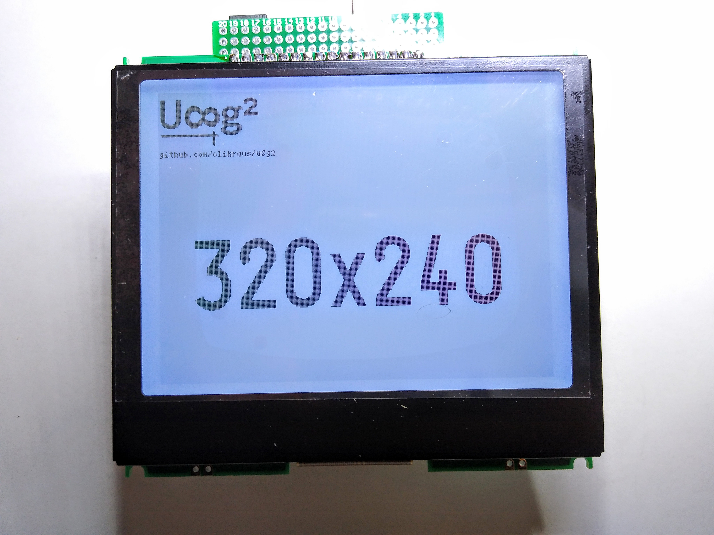

There is now support for the ST75320 controller. This JLX 320x240 display has a 
huge resolution: The usual u8g2 logo seems to be very small in the upper left corner.
In the picture, the display is driven by an Arduino Uno: I had to reduce the backlight 
so that the Uno is still able to drive the LCD Backlight.

Constructor:
```
U8G2_ST75320_JLX320240_1_4W_HW_SPI u8g2(U8G2_R0, /* cs=*/ 10, /* dc=*/ 9, /* reset=*/ 8);
```

Remember to activate U8g2 16 bit mode.


# 19 May 2019: ESP8266 Hardware SPI and ST7920 Display

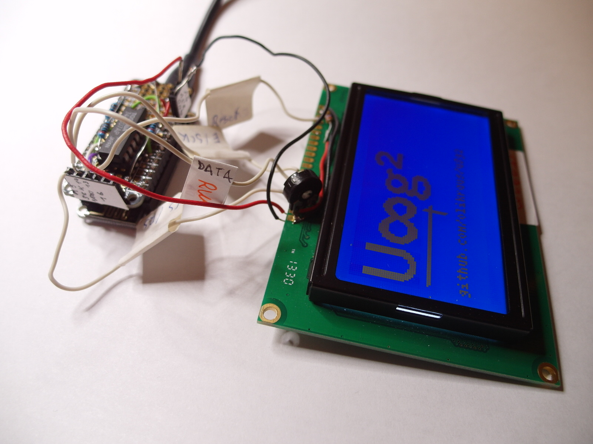

A long pending issue is now resolved in the latest version of the ESP8266 board software.
The correct SPI modes are now supported and the ST7920 display finally works out
of the box in hardware SPI mode (https://github.com/olikraus/u8g2/issues/53).

In the picture a Adafruit Feather ESP8266 board drives a ST7920 128x64 display (via 
74HC07 level shifter). 

```
U8G2_ST7920_128X64_1_HW_SPI u8g2(U8G2_R0, /* CS=*/ 15, /* reset=*/ 16);
```

Corresponding SW SPI setup is this:
```
U8G2_ST7920_128X64_1_SW_SPI u8g2(U8G2_R0, /* clock=*/ 14, /* data=*/ 13, /* CS=*/ 15, /* reset=*/ 16);
```


# 22 Apr 2019:  SH1107 128x128 Seeed Studio OLED

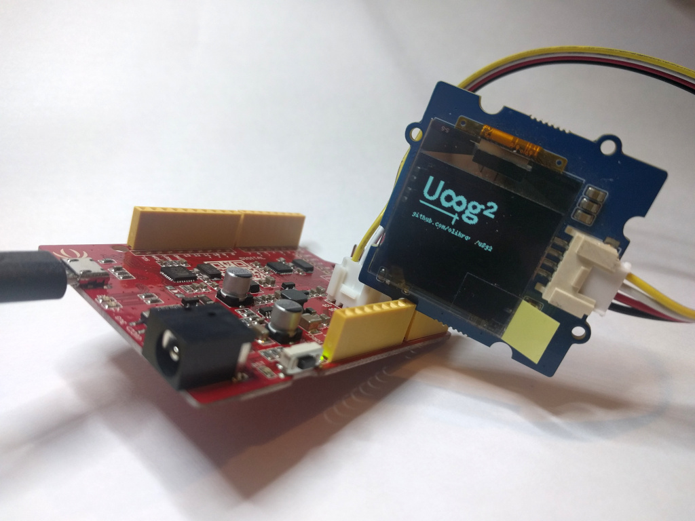

This is the newer version (128x128 instead of 96x96 pixel) of the quadratic 
 [Grove OLED](https://www.seeedstudio.com/catalog/product/view/id/161/).
Although the pixel size is bigger, the performance is still more than doubled 
compared to the older 96x96 display.

This is the U8g2 constructor for this display. Support will be available with v2.26:

```
U8G2_SH1107_SEEED_128X128_1_HW_I2C u8g2(U8G2_R0, /* reset=*/ U8X8_PIN_NONE);
```

Thanks to [seeedstudio.com](https://www.seeedstudio.com/) for supporting this project.


# 9 June 2018:  Step by Step Instructions for Atmel Studio 7

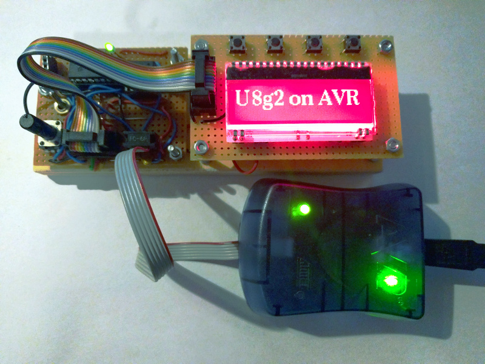

I have created a step by step guideline for the use of U8g2 with Atmel Studio 7:
[https://github.com/olikraus/u8g2/wiki/u8g2as7](https://github.com/olikraus/u8g2/wiki/u8g2as7)

# 19 May 2018:  ST7657 Transparent LCD ENH DG128064

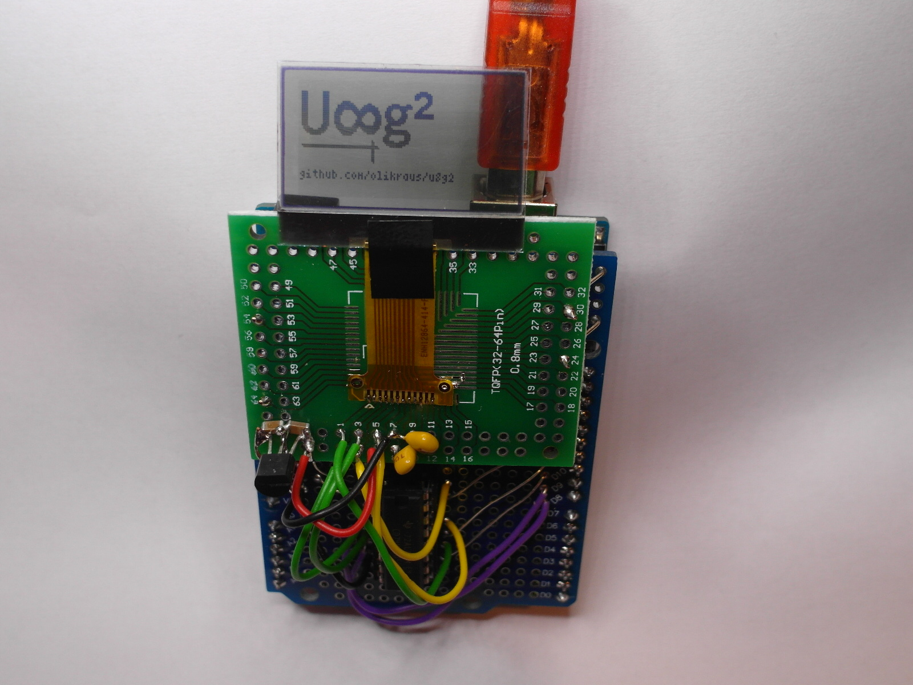


The ENH-DG128064 is one of the rare transparent LCDs available for the Maker
community ([http://www.geekdisplay.com/arduino-lcd-display/9-128x64-transparent-lcd-module.html](http://www.geekdisplay.com/arduino-lcd-display/9-128x64-transparent-lcd-module.html)).

 * The LCD came with a protective film on both sides of the display. The film is still attached to the LCD on the above image (The LCD will be even more transparent after removing the film).
 * The description is limited, but I got all the required information from the friendly shop owner: The pins on the flex cable 
are 1: CS, 2: Reset, 3: DC, 4: Clock, 5: Data, 6: 3.0V (!), 7: Ground, 8: V0, 9: XV0, 10: VG, 11 & 12: Not connected.
 * The pins on the flex cable have a distance of 0.8mm to each other.
 * The display requires 3.0V, I added a linear voltage regulator to get the 3.0V out of the 5V from the Arduino board.
 * The HC4050 level shifter is also driven by the 3.0V (lower part of the picture)
 * The voltage generator of the ST7657 can work without external caps, but to avoid ghost lines, I strongly recommend 2x 0.1uF caps between VG and Ground and between XV0 and V0 pins.

Support for U8g2 will be added with v2.23.

This is the constructor for the above picture (FlipMode is set to 1):
```
U8G2_ST7567_ENH_DG128064_1_4W_SW_SPI u8g2(U8G2_R0, /* clock=*/ 13, /* data=*/ 11, /* cs=*/ 10, /* dc=*/ 9, /* reset=*/ 8); 
```

If you look through the LCD from the back side, use either `U8G2_MIRROR` or the special "inverse" constructor:
```
U8G2_ST7567_ENH_DG128064I_1_4W_SW_SPI u8g2(U8G2_R0, /* clock=*/ 13, /* data=*/ 11, /* cs=*/ 10, /* dc=*/ 9, /* reset=*/ 8); 
```


# 13 Apr 2018:  SH1122 256x64 OLED

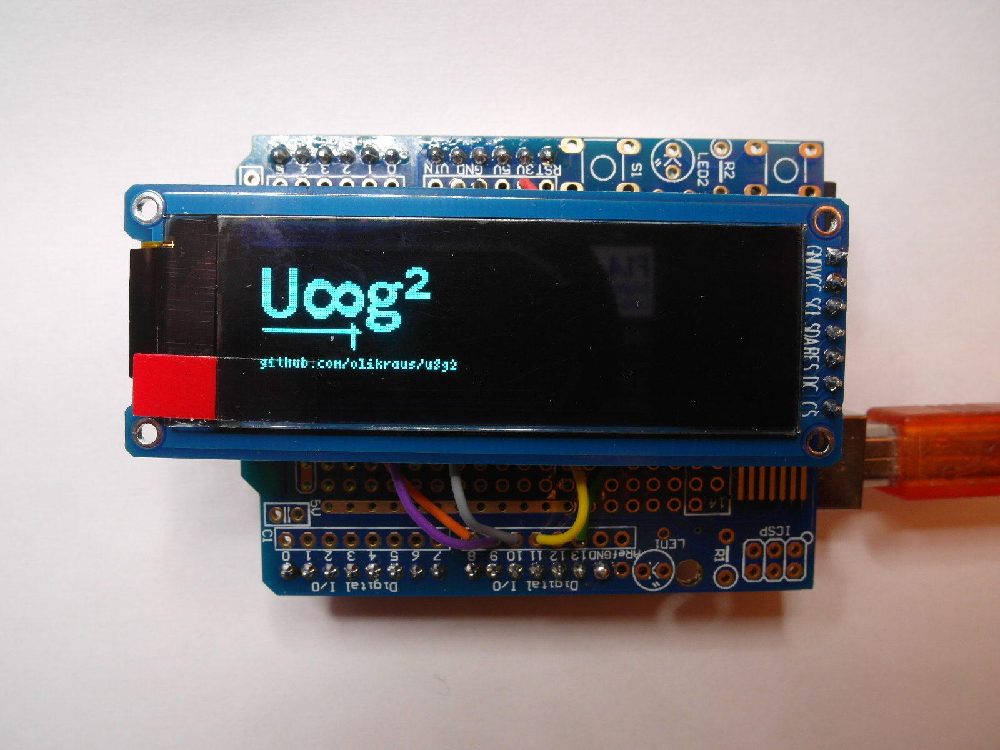

The SH1122 OLED is a small display with a high resolution. The SH1122 
is a gray level controller without monochrome mode. This will make the display refresh a 
little bit slow. 

The U8x8 API is not supported due to a different memory architecture.

This is the U8g2 constructor for this display will be available with v2.22:

```
U8G2_SH1122_256X64_1_4W_HW_SPI u8g2(U8G2_R0, /* cs=*/ 10, /* dc=*/ 9, /* reset=*/ 8);				// Enable U8G2_16BIT in u8g2.h
```


# 2 Feb 2018:  HX1230 96x68

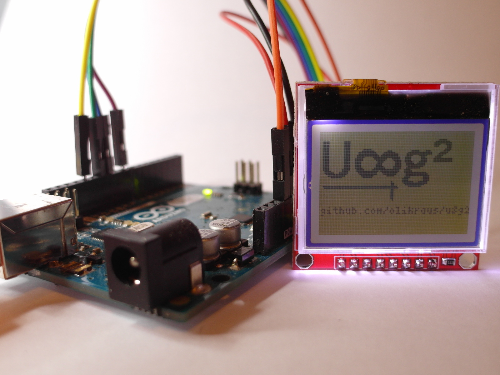

Recently I received this little and inexpense LCD with a HX1230 controller. The 
display module is configured as 3-wire SPI. There is no proper specification for the
backlight, but it works when connected to 3.3V power supply directly. 

In my picture the HX1230 is connected to an Uno Board (SMD Version).
The display module is powered by 5V, the backlight by 3.3V. Use 3W_SW_SPI 
constructor:

```
U8G2_HX1230_96X68_1_3W_SW_SPI u8g2(U8G2_R0, /* clock=*/ 13, /* data=*/ 11, /* cs=*/ 10, /* reset=*/ 8);
```


# 11 Dec 2017:  ESP32 and SSD1306 OLED

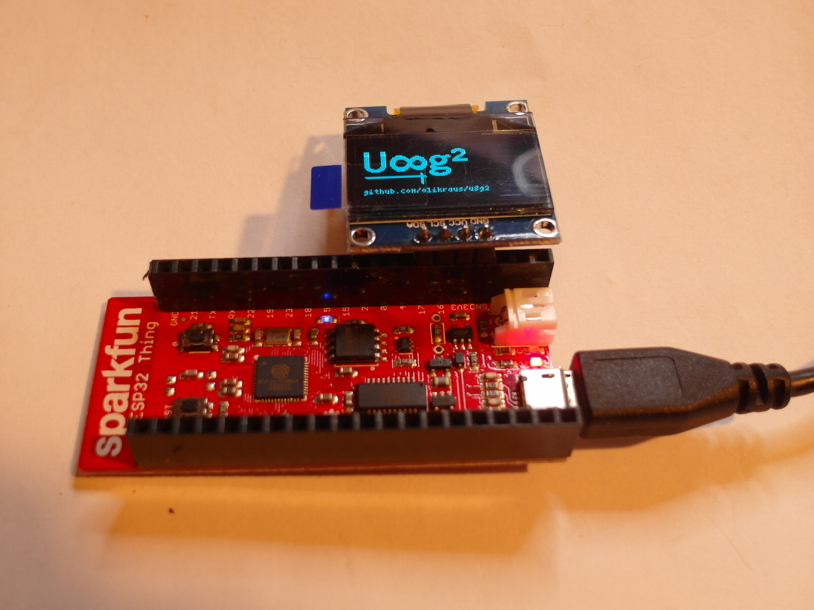

I just made a picture of the ESP32 Thing with a SSD1306 OLED. Some OLEDs
fit directly into the pinheader of the ESP32 board.

SW I2C and HW I2C with pin-remapping will work:

```
U8G2_SSD1306_128X64_NONAME_1_SW_I2C u8g2(U8G2_R2, /* clock=*/ 16, /* data=*/ 17, /* reset=*/ U8X8_PIN_NONE);   // ESP32 Thing, pure SW emulated I2C
U8G2_SSD1306_128X64_NONAME_1_HW_I2C u8g2(U8G2_R2, /* reset=*/ U8X8_PIN_NONE, /* clock=*/ 16, /* data=*/ 17);   // ESP32 Thing, HW I2C with pin remapping
```

# 21 Oct 2017:  ST75256 JLX25664

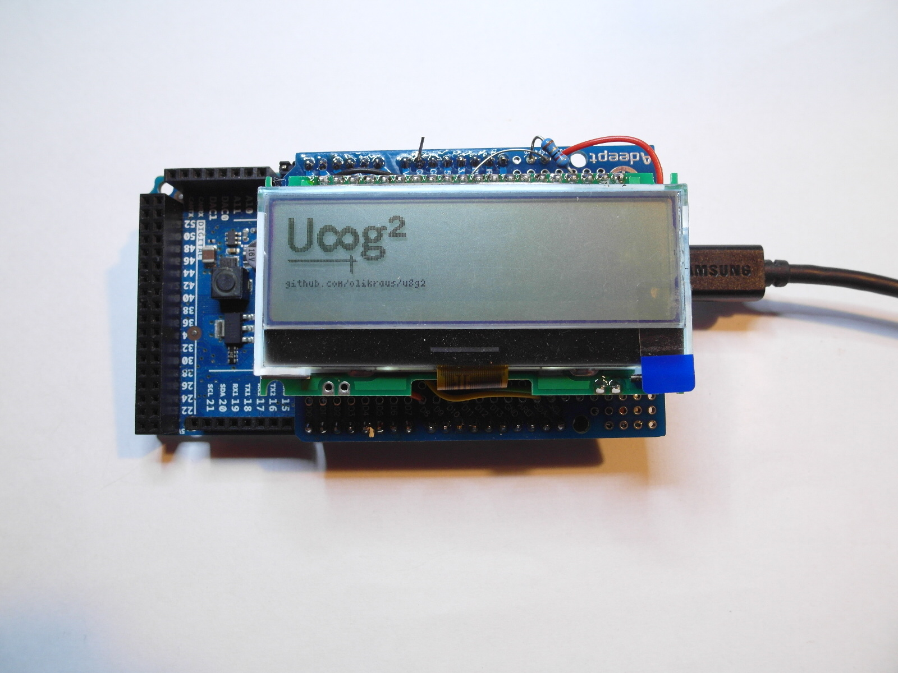

Another display with ST75256 controller, mounted on a proto shield for
the Arduino Due. This 256x64 display is configured for I2C bus. 
16 Bit mode must be enabled for U8g2.

```
U8G2_ST75256_JLX25664_1_2ND_HW_I2C u8g2(U8G2_R0, /* reset=*/ 8);
```


# 11 Oct 2017: ST75256 JLX256128

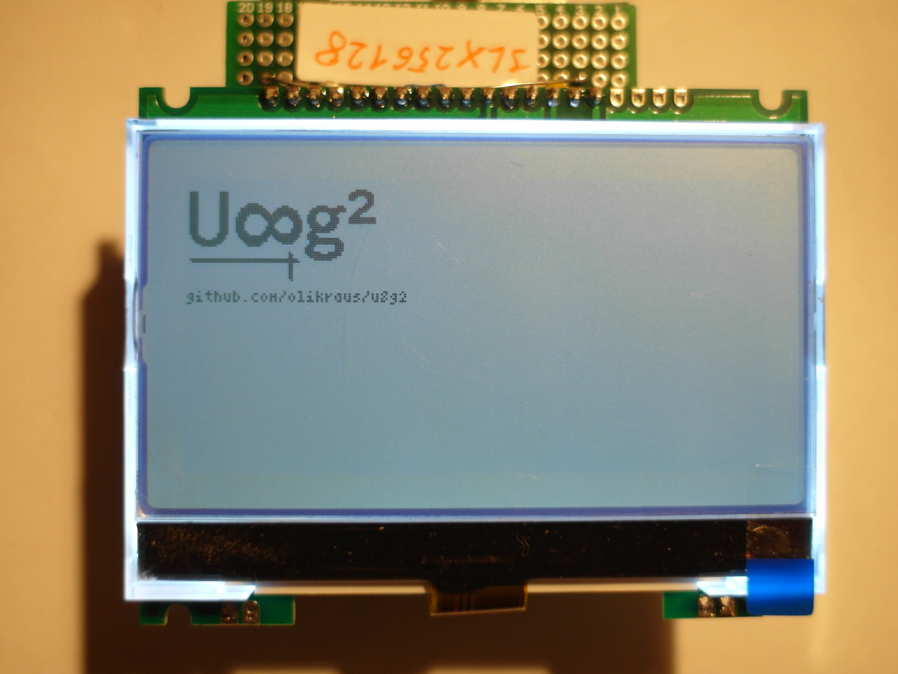

There are several display types with the ST75256 controller avaiilable. This is
the 256x128 variant. Support will be added with version 2.9.

Remember to enable 16 Bit mode for U8g2.

```
U8G2_ST75256_JLX256128_1_4W_HW_SPI u8g2(U8G2_R0, /* cs=*/ 10, /* dc=*/ 9, /* reset=*/ 8);
```

# 11 Oct 2017: ST75256 JLX172104

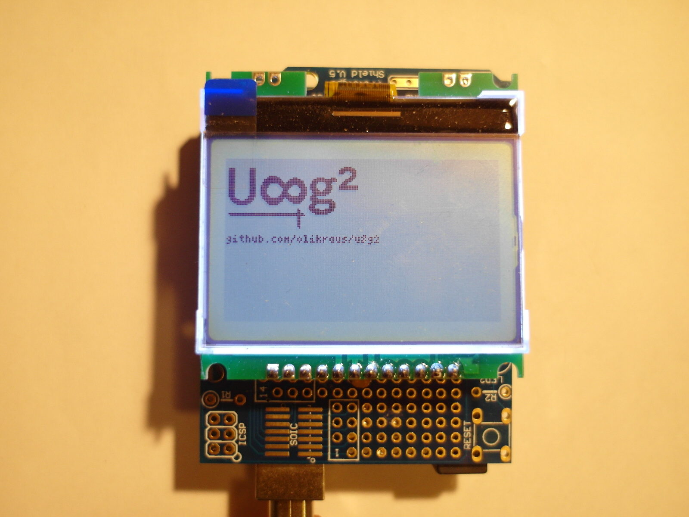

Version 2.9 will include support for the ST75256 controller. It took me almost
one year to figure out the right init sequence for this controller.

I placed the display module JLX172104 on an Arduino Shield (together with 
a 5V - 3.3V level shifter). Everything is driven by an Uno board.


```
U8G2_ST75256_JLX172104_1_4W_HW_SPI u8g2(U8G2_R0, /* cs=*/ 10, /* dc=*/ 9, /* reset=*/ 8);
```


# 27 Aug 2017: IL3820 WaveShare 296x128 e Ink

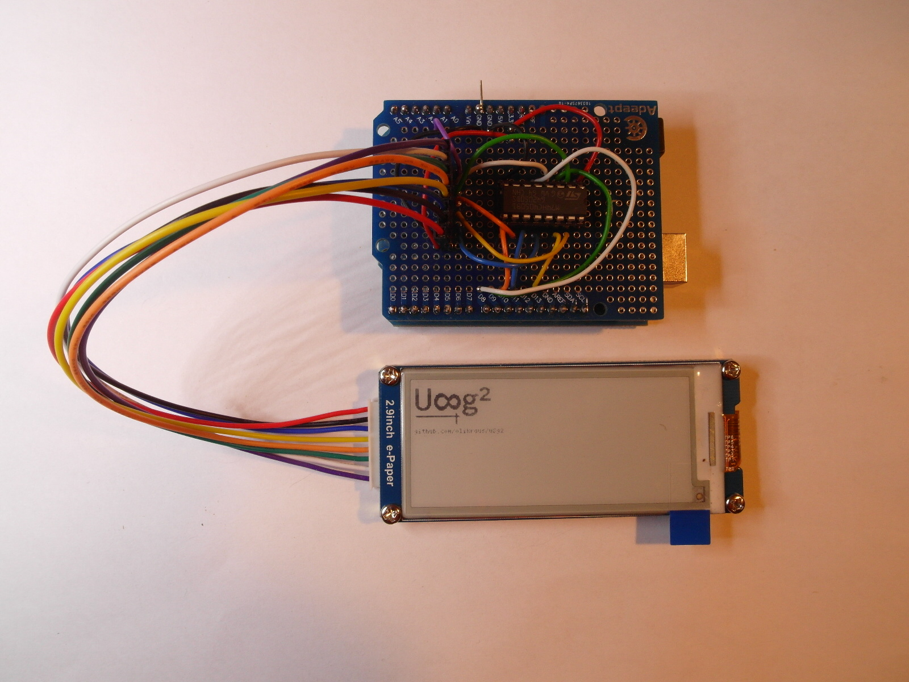

Version 2.7 will include support for the WaveShare 2.9" 296x128 e-Ink display. For U8g2 
the same restrictions apply as described below. On the picture above, the display
is driven by an Arduino Uno (The Protoboard includes the required level converter).

There are two constructors:
 * `U8G2_IL3820_296X128...`: Slow, lot of screen flicker, init code from vendor
 * `U8G2_IL3820_V2_296X128...`: Faster, lesser screen flicker, maybe little bit lesser display quality

For both devices, the power save command controlls the charge pump of the
e-paper controller. For minimal power consumption, enable power save mode.
Disable power save mode only for screen updates:


```
void setup(void) {
  u8g2.begin();			// e-paper is cleared, charge pump is active
    // charge pump still active after .begin()
  u8g2.setPowerSave(1);	// set power save mode: disable charge pump
}

...

  u8g2.setPowerSave(0);	// before drawing, enable charge pump (req. 300ms)
  u8g2.firstPage();
  do {
    draw();
  } while ( u8g2.nextPage() );
  u8g2.setPowerSave(1);	// disable charge pump
```


The above picture was generated with this constructor:
```
U8G2_IL3820_296X128_1_4W_SW_SPI u8g2(U8G2_R0, /* clock=*/ 13, /* data=*/ 11, /* cs=*/ 10, /* dc=*/ 9, /* reset=*/ 8);	// WaveShare 2.9 inch eInk/ePaper Display, enable 16 bit mode for this display!
```


# 11 Aug 2017: SED1520 122x32 LCD

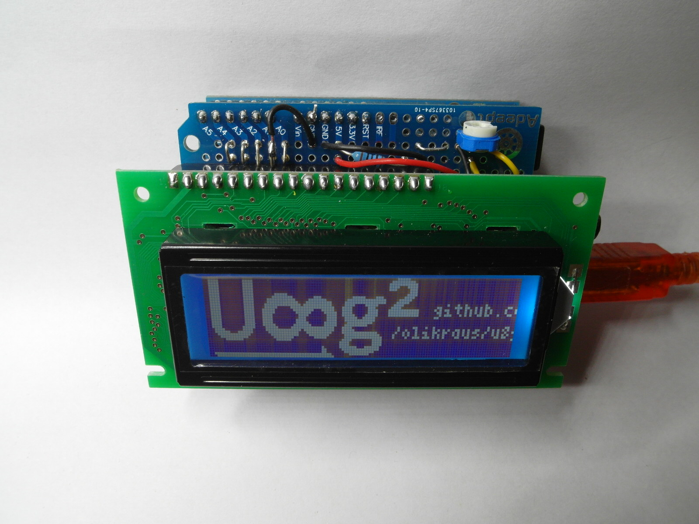

The SED1520 has a 8 bit parallel interface. U8g2 will configure this display in
6800 mode: The R/W input pin has to be tied to GND (0 volt).

U8x8 and hardware flip are not supported.


```
U8G2_SED1520_122X32_1 u8g2(U8G2_R0, 8, 9, 10, 11, 4, 5, 6, 7, /*dc=*/ A0, /*e1=*/ A3, /*e2=*/ A2, /* reset=*/  A4);
```


# 28 May 2017: MAX7219 32x8 LED Matrix

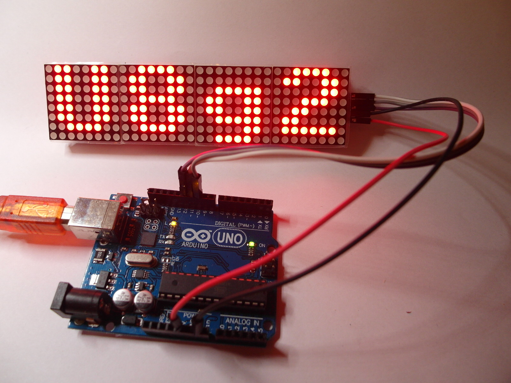


The MAX7219 is a LED driver for one 8x8 LED matrix. Multiple 8x8 blocks can be
connected together. I have added support for a 32x8 LED matrix.

U8x8 API is not supported, but the U8x8 fonts are also available for U8g2.
The MAX7219 does not require a `dc` input signal, it has to be set to
`U8X8_PIN_NONE`. The `LOAD` input line of the MAX7219 has to be connected
as `cs`.

```
U8G2_MAX7219_32X8_F_4W_SW_SPI u8g2(U8G2_R0, /* clock=*/ 11, /* data=*/ 12, /* cs=*/ 10, /* dc=*/ U8X8_PIN_NONE, /* reset=*/ U8X8_PIN_NONE);
```

Support will be added with U8g2 v2.16.

# 01 Apr 2017: SSD1306 & LPC824

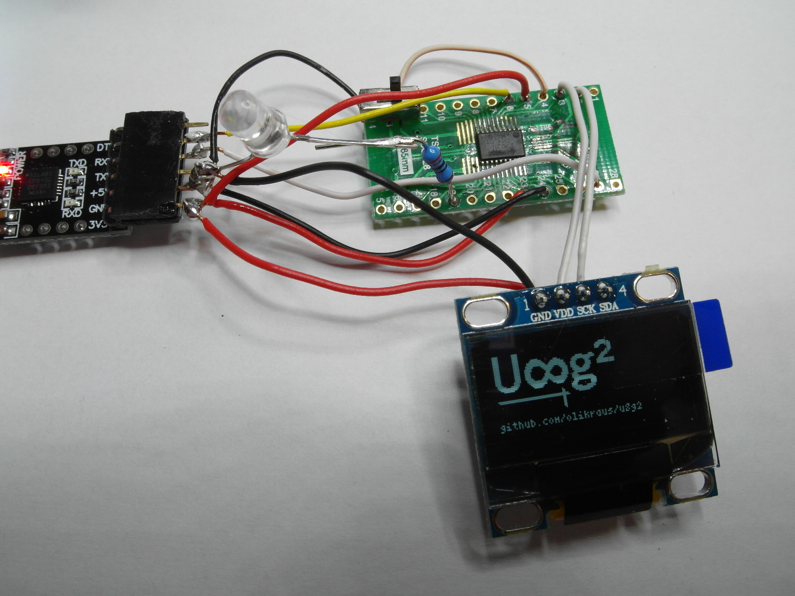


This is a port of u8g2 to the LPC824 controller. The complete project is located here:

https://github.com/olikraus/u8g2/tree/master/sys/arm/lpc824

The project also includes the upload tool for the LPC824 (hex2lpc). 

# 24 Mar 2017: WEMOS OLED Shield


The [64x48 OLED Shield](https://www.wemos.cc/product/oled-shield.html) for the WEMOS ESP8266 boards. It features a SSD1306 driver and works with no special modification using the I2C bus (hardware or software):

```
U8G2_SSD1306_64X48_ER_F_HW_I2C u8g2(U8G2_R0); // hardware
```

```
U8G2_SSD1306_64X48_ER_F_SW_I2C u8g2(U8G2_R0, D1, D2); // software
```


# 5 Feb 2017: SSD1607 200x200 eInk

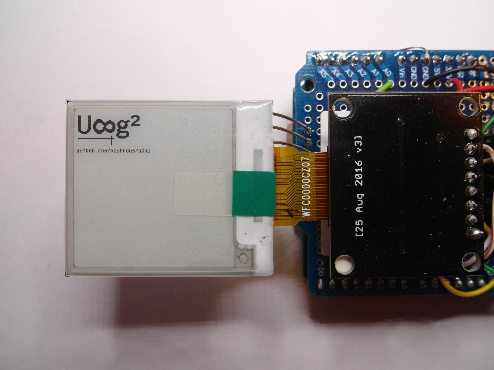

Several weeks back, I ordered this little 200x200 pixel e-paper device from embedded adventures.
It includes a breakout board, which makes it very easy to connect the display
to Arduino boards (of course 3.3V level shift is still required for 5V boards).
The e-paper itself seems to be the CFAP200200A0-0154 display module 
from Crystalfontz America, Inc.
The code for U8g2 is mainly 
based on the original library from embedded adventures.

The original library requires a lot of RAM. This restriction is not there for U8g2 (page mode or U8x8 API).


Notes:
  * A special refresh command is required to copy the content of the RAM cells to the display.
This command is automatically executed in U8g2.
  * The refresh command and the automatic buffer switch makes U8x8 difficult to
use. In U8x8 the refresh command (u8x8::refreshDisplay()) has to be called 
manually. Additionally, after each such call, the screen has to be erased manually,
because the last to last content is still inside the RAM.
  * There will be a black/white flicker for each refresh. This is intended and required for best contrast.
  * It requires a long time to change the color of a pixel. For this display, this is
more than one second. Any kind of animation will be very slow.
  * The busy line is not required. Instead I measured the timing and added 
delays into U8g2. 
  * U8g2 constrast setting is not available: There is no such command in the
display controller (except for reprogramming the display LUT memory).
  * Hardware flip is not implemented. Use the U8g2 software rotation instead.
  * U8g2 power down/up function is not required. Instead the display
is powered up and down by the refresh command sequence.

Conclusion:

U8g2 supports SSD1607 except for the hardware flip option in v2.13.x


```
U8G2_SSD1607_200X200_1_4W_SW_SPI u8g2(U8G2_R0, /* clock=*/ 13, /* data=*/ 11, /* cs=*/ 10, /* dc=*/ 9, /* reset=*/ 8);	// eInk/ePaper Display
```

# 17 Jan 2017: ST7588 JLX12864

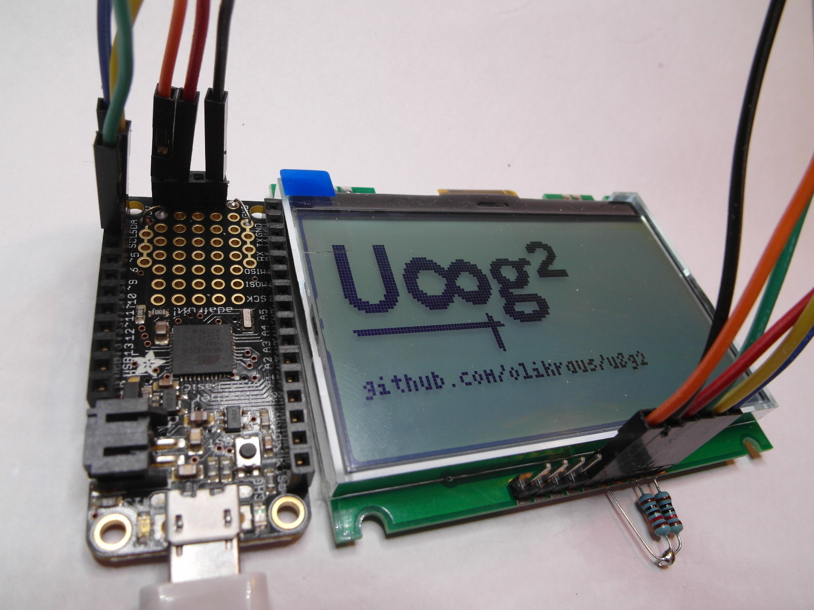

The JLX12864 comes with a white backlight and has a I2C interface.
 * ST7588 display controller.
 * Driven by a "feather 32u4 basic" to avoid level shifter for the I2C interface.
 * SW I2C will work without resistors, but HW I2C will require 10K pullups.
 * The backlight can be connected to the 3.3V power source without resistor.
 * Support will be added with U8g2 2.13.x

Because of the I2C 5V to 3.3V level shift problem, this display is a little bit
less suitable for 5V Arduino boards.

```
U8G2_ST7588_JLX12864_1_HW_I2C u8g2(U8G2_R0, /* reset=*/ 5);
```

# 13 Jan 2017: SSD1309 128x64

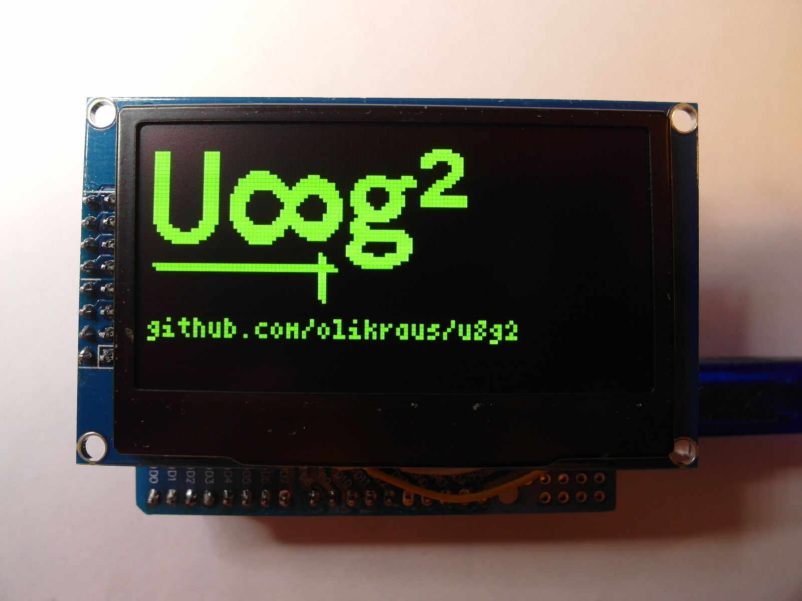

A 2.42" SSD1309 OLED. I had to reduce bightness a little bit, otherwise it might
be too much current consumption for the 3.3V power pin of the Arduino Uno.
Support will be there with U8g2 v2.12


```
U8G2_SSD1309_128X64_NONAME_1_4W_HW_SPI u8g2(U8G2_R0, /* cs=*/ 10, /* dc=*/ 9, /* reset=*/ 8)
```


# 7 Jan 2017: ST7565 DOGM132

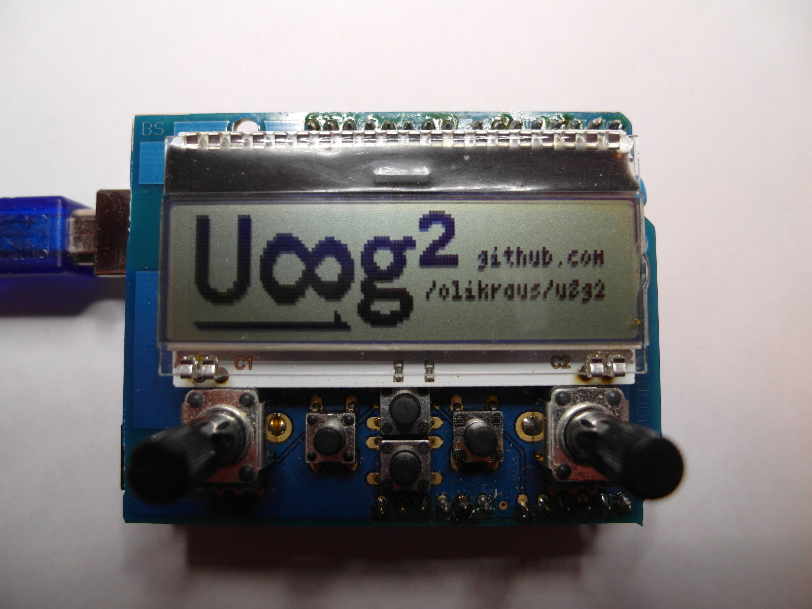

The EA DOGM132 has 132x32 pixel. Support will be added with v2.11.x.

```
U8G2_ST7565_EA_DOGM132_1_4W_HW_SPI u8g2(U8G2_R0, /* cs=*/ 10, /* dc=*/ 9, /* reset=*/ U8X8_PIN_NONE);
```


# 6 Jan 2017: SSD1305 128x32

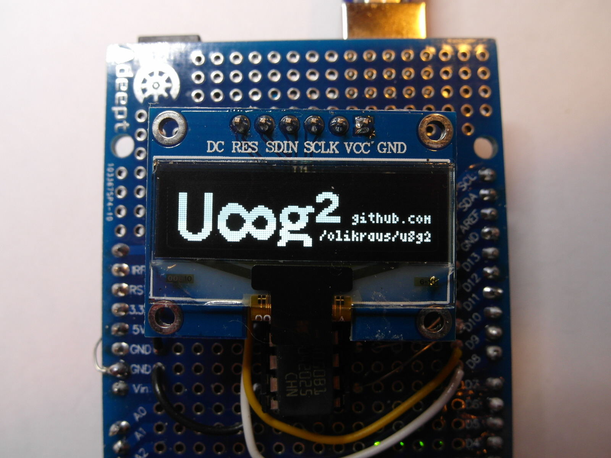

This is a very small SSD1305 128x32 OLED. I am not sure whether this is really
a SSD1305: I have not encountered any difference to the SSD1306.
  * There is no chip select input, but it still works.
  * The interface was preconfigured as I2C. The DC input is the lowest bit of the
  I2C client address. However, there is a solder bridge on the back for the selection
  of I2C and SPI (see below).
  * Support will be added with v2.11.x.  

```
U8G2_SSD1305_128X32_NONAME_1_4W_HW_SPI u8g2(U8G2_R0, /* cs=*/ 10, /* dc=*/ 9, /* reset=*/ 8);
```

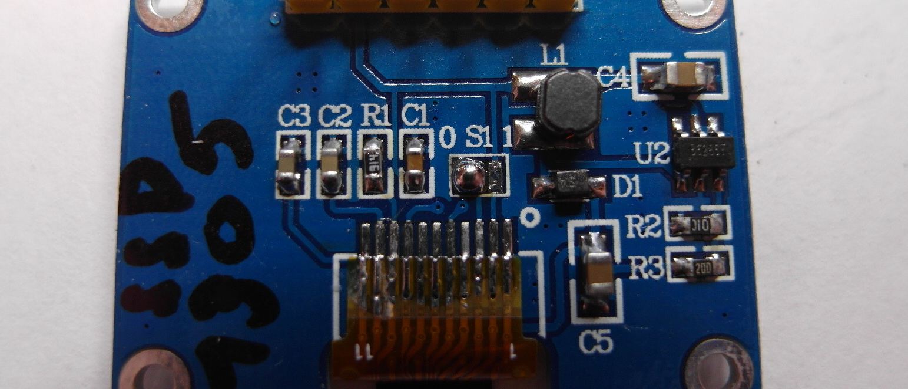
Solder bridge at S1 at the back side of the SSD1305 128x32 OLED:
 * 0: SPI
 * 1: I2C

# 2 Jan 2017: SSD1306 128x32 


* Used u8x8 on a I2C 128x32 OLED display based on SSD1306 drivers, which I bought on eBay.
* Used Arduino Uno R3, programmed on Atom IDE with PlatformIO.
* Used custom made icons.
```
U8X8_SSD1306_128X32_UNIVISION_SW_I2C u8x8(/* clock=A5*/ 19, /* data=A4*/ 18);
```
[u8x8 example on Arduino UNO R3 with a 128x32 I2C OLED Display](https://github.com/DyadicGit/u8x8_example_128x32_OLED_display)

All credit goes to *olikraus* and his *u8g2* project.

# 5 Jan 2017: SSD1327 96x96

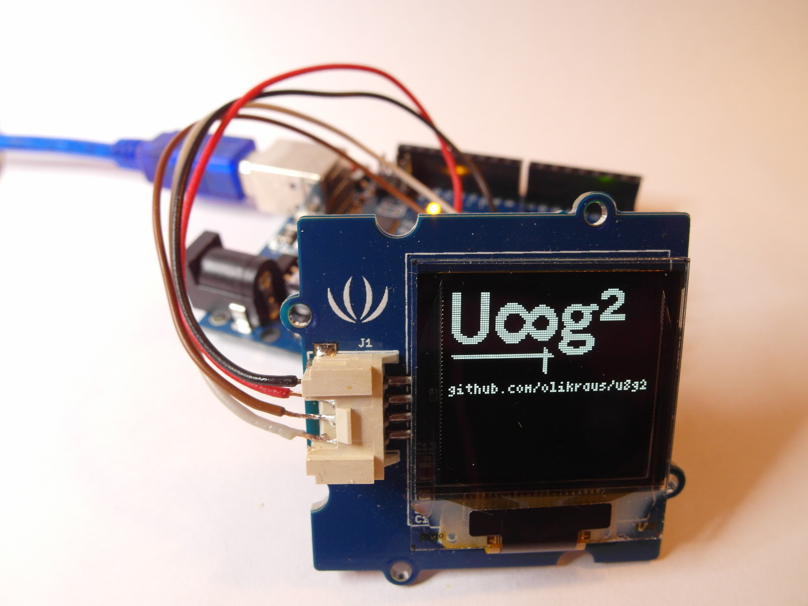

96x96 OLED from "seeedstudio.com". It accepts 5V input, but is a little bit
slow compared to SSD1306 OLEDs. Support will be added with v2.11.x.

```
U8G2_SSD1327_SEEED_96X96_1_HW_I2C u8g2(U8G2_R0, /* reset=*/ U8X8_PIN_NONE);
```

# 4 Jan 2017: NT7534 TG12864R

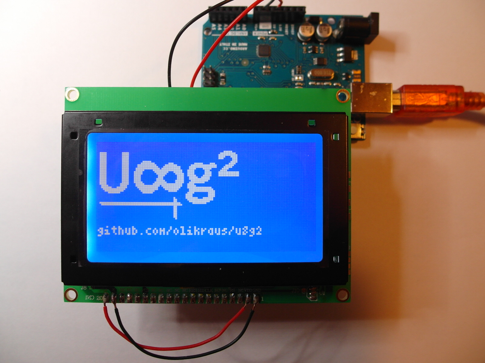

This 128x64 display (TG12864R) looks like a COB (chip on board) display similar to 
ST7920/KS0108 boards, however it is a NT7534 based COG (chip on glass) 
display (like the UC16xx family of displays). 
 
  * The TG12864R requires a 5V power supply and 5V logic levels (although the  
NT7534 is a 3.3V chip).
  * The backlight LED does not require any resistor: It must be connected directly
to the 5V power supply.
  * The NT7534 is almost identical to the ST7565, it shares the same fast SPI 
interface (at least compared to the ST7920).
  * Support will be added with v2.11.x.
 
```
U8G2_NT7534_TG12864R_1_4W_HW_SPI u8g2(U8G2_R0, /* cs=*/ 10, /* dc=*/ 9, /* reset=*/ 8);  
```

# 2 Jan 2017: ST7567 132x64

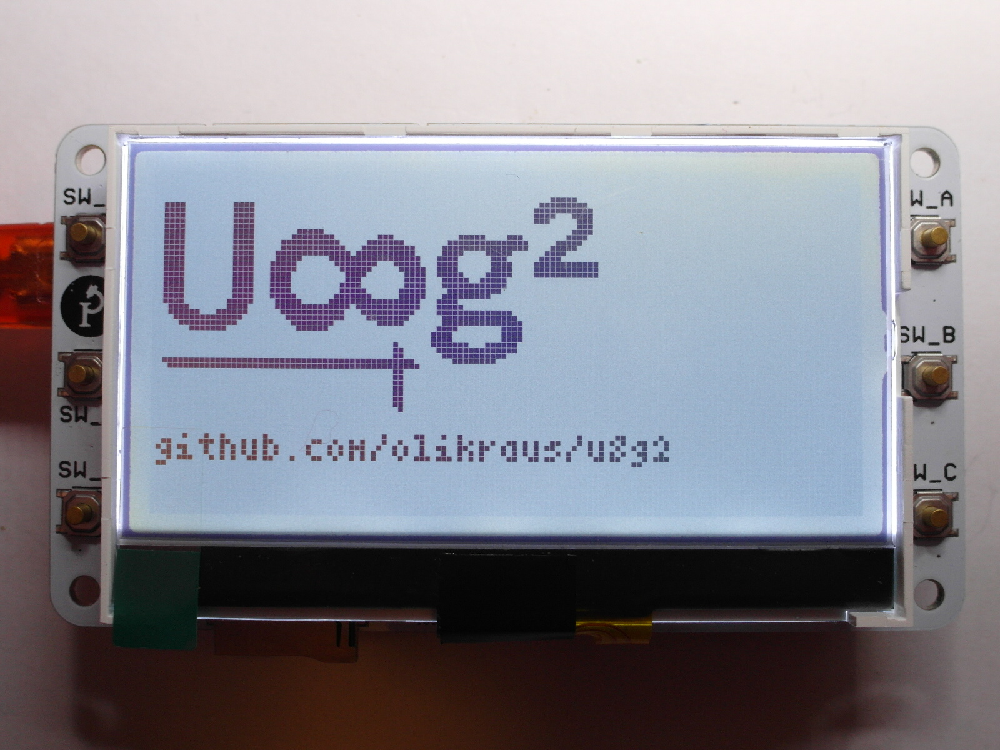

Today morning I received a nice GLCD shield from Pax Instruments.
It includes a 132x64 GLCD (ST7567), six buttons and a micro SD card slot.
Support for this controller will be there with v2.11.x.

The white backlight is not controlled by u8g2 and has to be activated manually with
`digitalWrite(6, LOW)`. 

I took the picture above with activated flip mode (`u8g2.setFlipMode(1)`).

```
U8G2_ST7567_PI_132X64_1_4W_HW_SPI u8g2(U8G2_R0, /* cs=*/ 7, /* dc=*/ 9, /* reset=*/ 8); 
```


# 31 Dec 2016: LC7981 160x80

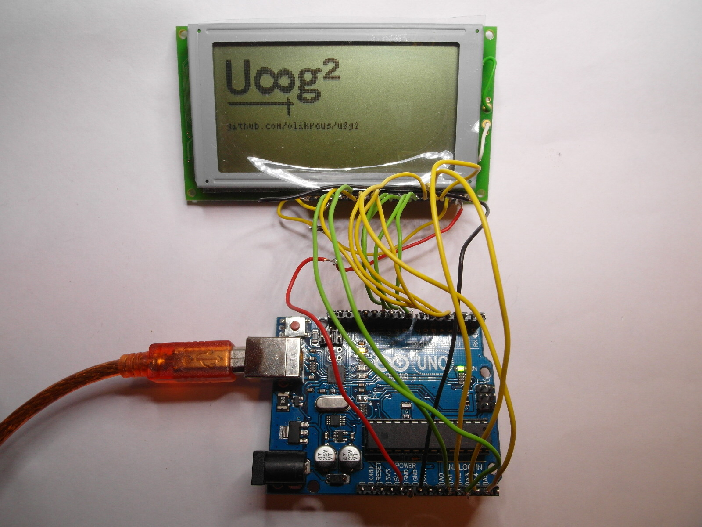

This is a quick port of the LC7981 code from u8glib to u8g2. 
I did not spent much time on performance, but it works as expected.

 * The RW input of the display must be connected to GND.
 * U8x8, contrast and hardware flip are not supported.
 * Support for this display will be included into U8g2 v2.11.x

```
U8G2_LC7981_160X80_1_6800 u8g2(U8G2_R0, 8, 9, 10, 11, 4, 5, 6, 7, /*enable=*/ 18, /*cs=*/ 14, /*dc=*/ 15, /*reset=*/ 16); 
```


# 30 Dec 2016: SSD1606 GDE021A1 172x72 eInk

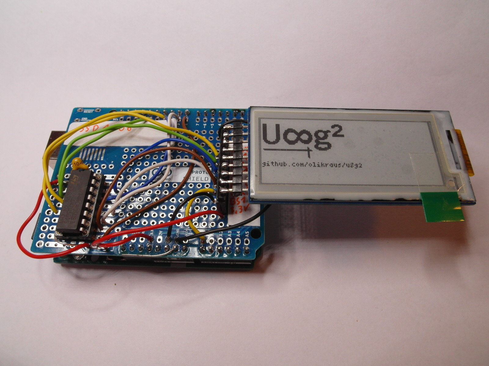

This is a GDE021A1 eInk/ePaper display mounted on a breakout board from "Smart-Prototyping".
It has a very high contrast and keeps the display content without power supply.

Notes:
  * A special refresh command is required to copy the content of the RAM cells to the display.
This command is automatically executed in U8g2.
  * The SSD1606 has two RAM framebuffer areas for the display content. The framebuffer
is switched after the execution of the refresh command. This buffer switch can
not be avoided (according to my current knowledge).
  * The refresh command and the automatic buffer switch makes U8x8 difficult to
use. In U8x8 the refresh command (u8x8::refreshDisplay()) has to be called 
manually. Additionally, after each such call, the screen has to be erased manually,
because the last to last content is still inside the RAM.
  * It requires a long time to change the color of a pixel. For this display, this is
one second. Any kind of animation will be very slow.
  * The busy line is not required. Instead I measured the timing and added 
delays into U8g2. 
  * U8g2 constrast setting is not available: There is no such command in the
display controller (except for reprogramming the display LUT memory).
  * Hardware flip is not implemented: It seems that this is not supported by
the SSD1606 controller. Use the U8g2 software rotation instead.
  * U8g2 power down/up function is not required. Instead the display
is powered up and down by the refresh command sequence.

Conclusion:

U8g2 supports SSD1606 except for the hardware flip option in v2.10.x


```
U8G2_SSD1606_172X72_1_4W_SW_SPI u8g2(U8G2_R0, /* clock=*/ 13, /* data=*/ 11, /* cs=*/ 10, /* dc=*/ 9, /* reset=*/ 8);		// eInk/ePaper Display
```

# 18 Dec 2016: UC1604 JLX19264

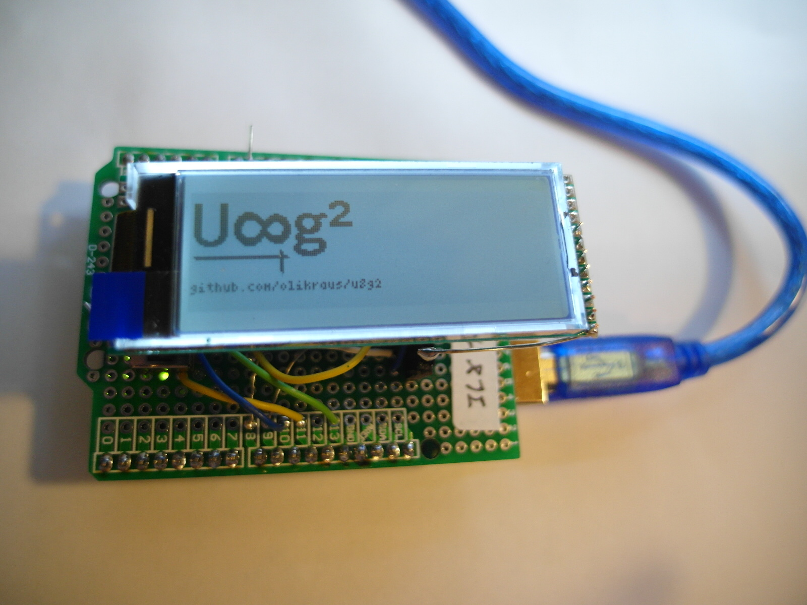

Another LCD which I received recently: JLX19264G-333. Support for the UC1604 
controller will be there with v2.9.x

```
U8G2_UC1604_JLX19264_1_4W_SW_SPI u8g2(U8G2_R0, /* clock=*/ 13, /* data=*/ 11, /* cs=*/ 10, /* dc=*/ 9, /* reset=*/ 8); 
```

# 16 Dec 2016: ST7565 128x64 LCD

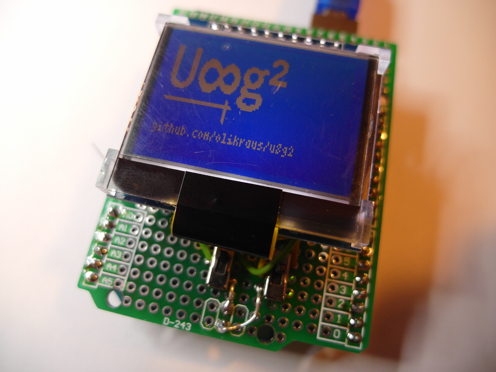

Long time back I ordered this 128x64 LCD from somewhere in the internet. I think it is from zolentech.com.
The protection foil is still on top of the LCD, which causes some artefacts on the picture above. Also pixel are 
not square, so that the U8g2 logo appears a little bit taller. However u8x8 will look very nice with this LCD.

```
U8G2_ST7565_ZOLEN_128X64_1_4W_SW_SPI u8g2(U8G2_R0, /* clock=*/ 13, /* data=*/ 11, /* cs=*/ 10, /* dc=*/ 9, /* reset=*/ 8);
```

# 15 Dec 2016: PCD8544 84x48 (Nokia 5110) LCD

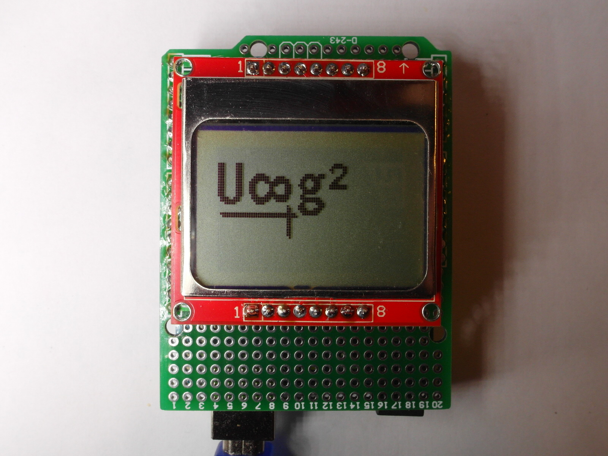

... the classic PCD8544 84x48 (Nokia) display.
I have not enabled the LCD backlight..

```
U8G2_PCD8544_84X48_1_4W_SW_SPI u8g2(U8G2_R0, /* clock=*/ 13, /* data=*/ 11, /* cs=*/ 10, /* dc=*/ 9, /* reset=*/ 8);	// Nokia 5110 Display
```


# 15 Dec 2016: KS0108 128x64 LCD 

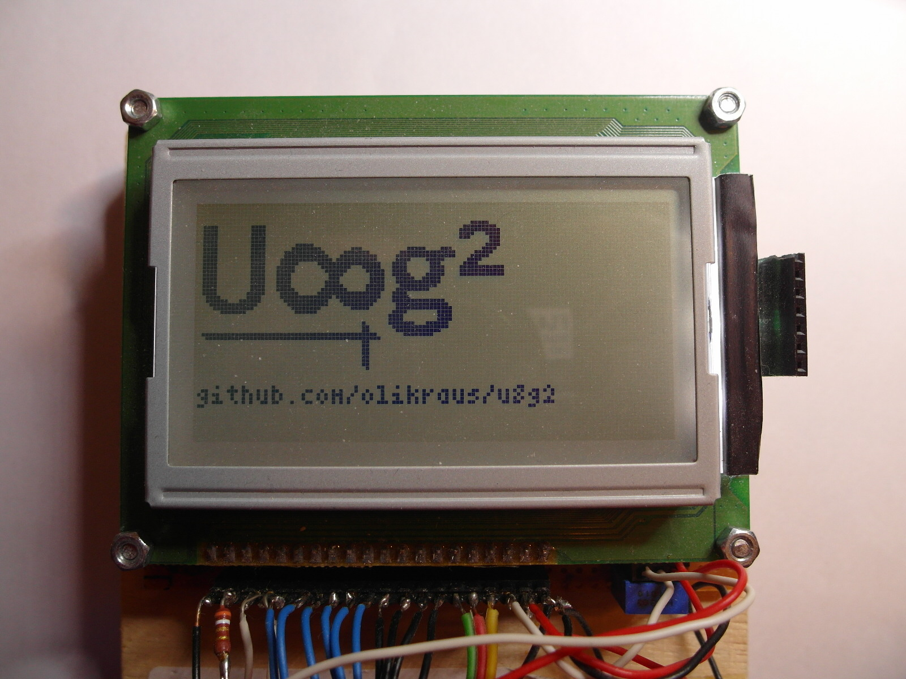

There are more faster Arduino libs for KS0108 LCDs, but due to some user requests, I also
ported the KS0108 driver from U8glib. When porting from U8glib, please note that the U8g2 constructur does not include the R/W pin 
any more. Connect the R/W pin to ground either directly or via digitalWrite().

```
U8G2_KS0108_128X64_1 u8g2(U8G2_R0, 8, 9, 10, 11, 4, 5, 6, 7, /*enable=*/ 18, /*dc=*/ 17, /*cs0=*/ 14, /*cs1=*/ 15, /*cs2=*/ U8X8_PIN_NONE, /* reset=*/  U8X8_PIN_NONE); 	// Set R/W to low!
```


# 26 Nov 2016: ST7920 128x64 LCD in 8080 parallel mode

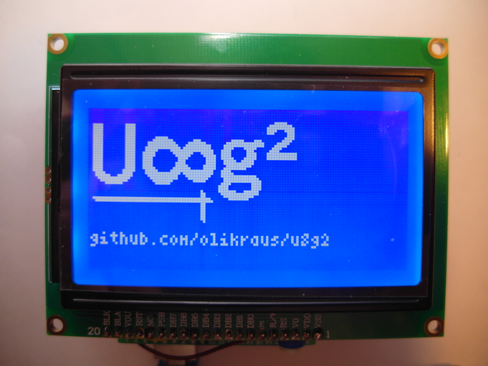

I did some more testing and speed improvements for the ST7920. 
 * If configured as parallel mode (PSB pin set to high), then the ST7920 will 
only work in u8g2 8080 mode. 
 * It is required to connect 
the "RW (SID)" to ground: U8g2 will only write, but not read from the ST7920 
display. 
 * There is no "chip select" in parallel mode of the ST7920, so the corresponding 
pin has to be configured as `U8X8_PIN_NONE` in U8g2.
 * The DC (data command) pin is called RS (register select) in the documentation for the ST7920.


```
U8G2_ST7920_128X64_1_8080 u8g2(U8G2_R0, 8, 9, 10, 11, 4, 5, 6, 7, /*enable=*/ 18 /* A4 */, /*cs=*/ U8X8_PIN_NONE, /*dc/rs=*/ 17 /* A3 */, /*reset=*/ 15 /* A1 */);	// Remember to set R/W to 0 
```


# 22 Nov 2016: UC1608 240x64 LCD

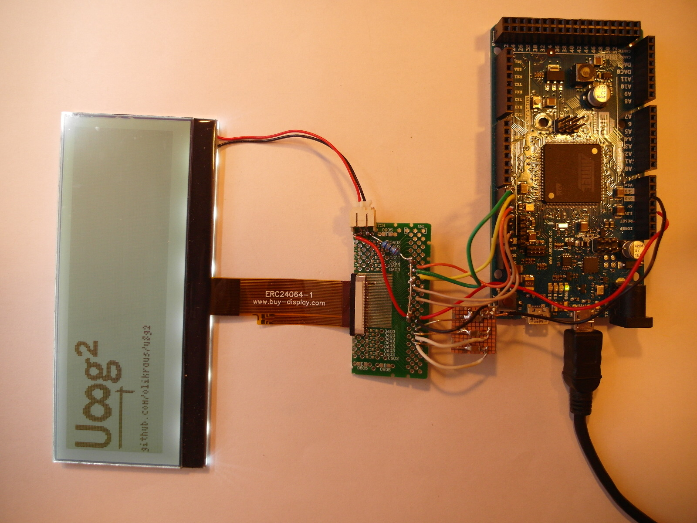

U8g2 (v2.7.1): This is my old ERC24064 (UC1608) test setup. Also ported to u8g2.
```
U8G2_UC1608_ERC24064_1_4W_SW_SPI u8g2(U8G2_R0, /* clock=*/ 13, /* data=*/ 11, /* cs=*/ 10, /* dc=*/ 9, /* reset=*/ 8);  // SW SPI, Due ERC24064-1 Test Setup
```

# 20 Nov 2016: SSD1306 64x48 OLED (EastRising 0.66")

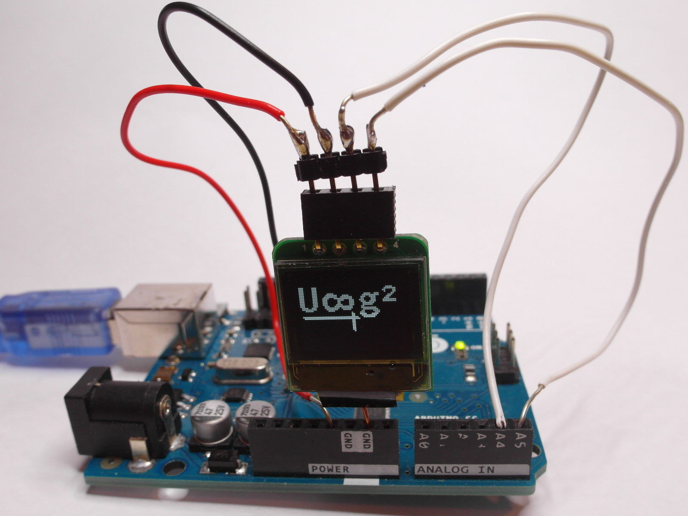

U8g2 (v2.7.0): This is the port of the 64x48 0.66" OLED from U8glib.
```
U8G2_SSD1306_64X48_ER_1_HW_I2C u8g2(U8G2_R0, /* reset=*/ U8X8_PIN_NONE);
```

# 13 Nov 2016: UC1611 (EA DOGXL240 Display)

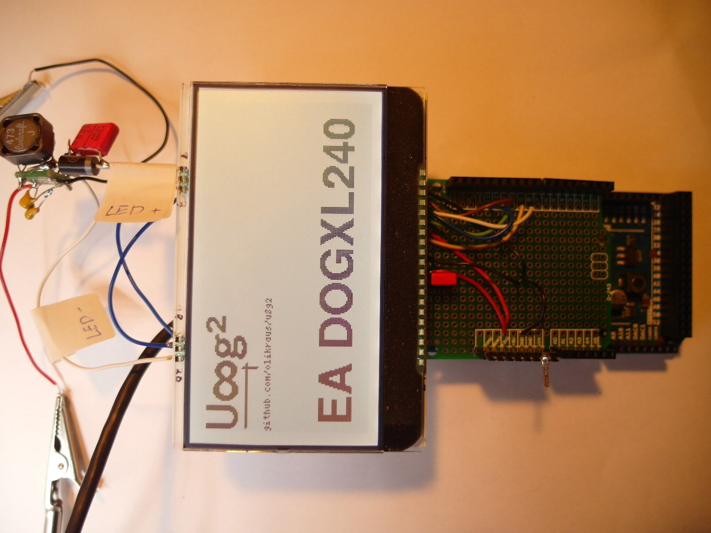

Today I finished code for the UC1611 controller and tested everything with a 240x128 display. Constructor is this:
```
U8G2_UC1611_EA_DOGXL240_1_4W_SW_SPI u8g2(U8G2_R0, /* clock=*/ 13, /* data=*/ 11, /* cs=*/ 10, /* dc=*/ 9, /* reset=*/ 8);

```
Thanks to [Electronic Assembly](http://www.lcd-module.com/) for supporting this project. 

# 6 Nov 2016: SSD1306 Mirror Option

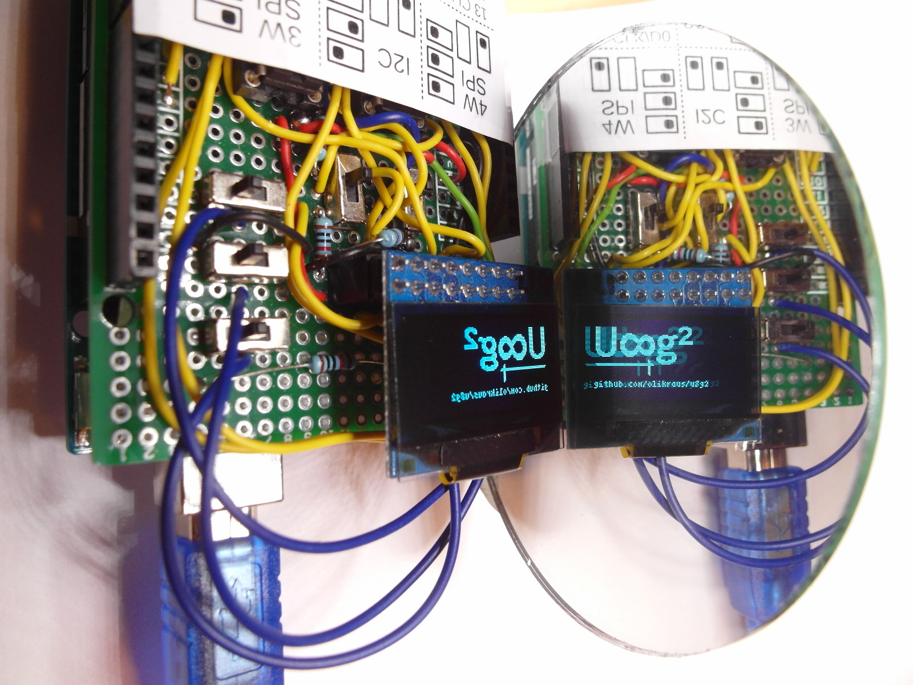

Version 2.6.x will have a mirror option (u8g2 library only). Instead of the rotation, apply U8G2_MIRROR as first option to the constructor (see below). 
Rotation by 180 degree is still possible with the hardware flip function.

```
U8G2_SSD1306_128X64_NONAME_1_4W_SW_SPI u8g2(U8G2_MIRROR, /* clock=*/ 13, /* data=*/ 11, /* cs=*/ 10, /* dc=*/ 9, /* reset=*/ 8);

```

# 15 Oct 2016: UC1610 160x104 DOGXL160

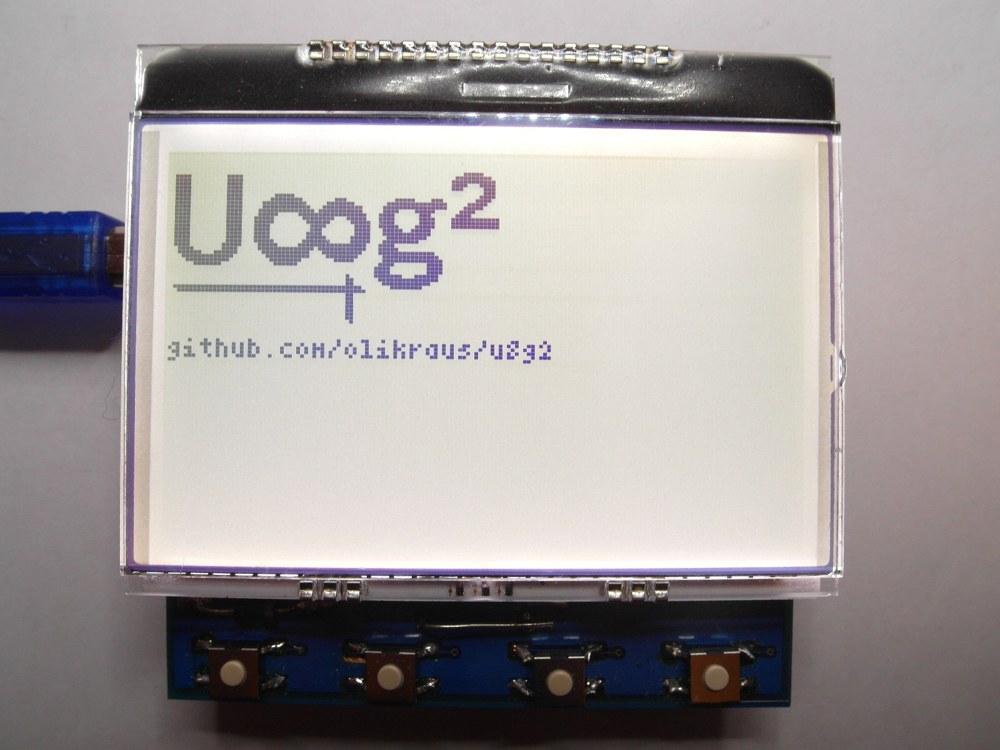

This is my old DOGXL160 test environment. I rewrote the
old u8glib code to support U8x8 and flip modes. 
Graylevels are not supported (U8g2 only knows black and white).

```
U8G2_UC1610_EA_DOGXL160_1_4W_SW_SPI u8g2(U8G2_R0, /* clock=*/ 13, /* data=*/ 11, /* cs=*/ 10, /* dc=*/ 9, /* reset=*/  U8X8_PIN_NONE);

```


# 2 Oct 2016: SSD1322 256x64 NHD Display

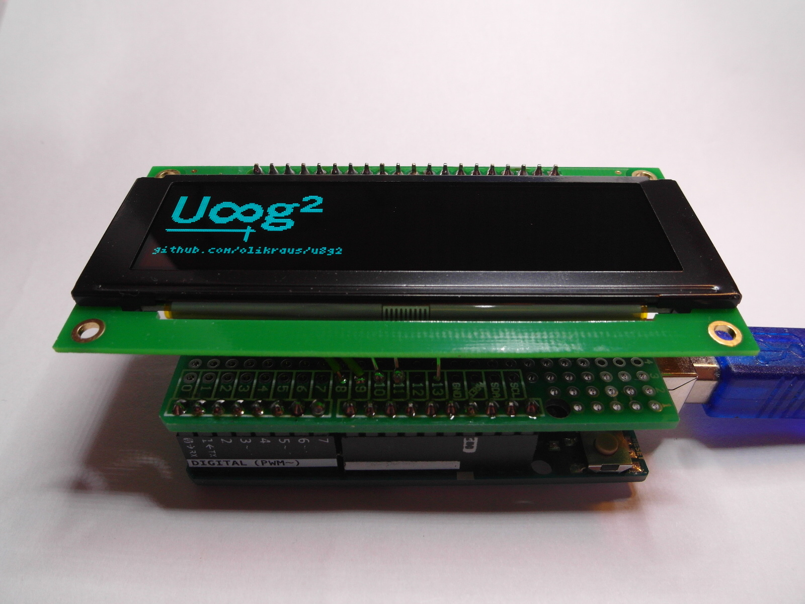

There was never a test board for the SSD1322 controller and u8glib v1.
Finally, I found some
time to create a proper test board for u8g2.  
Display is a 256x64 blue OLED from NHD.
Please turn on 16 bit mode for u8g2 by uncommenting U8G2_16BIT in u8g2.h. 
Because of the width of this display, 8 bit mode will not be sufficient.

```
U8G2_SSD1322_NHD_256X64_1_4W_SW_SPI u8g2(U8G2_R0, /* clock=*/ 13, /* data=*/ 11, /* cs=*/ 10, /* dc=*/ 9, /* reset=*/ 8);	
```

# 2 Oct 2016: SSD1325 128x64 NHD Display

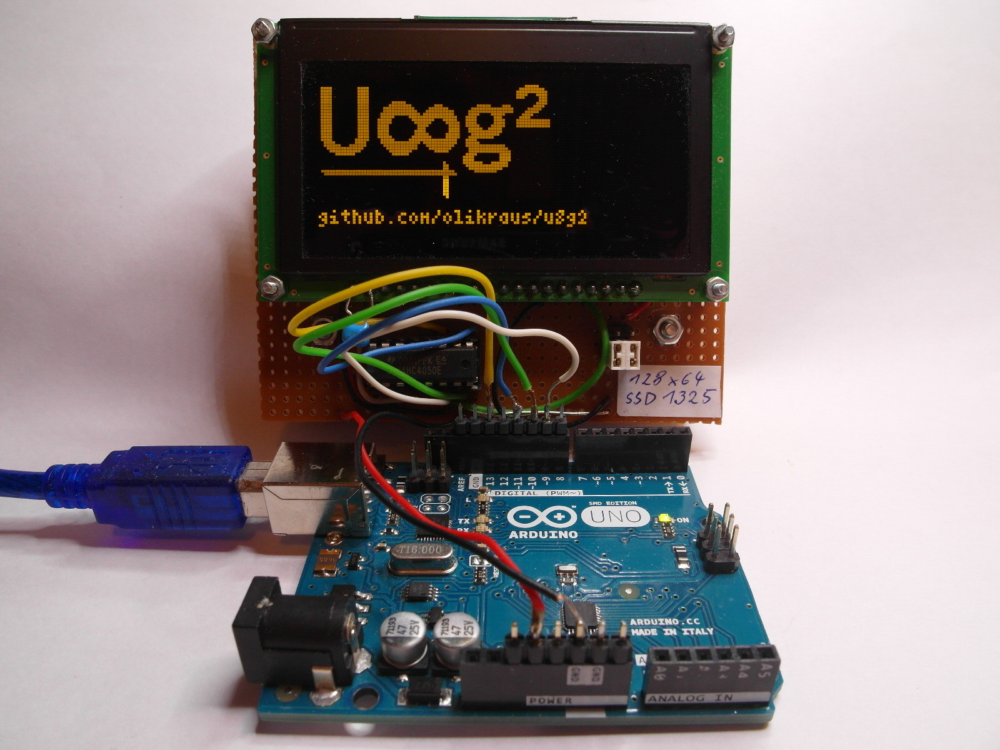

SSD1325 support has been ported to u8g2. This picture shows the existing old test board 
for U8glib.

```
U8G2_SSD1325_NHD_128X64_1_4W_SW_SPI u8g2(U8G2_R0, /* clock=*/ 13, /* data=*/ 11, /* cs=*/ 10, /* dc=*/ 9, /* reset=*/ 8);
```


# 24 Sep 2016: RA8835 240x128 NHD Display

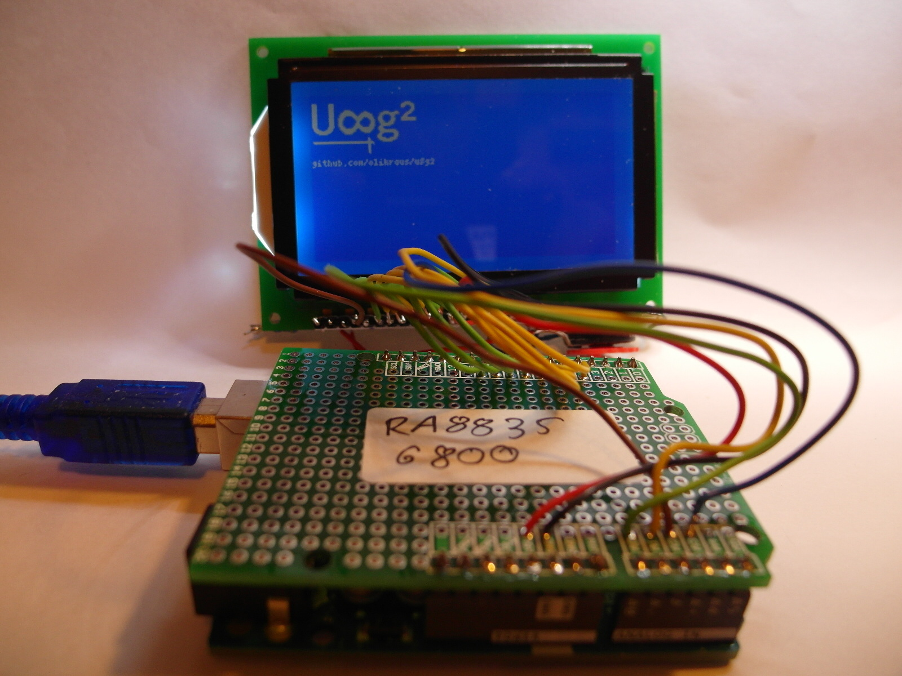

I recently ordered this NHD display from [Luna Displays](http://www.luna-displays.de/Graphic/240x128-Pixels/LCD-Graphic-Display-240-x-128-Pixels-93-0-x-65-0-mm-display.html).
The actual contrast is much better than on the picture. Some small flicker
may happen during write operation to the display memory (this is a RA8835 problem
I guess).

```
U8G2_RA8835_NHD_240X128_1_6800 u8g2(U8G2_R0, 8, 9, 10, 11, 4, 5, 6, 7,  /*enable=*/ 17, /*cs=*/ 14, /*dc=*/ 15, /*reset=*/ 16); // A0 is dc pin, /WR = RW = GND, enable is /RD = E
```


# 20 Aug 2016: SH1106 display

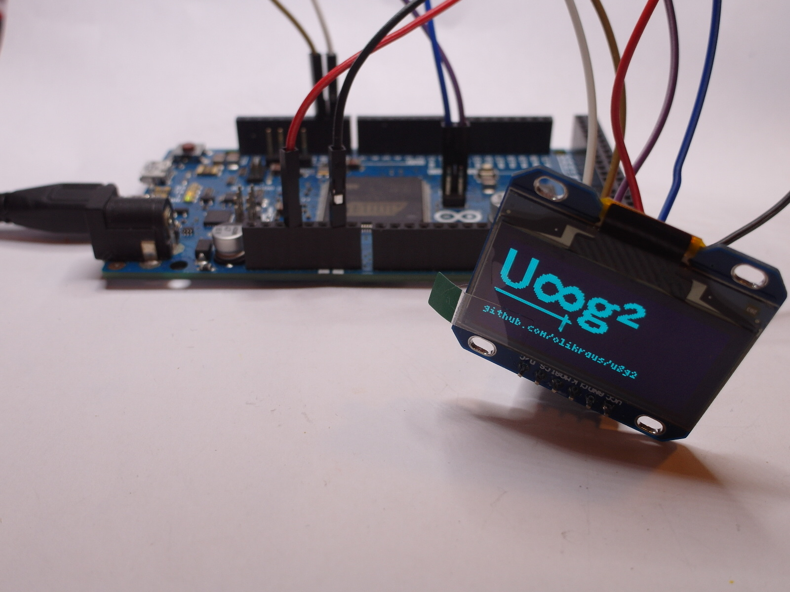

SH1106 display tested with HW SPI and an Arduino Due board.

```
U8G2_SH1106_128X64_NONAME_1_4W_HW_SPI u8g2(U8G2_R0, /* cs=*/ 10, /* dc=*/ 9, /* reset=*/ 8);
```

# 27 Jul 2016: A2 Micro Panel Thermal Printer

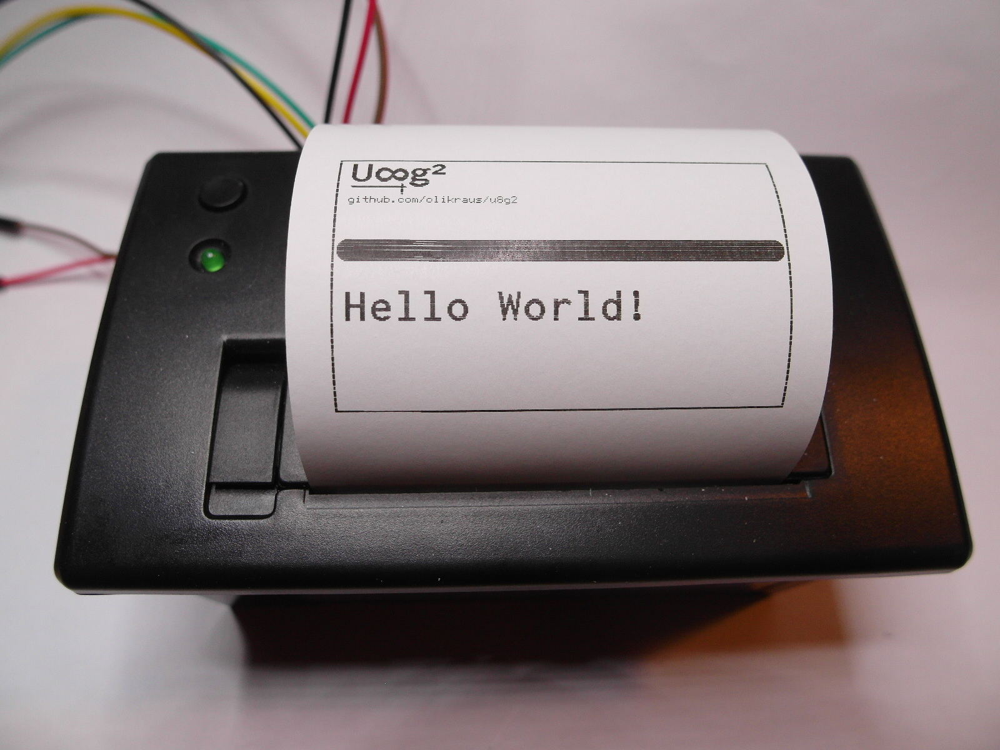

Today I finished the port of the A2 Micro Panel Thermal Printer (RS232 serial interface). Printing is optimized for low peak power consumption, it includes dynamic timing depending on the black level of the content and simulates a 384x240 display.
The setup differs a little bit from the other displays.
```
class U8G2 u8g2;
void setup(void) {

  u8g2_Setup_a2printer_384x240_1(		/* several different a2 printer procs exist... */
    u8g2.getU8g2(), 						/* this is a c call, so use the u8g2 struct instead of the class */
    U8G2_R0, 							/* this defines the usual rotation of the bitmap */
    u8x8_byte_arduino_serial, 				/* this is the new procedure from above */
    u8x8_gpio_and_delay_arduino);			/* standard arduino low level proc, used only for delay */
  u8g2.beginSimple();				/* Do not clear the display, wake is not required */  
}
```
Additionally the function `u8x8_byte_arduino_serial` has to be implemented (see the A2 Printer example).
Also remember to activate U8g2 16 Bit mode (`U8G2_16BIT`) in `u8g2.h`.


# 16 Jul 2016: T6963 240x128 LCD

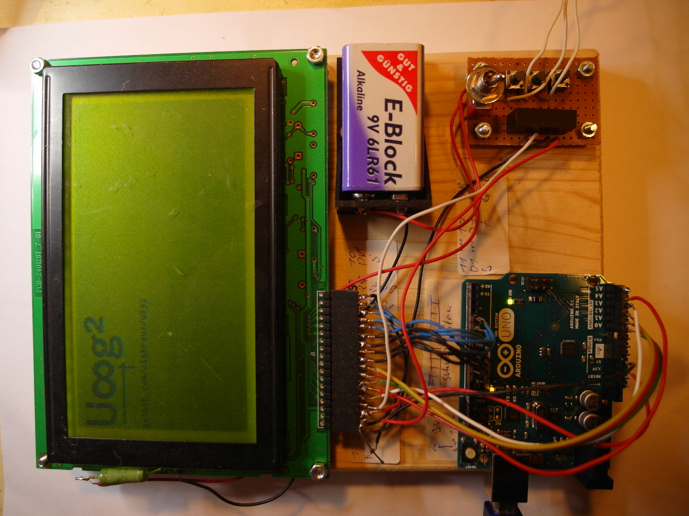

I reactivated my old T6963 for testing with u8g2. The black box at the 
upper right is the negative voltage generater. The 9V battery is used for
the backlight LED.

```
U8G2_T6963_240X128_1_8080 u8g2(U8G2_R0, 8, 9, 10, 11, 4, 5, 6, 7, /*enable=*/ 17, /*cs=*/ 14, /*dc=*/ 15, /*reset=*/ 16); // Connect RD with +5V, FS0 and FS1 with GND
```


# 25 Jun 2016: ST7920 128x64 LCD

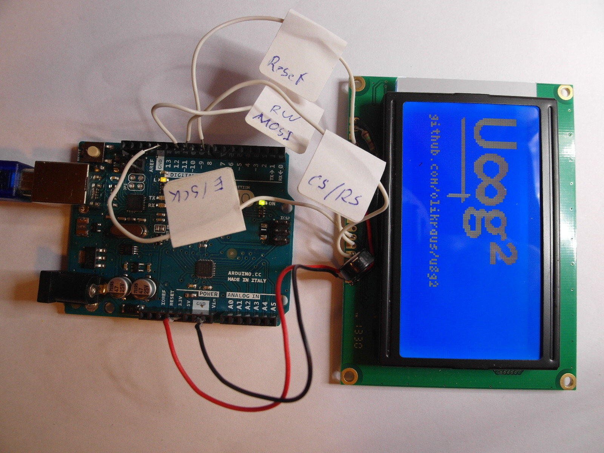

This is one of the common ST7920 based LCDs. 

```
U8G2_ST7920_128X64_1_SW_SPI u8g2(U8G2_R0, /* clock=*/ 13, /* data=*/ 11, /* CS=*/ 10, /* reset=*/ 8);
```

# 23 Jun 2016: LD7032 60x32 OLED

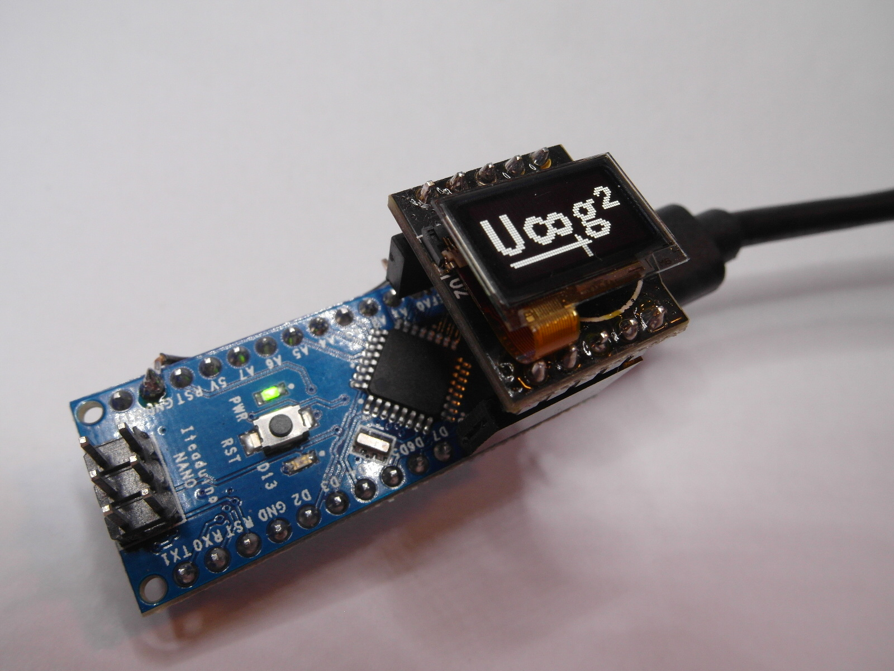

A very small OLED with the LD7032 controller. Unfortunately, u8x8 API is not
supported, but the normal u8g2 procedures work fine.

```
U8G2_LD7032_60X32_1_4W_SW_SPI u8g2(U8G2_R0, /* clock=*/ 11, /* data=*/ 12, /* cs=*/ 9, /* dc=*/ 10, /* reset=*/ 8);	// SW SPI Nano Board
```


# 23 Jun 2016: Arduboy (SSD1306 controller)

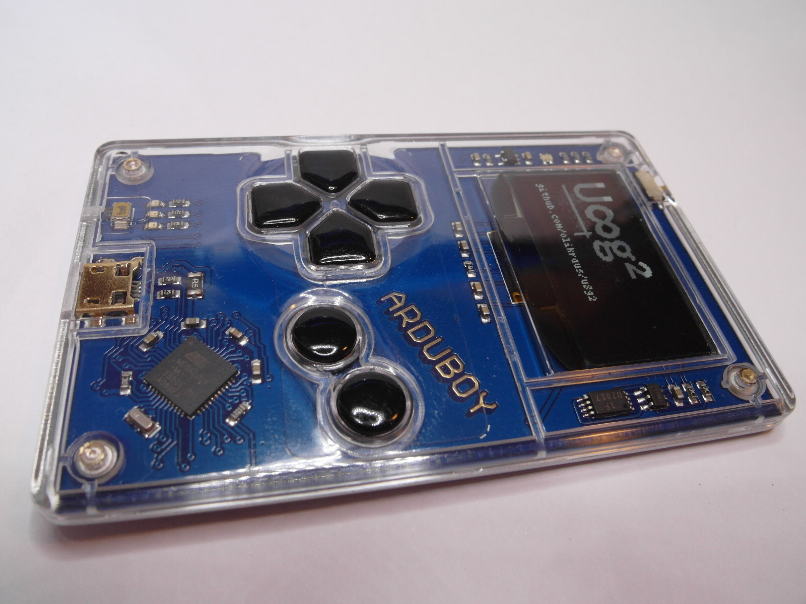

I finally received my own Arduboy. Of course I ported U8g2 to the Arduboy environment.
There is also a special edition of "Little Rook Chess" included in the examples:
Buttons and display of the Arduboy are supported.

This is the Arduboy 1.0 (Kickstarter Edition) constructor for U8g2:
```
U8G2_SSD1306_128X64_NONAME_1_4W_HW_SPI u8g2(U8G2_R0, /* cs=*/ 12, /* dc=*/ 4, /* reset=*/ 6);	// Arduboy (Production, Kickstarter Edition)
```

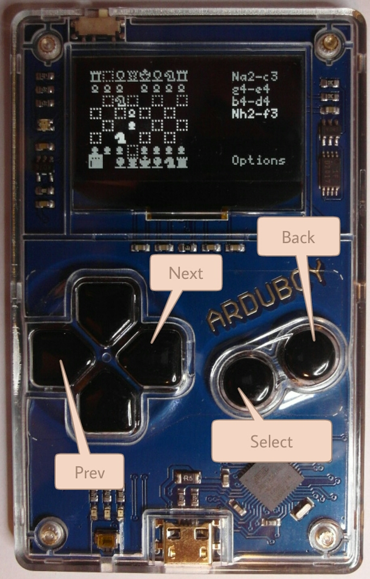


# 3 Dec 2015: DOGS102 (UC1701 controller)

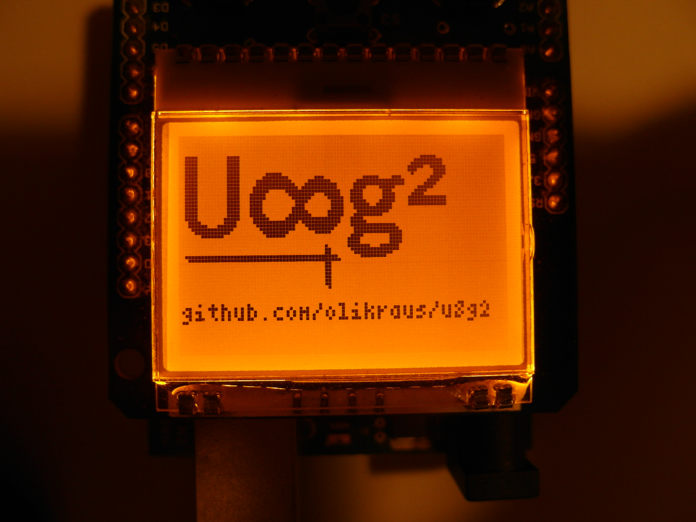

A picture of the EA DOGS102 display with UC1701 controller. Probably one of my
oldest displays in my lab. 


# 3 Dec 2015: SSD1306 Test board

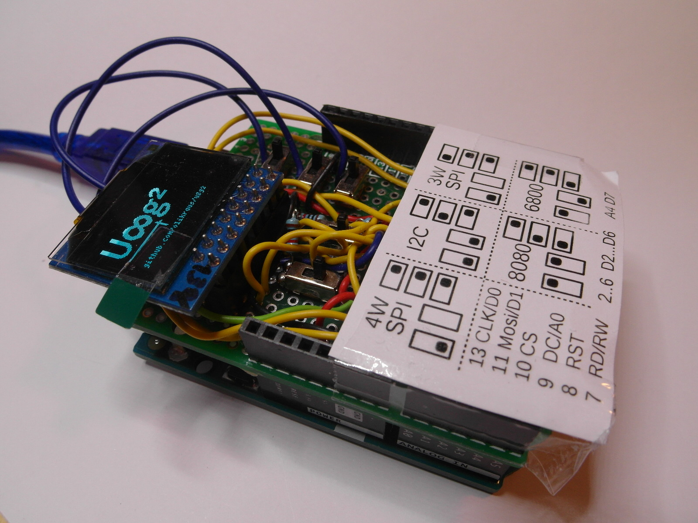

First picture of U8g2 library on a real display. The board is my test board
for the different communication protocols. The display module is modified (blue wires), 
so that I can use the switches to activate the different protocols.

