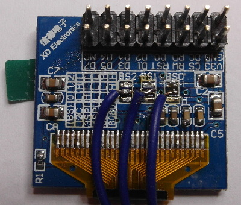
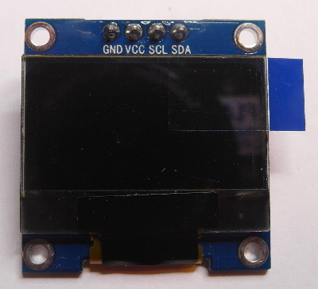
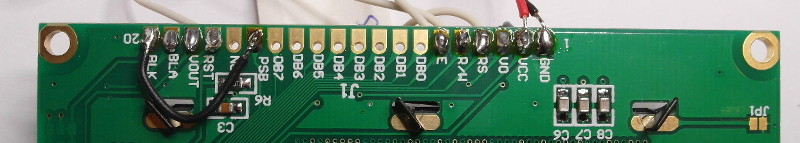

[tocstart]: # (toc start)

  * [How to connect a display to U8g2 Library?](#how-to-connect-a-display-to-u8g2-library)
    * [Identify the display](#identify-the-display)
    * [Select a physical bus](#select-a-physical-bus)
    * [Identify digital lines](#identify-digital-lines)
    * [U8g2 initialization](#u8g2-initialization)
  * [U8g2 full buffer,  page buffer and u8x8 mode](#u8g2-full-buffer--page-buffer-and-u8x8-mode)
    * [Full screen buffer mode](#full-screen-buffer-mode)
    * [Page buffer mode (Picture Loop)](#page-buffer-mode-picture-loop)
    * [U8x8 character mode](#u8x8-character-mode)

[tocend]: # (toc end)

# How to connect a display to U8g2 Library?

## Identify the display

You need to know the controller and the size of your display (Note: "Controllerless"
displays are not supported by U8g2).
In this example, we will use a ST7920 128x64 display. It has a ST7920 controller 
with a 128x64 LCD .

For U8g2 you have to select a matching constructor for the correct initialization of
the display. Select a constructor from this page: 
[C++ Setup/Arduino Constructor List](u8g2setupcpp)

Often the constructor is also mentioned in the examples. But you may need to 
uncomment the matching constructor.

For this example, locate the [ST7920 128x64 section](u8g2setupcpp#st7920-128x64).

## Select a physical bus

Graphics information has to be sent to the display. This information is received by
the display controller through a physical bus (usually two or more data lines),  
a communication protocol and a command sequence. Often a display supports more 
than one physical bus. You have to select and setup the correct bus.

The physical bus is selected by connecting special pins to GND (Low) or +5V (High).
This SSD1306 oled, the PCB has several solder pads (labeled as BS0, BS1 and BS2)
to setup the physical bus:



A small table on the left side gives hints about what setting will setup which bus.
Typically the busses are:
 * 3SPI, 3-wire SPI: Serial Peripheral Interface with three signals: Clock, Data and Chip-Select.
 * 4SPI, 4-Wire SPI: Same as 3SPI, but with one additional line for commands and data (often labeled as D/C, RS or A0)
 * I2C, IIC or TWI:  Inter-Integrated Circuit Bus which has two signals: Clock (SCL) and Data (SDA).
 * 8080: A 8-Bit bus which requires 8 data lines, chip select and a write strobe signal.
 * 6800: Another 8-Bit bus, but with a different protocol.

At this point of time, it is often a good idea to read the datasheet of the display 
controller or the manual for your display for instruction on how to setup a specific
bus.

Sometimes the bus is just fixed and can not be changed. For this oled with 
SSD1306 controller nothing can be changed:


 
The type of the bus can be guessed from the number of pins and their lables. In
this case, it seems to be a I2C bus because of the SCL and SDA lables.

For our initial example the PCB looks like this:



According to the ST7920 datasheet, the PSB pin selects between the 8-Bit and the
serial (SPI) bus. For the serial bus, pin "RS" is "Chip-Select", pin "E" will 
be the clock input and  pin "RW" acts as data line. 

Note: In the picture, PSB is connected to BLK, which in turn is connected to GND. 
This will select the serial bus for the ST7920 display.

## Identify digital lines

The display must be connected to the Arduino board in order to transfer
data from the Arduino board to the display. Depending on the selected
physical bus, several pins have to be connected to the outputs of the 
Arduino board.

In general, U8g2 can use any outputs of your Arduino Board. 
So it does not matter which output pin is used (However it might be clever
to select specific pins for hardware accelerated bus communication). 

My suggestion is to write down the wiring. Here is the example for the ST7920 display.

| Display Pin | Arduino Pin Number |
| :----- | :----- | 
| E, Clock | 13 |
| RW, Data, MOSI | 11 |
| RS, Chip Select | 10 |
| RST, Reset | 8 |

Note: RS (as labled on the PCB) actually means "Register Select", however for SPI mode the RS pin becomes "Chip Select". 


Remember to connect PSB pin with GND. Also apply correct voltage to the V0 input 
for this type of display (see datasheet).

## U8g2 initialization

U8g2 needs to know which output pin is connected to which input of the display:
The pin numbers are provided as list of arguments to the U8g2 constructor.
The position within the list is important and indicates the function/purpose
of the pin.

From the table  [here](u8g2setupcpp#st7920-128x64), the constructor
has the following template (with `u8g2` as object name):

```
U8G2_ST7920_128X64_1_SW_SPI u8g2(rotation, clock, data, cs [, reset])
```

After something which is called "rotation", the constructor expects the pin number
for the clock line, the data line and the chip select line (cs). The reset
line can be provided optionally.

The examples include similar constructor calls. You can uncomment one of them
and update the pin numbers, if required:

```
U8G2_ST7920_128X64_1_SW_SPI u8g2(U8G2_R0, 13, 11, 10, 8);
```


A complete example will look like this:


```
#include <Arduino.h>
#include <U8g2lib.h>
#include <SPI.h>
#include <Wire.h>

U8G2_ST7920_128X64_1_SW_SPI u8g2(U8G2_R0, 13, 11, 10, 8);

void setup(void) {
  u8g2.begin();
}

void loop(void) {
  u8g2.firstPage();
  do {
    u8g2.setFont(u8g2_font_ncenB14_tr);
    u8g2.drawStr(0,24,"Hello World!");
  } while ( u8g2.nextPage() );
}
```


# U8g2 full buffer,  page buffer and u8x8 mode

U8g2 supports three different drawing modes:
 * Full screen buffer mode
 * Page mode (This is the U8glib picture loop)
 * U8x8, character only mode
 
## Full screen buffer mode

### Pros and Cons
 * Fast
 * All graphics procedures can be used
 * Requires a lot of RAM
 
### Setup
Use the U8g2 constructor from [here](u8g2setupcpp). The constructor
must include the "F" character. For example:

`U8G2_ST7920_128X64_` **F**  `_SW_SPI(rotation, clock, data, cs [, reset])`

### Usage
 1. Clear the buffer with [u8g2.clearBuffer()](u8g2reference#clearbuffer).
 2. Draw something with the usual draw commands.
 3. Send the buffer to the display with [u8g2.sendBuffer()](u8g2reference#sendbuffer).

### Example
```
void setup(void) {
  u8g2.begin();
}

void loop(void) {
  u8g2.clearBuffer();
  u8g2.setFont(u8g2_font_ncenB14_tr);
  u8g2.drawStr(0,20,"Hello World!");
  u8g2.sendBuffer();
}
```
## Page buffer mode (Picture Loop)

### Pros and Cons
 * All graphics procedures can be used
 * Only a little bit of RAM is required
 * Slow
 
### Setup
Use the U8g2 constructor from [here](u8g2setupcpp). The constructor
must include the "1" or "2" character. For example:

`U8G2_ST7920_128X64_` **1**  `_SW_SPI(rotation, clock, data, cs [, reset])`
 
### Usage
 1. Call [u8g2.firstPage()](u8g2reference#firstPage).
 2. Start a do-while loop
 3. Inside the loop-body: Draw something with the usual draw commands.
 4. Loop as long as [u8g2.nextPage()](u8g2reference#nextPage) returns true.
 
Note: Always create the same picture inside the
loop body.  See details [here](https://github.com/olikraus/u8glib/wiki/tpictureloop).

 
### Example
```
void setup(void) {
  u8g2.begin();
}

void loop(void) {
  u8g2.firstPage();
  do {
    u8g2.setFont(u8g2_font_ncenB14_tr);
    u8g2.drawStr(0,24,"Hello World!");
  } while ( u8g2.nextPage() );
}
```

## U8x8 character mode

### Pros and Cons
 * Fast
 * No RAM required
 * No graphics possible
 * Not available for all displays
 
### Setup
Use the U8x8 constructor from [here](u8x8setupcpp). For example:

`U8X8_ST7565_EA_DOGM128_4W_SW_SPI u8x8(clock, data, cs, dc [, reset])`
 
### Usage
All draw commands directly write to the display.

### Example
```
void setup(void) {
  u8x8.begin();
}

void loop(void) {
  u8x8.setFont(u8x8_font_chroma48medium8_r);
  u8x8.drawString(0,1,"Hello World!");
}
```


