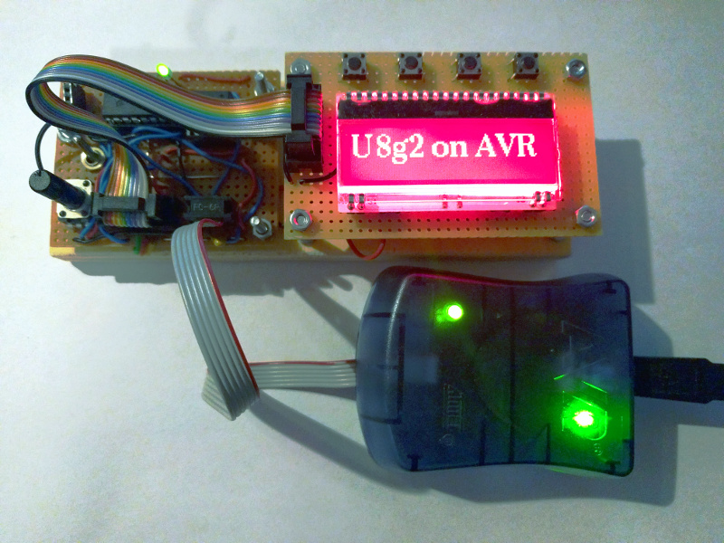

[tocstart]: # (toc start)

  * [U8g2 Install Instructions for Atmel Studio 7](#u8g2-install-instructions-for-atmel-studio-7)
    * [Open Atmel Studio 7](#open-atmel-studio-7)
    * [Create Solution](#create-solution)
    * [Select Target Device](#select-target-device)
    * [Assign main.c](#assign-mainc)
    * [Open Project Properties](#open-project-properties)
    * [Add Existing Item](#add-existing-item)
    * [Add U8g2 ](#add-u8g2-)
    * [Add Include Path](#add-include-path)
    * [Add Clock Speed](#add-clock-speed)
    * [Build](#build)
    * [AVR mkII ](#avr-mkii-)
    * [Open Programming Tool](#open-programming-tool)
    * [Prepare Download](#prepare-download)
    * [Execute Download](#execute-download)
    * [Result](#result)

[tocend]: # (toc end)

# U8g2 Install Instructions for Atmel Studio 7

This is a step by step instruction for use of U8g2 with Atmel Studio 7.

## Open Atmel Studio 7

## Create Solution
* Create a new gcc c executable project
* Enter a project "Name" 
* Enter a "Solution Name"

## Select Target Device

## Assign main.c

A template main.c will be created as part of the new solution.
Replace the content of this main.c with the content from here:

https://github.com/olikraus/u8g2/blob/master/sys/avr/as7/main.c

This example code is valid for a SPI display and will implement 
software emulated SPI.

* Change the pin numbers according to your project
* Change the setup procedure according to your display (select from here https://github.com/olikraus/u8g2/wiki/u8g2setupc)

## Open Project Properties

Menu "Project", Submenu "u8g2_test Properties"

## Add Existing Item

Menu "Project", Submenu "Add Existing Item..."

## Add U8g2 
* Download the u8g2 master zip file: https://github.com/olikraus/u8g2/archive/master.zip
* Unzip this file and locate the "csrc" folder
* Mark all files in "csrc" folder
* Add the selected items (press "Add")

## Add Include Path
1. Select the project
2. Locate Toolchain tab
3. Select "All Configurations"
4. Select AVR/GNU C Compiler/Directories
5. Press the green plus icon
6. Add ".." as relative include path
7. Press "OK".

## Add Clock Speed
1. Select the project
2. Locate Toolchain tab
3. Select "All Configurations"
4. Select AVR/GNU C Compiler/Symbols
5. Press the green plus icon
6. Add the target frequency of your controller (here: "F_CPU=8000000")
7. Press "OK".

## Build

Build the complete project: Menu "Build", Submenu "Build Solution"

## AVR mkII 

On my own Windows 10 environment, it was required to install a different usb driver for the AVRISP mkII.
Download Zadig from here: https://zadig.akeo.ie

## Open Programming Tool

Open the Device Programming dialog from the "Tools" menu.

## Prepare Download

1. Select your ISP tool in under "Tool". 
2. Select the correct target device and interface. Press "Apply" button.
3. Read the device signature from your target controller by pressing the "Read" button.
4. Goto "Production file" tab and select the generated .elf file as a "production file"

## Execute Download

Check the "Flash" checkbox and press the "Program" button.

## Result

