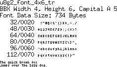

[tocstart]: # (toc start)

  * [RAM Optimization](#ram-optimization)
  * [Flash Memory Optimization](#flash-memory-optimization)
    * [Font Optimization](#font-optimization)
    * [U8g2 Feature Selection](#u8g2-feature-selection)

[tocend]: # (toc end)

# RAM Optimization

On AVR systems, use the Arduino `F()` macro. U8g2 supports the Arduino `print`
function, which accepts the `F()` macro.

A simple example for the `F()` macro is available as an example:

[https://github.com/olikraus/u8g2/blob/master/sys/arduino/u8g2_page_buffer/PrintHelloWorld/PrintHelloWorld.ino](https://github.com/olikraus/u8g2/blob/master/sys/arduino/u8g2_page_buffer/PrintHelloWorld/PrintHelloWorld.ino)

A more complex example is here:

[https://github.com/olikraus/u8g2/blob/master/sys/arduino/u8g2_page_buffer/PrintProgmem/PrintProgmem.ino](https://github.com/olikraus/u8g2/blob/master/sys/arduino/u8g2_page_buffer/PrintProgmem/PrintProgmem.ino)

# Flash Memory Optimization

## Font Optimization

Usually U8g2 fonts are available in different sizes (number of glyphs included in the
font). The last letter of the font name indicates the character set (and the size)
of the fonts.

| Font Name  | Character Set |
|-------------|-----------|
| u8g2_xxx_xe | Extended: Glyphs with unicode 32 to 701 are included in the font (v2.16.x will also include big ß) |
| u8g2_xxx_xf | Full: Glyphs with unicode 32 to 255 are included in the font |
| u8g2_xxx_xr | Restricted: Only characters from 32 to 127 are included  |
| u8g2_xxx_xu | Uppercase: Numbers and uppercase letters |
| u8g2_xxx_xn | Numbers and some extra glyphs for date and time printing are included |
| u8g2_xxx_x_something | Special selection of glyphs. See the font picture for details. |

For example if only a number needs to be displayed with a font,
then the font should contain only numbers. In such a case, it is better to
select a `n` font to avoid the allocation of unneeded chars in the flash memory.

Each font picture also includes the number of bytes, occupied by the font in 
flash memory (upper part of the picture, third line):

These pictures are available on the [font group](fntgrp) pages for each font.

If there is no proper set, you can always create your own custom font with
exactly those characters, which are required for your 
project (see [FAQ](https://github.com/olikraus/u8g2/blob/master/doc/faq.txt))

See also: [setFont](u8g2reference#setfont)

## U8g2 Feature Selection

U8g2 includes many features and includes several speed optimization procedures.
Sometimes speed is not critical or some features are not required. In those
cases, the user can disable such features in [`u8g2.h`](https://github.com/olikraus/u8g2/blob/master/csrc/u8g2.h):

Search for `u8g2.h` on your local drive.
For the Arduino Environment, `u8g2.h` should be in the subfolder
`libraries/U8g2_Arduino/src/clib` of your Arduino custom library folder.

The location of this custom library folder might be different on operating system and Arduino IDE.
It might be `C:\Users\<name>\AppData\Local\Arduino15\` on Windows OS or 
`~/Arduino/Libraries` for Unix based systems.
Some other pathes are mentioned [on the Arduino library hacking page](https://www.arduino.cc/en/hacking/libraries).

All features names start with `U8G2_WITH_`. A feature is enabled with a `#define` of
the feature name. It is disabled if the `#define` is put into comments.

| Feature Name  | Description |
|-------------|-----------|
| `U8G2_WITH_HVLINE_SPEED_OPTIMIZATION` | Enables speed optimation for pixel buffer writes. |
| `U8G2_WITH_INTERSECTION` | Enables speed optimation by early intersection tests for high level graphics primitives. |
| `U8G2_WITH_CLIP_WINDOW_SUPPORT` | Enables support for a custom clip window. If disabled, clipping will happen only against the display boundaries. |
| `U8G2_WITH_FONT_ROTATION` | Enables string output to all four directions. If disabled, strings can be written only from left to right. |
| `U8G2_WITH_UNICODE` | Enables support for Unicode Basic Multilingual Plane. |

By default all the above features are enabled. The following table gives an idea on the
flash memory reduction, if one or more features are disabled:

| Flash | Reduction | Disabled Feature |
|----------|----------------|-------------|
|   8732	|    				|	default, all features active |
|   8500	|   	    -2.65%	|	no `U8G2_WITH_CLIP_WINDOW_SUPPORT` |
|   8316	|   	    -4.76%	|	no `U8G2_WITH_FONT_ROTATION` |
|   8606	|   -1.44%	 |	no `U8G2_WITH_UNICODE` |
|   8692	|   -0.45%	|	no `U8G2_WITH_INTERSECTION` |
|   8328	|       -4.62%	 | 	no `U8G2_WITH_INTERSECTION`  no `U8G2_WITH_CLIP_WINDOW_SUPPORT` |
|   8718	|   -4.86%	|	no `U8G2_WITH_HVLINE_SPEED_OPTIMIZATION` |
|   8026	|       -8.08%	|	no `U8G2_WITH_FONT_ROTATION`   no `U8G2_WITH_INTERSECTION`  no `U8G2_WITH_CLIP_WINDOW_SUPPORT` |

Numbers are derived from:
 * Arduino 1.84, U8g2 2.23, Arduino Uno
 * U8G2_SSD1306_128X64_NONAME_1_4W_HW_SPI

