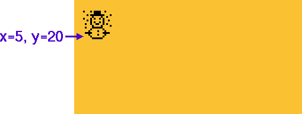
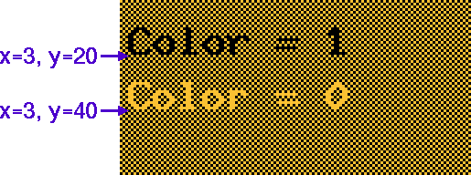
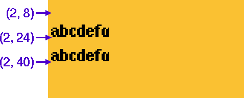

[tocstart]: # (toc start)

  * [C++/Arduino Example](#carduino-example)
  * [Reference](#reference)
    * [begin](#begin)
    * [clear](#clear)
    * [clearBuffer](#clearbuffer)
    * [clearDisplay](#cleardisplay)
    * [disableUTF8Print](#disableutf8print)
    * [drawBitmap](#drawbitmap)
    * [drawBox](#drawbox)
    * [drawCircle](#drawcircle)
    * [drawDisc](#drawdisc)
    * [drawEllipse](#drawellipse)
    * [drawFilledEllipse](#drawfilledellipse)
    * [drawFrame](#drawframe)
    * [drawGlyph](#drawglyph)
    * [drawHLine](#drawhline)
    * [drawLine](#drawline)
    * [drawPixel](#drawpixel)
    * [drawRBox](#drawrbox)
    * [drawRFrame](#drawrframe)
    * [drawStr](#drawstr)
    * [drawTriangle](#drawtriangle)
    * [drawUTF8](#drawutf8)
    * [drawVLine](#drawvline)
    * [drawXBM](#drawxbm)
    * [enableUTF8Print](#enableutf8print)
    * [firstPage](#firstpage)
    * [getAscent](#getascent)
    * [getDescent](#getdescent)
    * [getDisplayHeight](#getdisplayheight)
    * [getDisplayWidth](#getdisplaywidth)
    * [getMaxCharHeight](#getmaxcharheight)
    * [getMaxCharWidth](#getmaxcharwidth)
    * [getMenuEvent](#getmenuevent)
    * [getStrWidth](#getstrwidth)
    * [getUTF8Width](#getutf8width)
    * [home](#home)
    * [initDisplay](#initdisplay)
    * [nextPage](#nextpage)
    * [print](#print)
    * [sendBuffer](#sendbuffer)
    * [sendF](#sendf)
    * [setAutoPageClear](#setautopageclear)
    * [setBitmapMode](#setbitmapmode)
    * [setBusClock](#setbusclock)
    * [setClipWindow](#setclipwindow)
    * [setContrast](#setcontrast)
    * [setCursor](#setcursor)
    * [setDisplayRotation](#setdisplayrotation)
    * [setDrawColor](#setdrawcolor)
    * [setFlipMode](#setflipmode)
    * [setFont](#setfont)
    * [setFontDirection](#setfontdirection)
    * [setFontMode](#setfontmode)
    * [setFontPosBaseline](#setfontposbaseline)
    * [setFontPosBottom](#setfontposbottom)
    * [setFontPosTop](#setfontpostop)
    * [setFontPosCenter](#setfontposcenter)
    * [setFontRefHeightAll](#setfontrefheightall)
    * [setFontRefHeightExtendedText](#setfontrefheightextendedtext)
    * [setFontRefHeightText](#setfontrefheighttext)
    * [setI2CAddress](#seti2caddress)
    * [setMaxClipWindow](#setmaxclipwindow)
    * [setPowerSave](#setpowersave)
    * [updateDisplay](#updatedisplay)
    * [updateDisplayArea](#updatedisplayarea)
    * [userInterfaceInputValue](#userinterfaceinputvalue)
    * [userInterfaceMessage](#userinterfacemessage)
    * [userInterfaceSelectionList](#userinterfaceselectionlist)
    * [writeBufferPBM](#writebufferpbm)
    * [writeBufferPBM2](#writebufferpbm2)
    * [writeBufferXBM](#writebufferxbm)
    * [writeBufferXBM2](#writebufferxbm2)
  * [Direct Access Buffer API](#direct-access-buffer-api)
    * [Memory structure for controller with U8x8 support](#memory-structure-for-controller-with-u8x8-support)
    * [getBufferSize](#getbuffersize)
    * [setBufferPtr](#setbufferptr)
    * [getBufferPtr](#getbufferptr)
    * [getBufferTileHeight](#getbuffertileheight)
    * [getBufferTileWidth](#getbuffertilewidth)
    * [getBufferCurrTileRow](#getbuffercurrtilerow)
    * [setBufferCurrTileRow](#setbuffercurrtilerow)

[tocend]: # (toc end)

# C++/Arduino Example

```
#include <Arduino.h>
#include <SPI.h>
#include <U8g2lib.h>

U8G2_SSD1306_128X64_NONAME_1_4W_SW_SPI u8g2(U8G2_R0, /* clock=*/ 13, /* data=*/ 11, /* cs=*/ 10, /* dc=*/ 9, /* reset=*/ 8);

void setup(void) {
  u8g2.begin();
}

void loop(void) {
  u8g2.firstPage();
  do {
    u8g2.setFont(u8g2_font_ncenB14_tr);
    u8g2.drawStr(0,15,"Hello World!");
  } while ( u8g2.nextPage() );
  delay(1000);
}

```

The first argument of the constructor assignes the basic layout for the display:

| Layout | Description  |
|---|---|
| `U8G2_R0` | No rotation, landscape |
| `U8G2_R1` | 90 degree clockwise rotation |
| `U8G2_R2` | 180 degree clockwise rotation |
| `U8G2_R3` | 270 degree clockwise rotation |
| `U8G2_MIRROR` | No rotation, landscape, display content is mirrored (v2.6.x) |

All other arguments descibe the wiring of the display.


Available constructors are listed in the [setup guide](u8g2setupcpp).

Note: U8G2_MIRROR works together with [setFlipMode](u8g2reference#setflipmode).


# Reference

## begin
  * **C++/Arduino Prototype:**
```
bool U8G2::begin(void)
bool U8G2::begin(uint8_t menu_select_pin, uint8_t menu_next_pin, uint8_t menu_prev_pin, uint8_t menu_up_pin = U8X8_PIN_NONE, uint8_t menu_down_pin = U8X8_PIN_NONE, uint8_t menu_home_pin = U8X8_PIN_NONE)
 ```
  * **Description:** Simplified setup procedure of the display for the Arduino enviornment.
See the [setup guide](u8g2setupcpp) for the selection of a suitable U8g2 constructor.
This function will reset, configure, clear and disable power save mode of
the display. 
U8g2 can also detect key press events. Up to six buttons can be observed. The Arduino pin number 
can be assigned here. Use `U8X8_PIN_NONE` if there is no switch connected to the pin.
The switch has to connect the GPIO pin with GND (low active button). 
Use [getMenuEvent](u8g2reference#getmenuevent) to check for any key press event.
Select, next and prev pins are also required for the user interface procedures (for example 
[userInterfaceMessage](u8g2reference#userinterfacemessage) ). `begin` will call  
1. [initDisplay](u8g2reference#initdisplay)
2. [clearDisplay](u8g2reference#cleardisplay)
3. [setPowerSave](u8g2reference#setpowersave)
  * **Arguments:** -
  * **Returns:** Always 1/true
  * **See also:** [initDisplay](u8g2reference#initdisplay) [setPowerSave](u8g2reference#setpowersave) [clearDisplay](u8g2reference#cleardisplay) [U8X8::begin](u8x8reference#begin)
  * **Example:**
```
void setup(void) {
  u8g2.begin();
}

void loop(void) {
  u8g2.firstPage();
  do {
    u8g2.setFont(u8g2_font_ncenB14_tr);
    u8g2.drawStr(0,15,"Hello World!");
  } while ( u8g2.nextPage() );
  delay(1000);
```


## clear
  * **C++/Arduino Prototype:**
```
void U8G2::clear(void)
```
  * **Description:** Clears all pixel on the display and the buffer. Puts the cursor for the [print](u8g2reference#print) function into the upper left corner. 
`clear` will call  
1. [home](u8g2reference#home)
2. [clearDisplay](u8g2reference#cleardisplay)
3. [clearBuffer](u8g2reference#clearbuffer)
  * **Arguments:**
  * **Returns:** -
  * **See also:** [print](u8g2reference#print) [home](u8g2reference#home) [clearBuffer](u8g2reference#clearbuffer)

## clearBuffer
  * **C++/Arduino Prototype:**
```
void U8G2::clearBuffer(void)    
```
  * **C Prototype:**
```
void u8g2_ClearBuffer(u8g2_t *u8g2);
```
  * **Description:** Clears all pixel in the memory frame buffer. Use  [sendBuffer](u8g2reference#sendbuffer) to transfer
the cleared frame buffer to the display. In most cases, this procedure is useful only with a full frame buffer in the RAM of the 
microcontroller (Constructor with buffer option "f", see [here](u8g2setupcpp#buffer-size)).
This procedure will also send a refresh message ([refreshDisplay](u8x8reference#refreshdisplay))
to an e-Paper/e-Ink device.
  * **Arguments:**
    * `u8g2`: A pointer to the u8g2 structure.
  * **Returns:** -
  * **See also:** [sendBuffer](u8g2reference#sendbuffer)
  * **Example:**
```
void loop(void) {
  u8g2.clearBuffer();
  // ... write something to the buffer 
  u8g2.sendBuffer();
  delay(1000);
```

## clearDisplay
  * **C++/Arduino Prototype:**
```
void U8G2::clearDisplay(void)    
```
  * **C Prototype:**
```
void u8g2_ClearDisplay(u8g2_t *u8g2);
```
  * **Description:** Clears all pixel in the internal buffer AND on the connected display. This procedure is
also called from [begin](u8x8reference#begin). Usually there is no need to call this function except for the init procedure. 
Other procedures like [sendBuffer](u8g2reference#sendbuffer) and [nextPage](u8g2reference#nextpage) will also overwrite (and clear) the display.
  * **Arguments:**
    * `u8g2`: A pointer to the u8g2 structure.
  * **Returns:** -
  * **Notes:** 
    * This command can be used with all constructors (`_F_`, `_1_`, `_2_`).  
    * Do not use this command within the picture loop (between [firstPage](u8g2reference#firstpage) and [nextPage](u8g2reference#nextpage)).     
  * **See also:** [begin](u8g2reference#begin)

## disableUTF8Print
  * **C++/Arduino Prototype:**
```
void U8G2::disableUTF8Print(void)
```
  * **Description:** Disables UTF8 support for the Arduino `print` function. 
  This is also the default setting.
  * **Arguments:** -
  * **Returns:** -
  * **See also:** [print](u8g2reference#print), [enableUTF8Print](u8g2reference#enableutf8print)


## drawBitmap
  * **C++/Arduino:**
```
void U8G2::drawBitmap(u8g2_uint_t x, u8g2_uint_t y, u8g2_uint_t cnt, u8g2_uint_t h, const uint8_t *bitmap)
```
  * **C:**
```
void u8g2_DrawBitmap(u8g2_t *u8g2, u8g2_uint_t x, u8g2_uint_t y, u8g2_uint_t cnt, u8g2_uint_t h, const uint8_t *bitmap)
```
  * **Description:** Draw a bitmap at the specified x/y position (upper left corner of the bitmap). Parts of the bitmap may be outside the display boundaries.The bitmap is specified by the array `bitmap`. A cleared bit means: Do not draw a pixel. A set bit inside the array means: Write pixel with the current color index.For a monochrome display, the color index 0 will clear a pixel (in solid mode) and the color index 1 will set a pixel.
  * **Arguments:**
    * `u8g2` : Pointer to the `u8g2` structure (C interface only).
    * `x`:  X-position (left position of the bitmap).
    * `y`:  Y-position (upper position of the bitmap).
    * `cnt`: Number of bytes of the bitmap in horizontal direction. The width of the bitmap is `cnt*8`.
    * `h`: Height of the bitmap.
  * **Returns:**-
  * **Note:** This function should not be used any more, please use [drawXBM](u8g2reference#drawxbm) instead. 
  * **See also:** [drawXBM](u8g2reference#drawxbm) [setBitmapMode](u8g2reference#setbitmapmode)

## drawBox
  * **C++/Arduino:**
```
void U8G2::drawBox(u8g2_uint_t x, u8g2_uint_t y, u8g2_uint_t w, u8g2_uint_t h)
```
  * **C:**
```
void u8g2_DrawBox(u8g2_t *u8g2, u8g2_uint_t x, u8g2_uint_t y, u8g2_uint_t w, u8g2_uint_t h)
```
  * **Description:** Draw a box (filled frame), starting at x/y position (upper left edge). The box has width `w` and height `h`. Parts of the box can be outside of the display boundaries.
This procedure will use the current color ([setDrawColor](u8g2reference#setdrawcolor)) 
to draw the box. 
For a monochrome display, the color index 0 will clear a pixel and 
the color index 1 will set a pixel.
  * **Arguments:**
    * `u8g2` : Pointer to the `u8g2` structure (C interface only).
    * `x`:  X-position of upper left edge.
    * `y`:  Y-position of upper left edge.
    * `w`:  Width of the box.
    * `h`:  Height of the box.
  * **Returns:**
  * **See also:** [drawFrame](u8g2reference#drawframe) [setDrawColor](u8g2reference#setdrawcolor) 
  * **Example:**
```
u8g2.drawBox(3,7,25,15);
```


## drawCircle
  * **C++/Arduino:** 
```
void U8G2::drawCircle(u8g2_uint_t x0, u8g2_uint_t y0, u8g2_uint_t rad, uint8_t opt = U8G_DRAW_ALL)
```
  * **C:**
```
void u8g2_DrawCircle(u8g2_t *u8g2, u8g2_uint_t x0, u8g2_uint_t y0, u8g2_uint_t rad, uint8_t opt)
```
  * **Description:** Draw a circle with radus `rad` at position `(x0, y0)`. 
The diameter of the circle is `2*rad+1`. 
Depending on `opt`, it is possible to draw only some sections of the circle. 
Possible values for `opt` are:`U8G2_DRAW_UPPER_RIGHT`, 
`U8G2_DRAW_UPPER_LEFT`, `U8G2_DRAW_LOWER_LEFT`, 
`U8G2_DRAW_LOWER_RIGHT`, `U8G2_DRAW_ALL`.
These values can be combined with the `|` operator.
This procedure will use the current color ([setDrawColor](u8g2reference#setdrawcolor)) 
for drawing.
  * **Arguments:**
    * `u8g2` : Pointer to the `u8g2` structure (C interface only).
    * `x0`, `y0`:  Position of the center of the circle.
    * `rad`:  Defines the size of the circle: Radus = `rad`.
    * `opt`: Selects some or all sections of the circle.
      * `U8G2_DRAW_UPPER_RIGHT`
      * `U8G2_DRAW_UPPER_LEFT`
      * `U8G2_DRAW_LOWER_LEFT`
      * `U8G2_DRAW_LOWER_RIGHT`
      * `U8G2_DRAW_ALL`
  * **Returns:**
  * **Note:** [Draw color](u8g2reference#setdrawcolor) 2 (XOR Mode) is not supported.
  * **See also:** [drawDisc](u8g2reference#drawdisc) [setDrawColor](u8g2reference#setdrawcolor) 
  * **Example:**
```
  u8g2.drawCircle(20, 25, 10, U8G2_DRAW_ALL);
```


## drawDisc
  * **C++/Arduino:** 
```
void U8G2::drawDisc(u8g2_uint_t x0, u8g2_uint_t y0, u8g2_uint_t rad, uint8_t opt = U8G_DRAW_ALL)
```
  * **C:**
```
void u8g2_DrawDisc(u8g2_t *u8g2, u8g2_uint_t x0, u8g2_uint_t y0, u8g2_uint_t rad, uint8_t opt)
```
  * **Description:** Draw a filled circle with radus `rad` at position `(x0, y0)`. 
The diameter of the circle is `2*rad+1`. 
Depending on `opt`, it is possible to draw only some sections of the disc. 
Possible values for `opt` are:`U8G2_DRAW_UPPER_RIGHT`, 
`U8G2_DRAW_UPPER_LEFT`, `U8G2_DRAW_LOWER_LEFT`, 
`U8G2_DRAW_LOWER_RIGHT`, `U8G2_DRAW_ALL`.
These values can be combined with the `|` operator.
This procedure will use the current color ([setDrawColor](u8g2reference#setdrawcolor)) 
for drawing.
  * **Arguments:**
    * `u8g2` : Pointer to the `u8g2` structure (C interface only).
    * `x0`, `y0`:  Position of the center of the disc.
    * `rad`:  Defines the size of the circle: Radus = `rad`.
    * `opt`: Selects some or all sections of the disc.
      * `U8G2_DRAW_UPPER_RIGHT`
      * `U8G2_DRAW_UPPER_LEFT`
      * `U8G2_DRAW_LOWER_LEFT`
      * `U8G2_DRAW_LOWER_RIGHT`
      * `U8G2_DRAW_ALL`
  * **Returns:**
  * **Note:** [Draw color](u8g2reference#setdrawcolor) 2 (XOR Mode) is not supported.
  * **See also:** [drawCircle](u8g2reference#drawcircle) [setDrawColor](u8g2reference#setdrawcolor) 
  * **Example:** See [drawCircle](u8g2reference#drawcircle)


## drawEllipse
  * **C++/Arduino:** 
```
void U8G2::drawEllipse(u8g2_uint_t x0, u8g2_uint_t y0, u8g2_uint_t rx, u8g2_uint_t ry, uint8_t opt)
```
  * **C:**
```
void u8g2_DrawEllipse(u8g2_t *u8g2, u8g2_uint_t x0, u8g2_uint_t y0, u8g2_uint_t rx, u8g2_uint_t ry, uint8_t opt)
```
  * **Description:** Draw ellipse with radus `rx` and 'ry' at position `(x0, y0)`.  `rx*ry` must be lower than  512 in 8 Bit mode of u8g2.  
Depending on `opt`, it is possible to draw only some sections of the disc.
Possible values for `opt` are:`U8G_DRAW_UPPER_RIGHT`, `U8G_DRAW_UPPER_LEFT`, `U8G_DRAW_LOWER_LEFT`, `U8G_DRAW_LOWER_RIGHT`, `U8G_DRAW_ALL`.
These values can be combined with the `|` operator. The diameter is twice the radius plus one.
  * **Arguments:**
    * `u8g2` : Pointer to the `u8g2` structure (C interface only).
    * `x0`, `y0`:  Position of the center of the filled circle.
    * `rx`, `ry`:  Defines the size of the ellipse.
    * `opt`: Selects some or all sections of the ellipse.
      * `U8G2_DRAW_UPPER_RIGHT`
      * `U8G2_DRAW_UPPER_LEFT`
      * `U8G2_DRAW_LOWER_LEFT`
      * `U8G2_DRAW_LOWER_RIGHT`
      * `U8G2_DRAW_ALL`
  * **Returns:**
  * **Note:** [Draw color](u8g2reference#setdrawcolor) 2 (XOR Mode) is not supported.
  * **See also:** [drawCircle](u8g2reference#drawcircle)
  * **Example:**
```
  u8g2.drawEllipse(20, 25, 15, 10, U8G2_DRAW_ALL);
```


## drawFilledEllipse
```
void U8G2::drawFilledEllipse(u8g2_uint_t x0, u8g2_uint_t y0, u8g2_uint_t rx, u8g2_uint_t ry, uint8_t opt)
```
  * **C:**
```
void u8g2_DrawFilledEllipse(u8g2_t *u8g2, u8g2_uint_t x0, u8g2_uint_t y0, u8g2_uint_t rx, u8g2_uint_t ry, uint8_t opt)
```
  * **Description:** Draw a filled ellipse with radus `rx` and 'ry' at position `(x0, y0)`.  `rx*ry` must be lower than  512 in 8 Bit mode of u8g2.Depending on `opt`, it is possible to draw only some sections of the disc. Possible values for `opt` are:`U8G_DRAW_UPPER_RIGHT`, `U8G_DRAW_UPPER_LEFT`, `U8G_DRAW_LOWER_LEFT`, `U8G_DRAW_LOWER_RIGHT`, `U8G_DRAW_ALL`.These values can be combined with the `|` operator.
  * **Arguments:**
    * `u8g2` : Pointer to the `u8g2` structure (C interface only).
    * `x0`, `y0`:  Position of the center of the filled circle.
    * `rx`, `ry`:  Defines the size of the ellipse.
    * `opt`: Selects some or all sections of the ellipse.
      * `U8G2_DRAW_UPPER_RIGHT`
      * `U8G2_DRAW_UPPER_LEFT`
      * `U8G2_DRAW_LOWER_LEFT`
      * `U8G2_DRAW_LOWER_RIGHT`
      * `U8G2_DRAW_ALL`
  * **Returns:**
  * **Note:** [Draw color](u8g2reference#setdrawcolor) 2 (XOR Mode) is not supported.
  * **See also:** [drawCircle](u8g2reference#drawcircle)
  * **Example:** [drawEllipse](u8g2reference#drawellipse)


## drawFrame
  * **C++/Arduino:**
```
void U8G2::drawFrame(u8g2_uint_t x, u8g2_uint_t y, u8g2_uint_t w, u8g2_uint_t h)
```
  * **C:**
```
void u8g2_DrawFrame(u8g2_t *u8g2, u8g2_uint_t x, u8g2_uint_t y, u8g2_uint_t w, u8g2_uint_t h)
```
  * **Description:** Draw a frame (empty box), starting at x/y position (upper left edge). The box has width `w` and height `h`. 
Parts of the frame can be outside of the display boundaries.
This procedure will use the current color ([setDrawColor](u8g2reference#setdrawcolor)) 
to draw the box. 
For a monochrome display, the color index 0 will clear a pixel and 
the color index 1 will set a pixel.
  * **Arguments:**
    * `u8g2` : Pointer to the `u8g2` structure (C interface only).
    * `x`:  X-position of upper left edge.
    * `y`:  Y-position of upper left edge.
    * `w`:  Width of the frame.
    * `h`:  Height of the frame.
  * **Returns:**
  * **See also:** [drawBox](u8g2reference#drawbox) [setDrawColor](u8g2reference#setdrawcolor) 
  * **Example:**
```
u8g2.drawFrame(3,7,25,15);
```


## drawGlyph
  * **C++/Arduino Prototype:**
```
void U8G2::drawGlyph(u8g2_uint_t x, u8g2_uint_t y, uint16_t encoding)
```
  * **C Prototype:**
```
void u8g2_DrawGlyph(u8g2_t *u8g2, u8g2_uint_t x, u8g2_uint_t y, uint16_t encoding);
```
  * **Description:** Draw a single character. 
The character is placed at the specified pixel posion `x` and `y`.
U8g2 supports the lower 16 bit of the unicode character range (plane 0/Basic Multilingual Plane): The `encoding` can be any value from 0 to 65535.
The glyph can be drawn only, if the encoding exists in the active font.
  * **Arguments:**
    * `u8g2`: A pointer to the u8g2 structure.
    * `x`, `y`: Position of the character on the display.
    * `encoding`:  Unicode value of the character.
  * **Returns:** -
  * **Note:** This drawing function depends on the current [font mode](u8g2reference#setfontmode) and [drawing color](u8g2reference#setdrawcolor).
  * **See also:** [setFont](u8g2reference#setfont) 
  * **Example:** The "snowman" glyph is part of the unicode weather symbols and
has the unicode 9731 (dezimal) / 2603 (hex): "☃".
The "snowman" is also part of the u8g2 font `u8g2_font_unifont_t_symbols` (see below).
```
    u8g2.setFont(u8g2_font_unifont_t_symbols);
    u8g2.drawGlyph(5, 20, 0x2603);	/* dec 9731/hex 2603 Snowman */
```



## drawHLine
  * **C++/Arduino:** 
```
  void U8G2::drawHLine(u8g2_uint_t x, u8g2_uint_t y, u8g2_uint_t w)
```
  * **C:**
```
  void u8g2_DrawHLine(u8g2_t *u8g2, u8g2_uint_t x, u8g2_uint_t y, u8g2_uint_t w)
```  
  * **Description:** Draw a horizontal line, starting at x/y position (left edge). The width (length) of the line is `w` pixel. Parts of the line can be outside of the display boundaries.
  This procedure uses the current color index to draw the line. Color index 0 will clear a pixel and the color index 1 will set a pixel.
  * **Arguments:**
    * `u8g2` : Pointer to the `u8g2` structure (C interface only).
    * `x`:  X-position.
    * `y`:  Y-position.
    * `w`:  Length of the horizontal line.
  * **Returns:** -
  * **See also:** [setDrawColor](u8g2reference#setdrawcolor), [drawVLine](u8g2reference#drawvline)


## drawLine
  * **C++/Arduino:**
```
void U8G2::drawLine(u8g2_uint_t x0, u8g2_uint_t y0, u8g2_uint_t x1, u8g2_uint_t y1)
```
  * **C:**
```
void u8g2_DrawLine(u8g2_t *u8g2, u8g2_uint_t x0, u8g2_uint_t y0, u8g2_uint_t x1, u8g2_uint_t y1)
```
  * **Description:** Draw a line between two points.
This procedure will use the current color ([setDrawColor](u8g2reference#setdrawcolor)). 
  * **Arguments:**
    * `u8g2` : Pointer to the `u8g2` structure (C interface only).
    * `x0`:  X-position of the first point.
    * `y0`:  Y-position of the first point.
    * `x1`:  X-position of the second point.
    * `y1`:  Y-position of the second point.
  * **Returns:**
  * **See also:** [drawPixel](u8g2reference#drawpixel) [setDrawColor](u8g2reference#setdrawcolor) 
  * **Example:**
```
u8g2.drawLine(20, 5, 5, 32);
```


## drawPixel
  * **C++/Arduino:**
```
void U8G2::drawPixel(u8g2_uint_t x, u8g2_uint_t y)
```
  * **C:**
```
void u8g2_DrawPixel(u8g2_t *u8g2, u8g2_uint_t x, u8g2_uint_t y)
```
  * **Description:** Draw a pixel at the specified x/y position. Position (0,0) is at the upper left corner of the display.
The position may be outside the display boundaries.This procedure uses the current color index to draw the pixel. 
The color index 0 will clear a pixel and the color index 1 will set a pixel.
  * **Arguments:**
    * `u8g2` : Pointer to the `u8g2` structure (C interface only).
    * `x`:  X-position.
    * `y`:  Y-position.
  * **Returns:**
  * **See also:** [setDrawColor](u8g2reference#setdrawcolor)


## drawRBox
## drawRFrame
  * **C++/Arduino:** 
```
void U8G2::drawRBox(u8g2_uint_t x, u8g2_uint_t y, u8g2_uint_t w, u8g2_uint_t h, u8g2_uint_t r)
void U8G2::drawRFrame(u8g2_uint_t x, u8g2_uint_t y, u8g2_uint_t w, u8g2_uint_t h, u8g2_uint_t r)
```
  * **C:** 
```
void u8g2_DrawRBox(u8g2_t *u8g2, u8g2_uint_t x, u8g2_uint_t y, u8g2_uint_t w, u8g2_uint_t h, u8g2_uint_t r)
void u8g2_DrawRFrame(u8g2_t *u8g2, u8g2_uint_t x, u8g2_uint_t y, u8g2_uint_t w, u8g2_uint_t h, u8g2_uint_t r)
```
  * **Description:** Draw a box/frame with round edges, starting at x/y position (upper left edge). The box/frame has width `w` and height `h`.
Parts of the box can be outside of the display boundaries. Edges have radius `r`. 
It is required that `w >= 2*(r+1)` and `h >= 2*(r+1)`. This condition is not checked. Behavior is undefined if `w` or `h` is smaller than `2*(r+1)`.
This procedure uses the current color index to draw the box. For a monochrome display, the color index 0 will clear a pixel and the color index 1 will set a pixel.
  * **Arguments:**
    * `u8g2` : Pointer to the `u8g2` structure (C interface only).
    * `x`:  X-position of upper left edge.
    * `y`:  Y-position of upper left edge.
    * `w`:  Width of the box.
    * `h`:  Height of the box.
    * `r`:  Radius for the four edges.
  * **Returns:** -
  * **See also:** [setDrawColor](u8g2reference#setdrawcolor), [drawFrame](u8g2reference#drawframe), [drawBox](u8g2reference#drawbox)
  * **Example:**
```
    u8g2.drawRFrame(20,15,30,22,7);
```


## drawStr
  * **C++/Arduino Prototype:**
```
u8g2_uint_t U8g2::drawStr(u8g2_uint_t x, u8g2_uint_t y, const char *s)    
```
  * **C Prototype:**
```
u8g2_uint_t u8g2_DrawStr(u8g2_t *u8g2, u8g2_uint_t x, u8g2_uint_t y, const char *s);
```
  * **Description:** Draw a string. The first character is placed at position `x` and`y`.
Use [setFont](u8x8reference#setFont) to assign a font before 
drawing a string on the display.
To draw a character with encoding 127 to 255, use the C/C++/Arduino escape sequence "\xab" (hex value ab) or
"\xyz" (octal value xyz). This function can not draw any glyph with encoding greater
or equal to 256. Use [drawUTF8](u8g2reference#drawutf8) 
or [drawGlyph](u8g2reference#drawglyph) to access glyphs with encoding 
greater or equal to 256.
  * **Arguments:**
    * `u8g2`: A pointer to the u8g2 structure.
    * `x`, `y`: Position of the first character on the display.
    * `s`:  Text.
  * **Returns:** Width of the string. 
  * **Note 1:** This drawing function depends on the current [font mode](u8g2reference#setfontmode) and [drawing color](u8g2reference#setdrawcolor).
  * **Note 2:** Use the [print](u8g2reference#print) function to print the value of a numeric variable.
  * **See also:** [setFont](u8g2reference#setfont) [drawUTF8](u8g2reference#drawutf8) [drawGlyph](u8g2reference#drawglyph) [print](u8g2reference#print)
  * **Example:**
```
    u8g2.setFont(u8g2_font_ncenB14_tr);
    u8g2.drawStr(0,15,"Hello World!");
```


## drawTriangle
  * **C++/Arduino:**
```
 void U8G2::drawTriangle(int16_t x0, int16_t y0, int16_t x1, int16_t y1, int16_t x2, int16_t y2)
```
  * **C:**
```
void u8g2_DrawTriangle(u8g2_t *u8g2, int16_t x0, int16_t y0, int16_t x1, int16_t y1, int16_t x2, int16_t y2)
```
  * **Description:** Draw a triangle (filled polygon). Arguments are 16 bit and the polygon is clipped to the size of the display. 
Multiple polygons are drawn so that they exactly match without overlap:The left side of a polygon is drawn, the right side is not draw. 
The upper side is only draw if it is flat. 
  * **Arguments:**
    * `u8g2` : Pointer to the `u8g2` structure (C interface only).
    * `x0`:  X-position point 0.
    * `y0`:  Y-position point 0.
    * `x1`:  X-position point 1.
    * `y1`:  Y-position point 1.
    * `x2`:  X-position point 2.
    * `y2`:  Y-position point 2.
  * **Returns:** -
  * **Example:**
```
u8g2.drawTriangle(20,5, 27,50, 5,32);
```


## drawUTF8
  * **C++/Arduino Prototype:**
```
u8g2_uint_t U8g2::drawUTF8(u8g2_uint_t x, u8g2_uint_t y, const char *s)    
```
  * **C Prototype:**
```
u8g2_uint_t u8g2_DrawUTF8(u8g2_t *u8g2, u8g2_uint_t x, u8g2_uint_t y, const char *s);
```
  * **Description:** Draw a string which is encoded as UTF-8. There are two
preconditions for the use of this function: (A) the C/C++/Arduino compiler must support
UTF-8 encoding (this is default for the gnu compiler, which is also used for 
most Arduino boards) and (B) the code editor/IDE must support and store the
C/C++/Arduino code as UTF-8 (true for the Arduino IDE). If these conditions are met,
you can use the character with code value greater than 127 directly in the string 
(of course the character must
exist in the font file, see also [setFont](u8g2reference#setfont)). 
Advantage: No escape codes are required
and the source code is more readable. The glyph can be copied and paste into the
editor from a "char set" tool. Disadvantage: The code is less portable
and the `strlen` function will not return the number of visible characters. Use 
[getUTF8Len](u8x8reference#getutf8len) instead of `strlen`.
  * **Arguments:**
    * `u8g2`: A pointer to the u8g2 structure.
    * `x`, `y`: Position of the first character on the display.
    * `s`:  UTF-8 encoded text.
  * **Returns:** Width of the string. 
  * **Note 1:** This drawing function depends on the current [font mode](u8g2reference#setfontmode) and [drawing color](u8g2reference#setdrawcolor).
  * **Note 2:** Use the [print](u8g2reference#print) function to print the value of a numeric variable.
  * **See also:** [setFont](u8g2reference#setfont) [drawStr](u8g2reference#drawstr) [print](u8g2reference#print)
  * **Example:**
```
    u8g2.setFont(u8g2_font_unifont_t_symbols);
    u8g2.drawUTF8(5, 20, "Snowman: ☃");	
```


## drawVLine
  * **C++/Arduino:** 
```
  void U8G2::drawVLine(u8g2_uint_t x, u8g2_uint_t y, u8g2_uint_t h)
```
  * **C:**
```
  void u8g2_DrawVLine(u8g2_t *u8g2, u8g2_uint_t x, u8g2_uint_t y, u8g2_uint_t h)
```  
  * **Description:** Draw a vertical line, starting at x/y position (upper end). The height (length) of the line is `h` pixel. Parts of the line can be outside of the display boundaries.
  This procedure uses the current color index to draw the line. Color index 0 will clear a pixel and the color index 1 will set a pixel.
  * **Arguments:**
    * `u8g2` : Pointer to the `u8g2` structure (C interface only).
    * `x`:  X-position.
    * `y`:  Y-position.
    * `h`:  Length of the vertical line.
  * **Returns:** -
  * **See also:** [setDrawColor](u8g2reference#setdrawcolor), [drawHLine](u8g2reference#drawhline)

## drawXBM
  * **C++/Arduino:**
```
void U8G2::drawXBM(u8g2_uint_t x, u8g2_uint_t y, u8g2_uint_t w, u8g2_uint_t h, const uint8_t *bitmap)
void U8G2::drawXBMP(u8g2_uint_t x, u8g2_uint_t y, u8g2_uint_t w, u8g2_uint_t h, const uint8_t *bitmap)
```
  * **C:**
```
void u8g2_DrawXBM(u8g2_t *u8g2, u8g2_uint_t x, u8g2_uint_t y, u8g2_uint_t w, u8g2_uint_t h, const uint8_t *bitmap)
void u8g2_DrawXBMP(u8g2_t *u8g2, u8g2_uint_t x, u8g2_uint_t y, u8g2_uint_t w, u8g2_uint_t h, const uint8_t *bitmap)
```
  * **Description:** Draw a [XBM Bitmap](http://en.wikipedia.org/wiki/X_BitMap). Position (x,y) is the upper left corner of the bitmap. 
  XBM contains monochrome, 1-bit bitmaps.  
  The current color index is used for drawing (see [setColorIndex](userreference#setcolorindex))
  pixel values 1.
  Version 2.15.x of U8g2 introduces a solid and a transparent mode for bitmaps.
  By default, drawXBM will draw solid bitmaps. This differs from the previous
  versions: Use setBitmapMode(1) to switch to the previous behavior. 
  The XBMP version of this procedure expects the bitmap to be in PROGMEM area (AVR only).
  Many tools (including GIMP) can save a bitmap as XBM. A nice step by step instruction is [here (external link)](https://sandhansblog.wordpress.com/2017/04/16/interfacing-displaying-a-custom-graphic-on-an-0-96-i2c-oled/).
  The result will look like this: 

**Example:**
```
#define u8g_logo_width 38
#define u8g_logo_height 24
static unsigned char u8g_logo_bits[] = {
   0xff, 0xff, 0xff, 0xff, 0x3f, 0xff, 0xff, 0xff, 0xff, 0x3f, 0xe0, 0xe0,
...
   0xff, 0x3f, 0xff, 0xff, 0xff, 0xff, 0x3f, 0xff, 0xff, 0xff, 0xff, 0x3f };
```
 This could can be copied directly into your code. Use `drawXBM` to draw this bitmap at (0,0):
```
u8g2.drawXBM( 0, 0, u8g_logo_width, u8g_logo_height, u8g_logo_bits);
```
  * **Arguments:**
    * `u8g2` : Pointer to the `u8g2` structure (C interface only).
    * `x`:  X-position.
    * `y`:  Y-position.
    * `w`:  Width of the bitmap.
    * `h`:  Height of the bitmap.
    * `bitmap`:  Pointer to the start of the bitmap.
  * **Returns:**
  * **See also:** [setBitmapMode](u8g2reference#setbitmapmode)
  * **Note:** The XBMP version requires, that the bitmap array is defined in this way:
```
static const unsigned char u8g_logo_bits[] U8X8_PROGMEM = { ...
```

    


## enableUTF8Print
  * **C++/Arduino Prototype:**
```
void U8G2::enableUTF8Print(void)
```
  * **Description:** Activates UTF8 support for the Arduino `print` function. 
  When activated, unicode symbols are allowed for strings passed to the
  `print` function. Usually this function is called after `begin()`:
```
void setup(void) {
  u8g2.begin();
  u8g2.enableUTF8Print();		// enable UTF8 support for the Arduino print()
}
```
  * **Arguments:** -
  * **Returns:** -
  * **See also:** [print](u8g2reference#print), [disableUTF8Print](u8g2reference#disableutf8print)
  * **Example:**
```  
void setup(void) {
  u8g2.begin();
  u8g2.enableUTF8Print();		// enable UTF8 support for the Arduino print() function
}
void loop(void) {
  u8g2.setFont(u8g2_font_unifont_t_chinese2);  // use chinese2 for all the glyphs of "你好世界"
  u8g2.firstPage();
  do {
    u8g2.setCursor(0, 40);
    u8g2.print("你好世界");		// Chinese "Hello World" 
  } while ( u8g2.nextPage() );
  delay(1000);
}
```  

## firstPage
  * **C++/Arduino Prototype:**
```
void U8G2::firstPage(void)
```
  * **C Prototype:**
```
void u8g2_FirstPage(u8g2_t *u8g2);
```
  * **Description:** This command is part of the (picture) loop which renders the 
content of the display. This command must be used together with [nextPage](u8g2reference#nextpage).
There are some restrictions: Do not change the content when executing this loop. 
Always redraw everything. It is not possible to redraw only parts of the content.
The advantage is lesser RAM consumption compared to a full frame buffer in RAM, see 
[sendBuffer](u8g2reference#sendbuffer).
  * **Arguments:**
    * `u8g2`: A pointer to the u8g2 structure.
  * **Returns:** -
  * **Note:** This procedure sets the [current page position](u8g2reference#getBufferCurrTileRow) to zero.
  * **See also:** [nextPage](u8g2reference#nextpage)
  * **Example:**
```  
  u8g2.firstPage();
  do {
    /* all graphics commands have to appear within the loop body. */    
    u8g2.setFont(u8g2_font_ncenB14_tr);
    u8g2.drawStr(0,20,"Hello World!");
  } while ( u8g2.nextPage() );

```

## getAscent
  * **C++/Arduino:** 
```
int8_t U8G2::getAscent(void)
```
  * **C:**
```
int8_t u8g_GetAscent(u8g_t *u8g)
```
  * **Description:** Returns the reference height of the glyphs above the baseline (ascent).
This value depends on the current reference height (see [setFontRefHeightAll](u8g2reference#setfontrefheightall)).
  * **Arguments:**
    * `u8g2` : Pointer to the `u8g2` structure (C interface only).
  * **Returns:** The ascent of the current font.
  * **See also:** [setFont](u8g2reference#setfont) [getDescent](u8g2reference#getdescent) [setFontRefHeightAll](u8g2reference#setfontrefheightall)
  * **Example:** In the picture below, the ascent is 18 and the descent value is -5 (minus 5!).


## getDescent
  * **C++/Arduino:**
```
int8_t U8G2::getDescent(void)
```
  * **C:**
```
int8_t u8g2_GetDescent(u8g2_t *u8g2)
```
  * **Description:** Returns the reference height of the glyphs below the baseline (descent). For most fonts, this value will be negative.
This value depends on the current reference height (see [setFontRefHeightAll](u8g2reference#setfontrefheightall)).
  * **Arguments:**
    * `u8g2` : Pointer to the `u8g2` structure (C interface only).
  * **Returns:** The descent of the current font.
  * **See also:** [setFont](u8g2reference#setfont) [getDescent](u8g2reference#getdescent) [setFontRefHeightAll](u8g2reference#setfontrefheightall)
  * **Example:** In the picture below, the ascent is 18 and the descent value is -5 (minus 5!).


## getDisplayHeight
  * **C++/Arduino:**
```
u8g2_uint_t getDisplayHeight(void)
```
  * **C:**
```
u8g2_uint_t u8g2_GetDisplayHeight(u8g2_t *u8g2)
```
  * **Description:** Returns the height of the display.
  * **Arguments:**
    * `u8g2` : Pointer to the `u8g2` structure (C interface only).
  * **Returns:** The height of the display.
  * **See also:** [getDisplayWidth](u8g2reference#getdisplaywidth)
  * **Example:** -
  
## getDisplayWidth
  * **C++/Arduino:**
```
u8g2_uint_t getDisplayWidth(void)
```
  * **C:**
```
u8g2_uint_t u8g2_GetDisplayWidth(u8g2_t *u8g2)
```
  * **Description:** Returns the width of the display.
  * **Arguments:**
    * `u8g2` : Pointer to the `u8g2` structure (C interface only).
  * **Returns:** The width of the display.
  * **See also:** [getDisplayHeight](u8g2reference#getdisplayheight)
  * **Example:** -

## getMaxCharHeight
  * **C++/Arduino:**
```
u8g2_uint_t getMaxCharHeight(void)
```
  * **C:**
```
int8_t u8g2_GetMaxCharHeight(u8g2_t *u8g2)
```
  * **Description:** Each glyph is stored as a bitmap. This returns the height of the largest bitmap in the font.
  * **Arguments:**
    * `u8g2` : Pointer to the `u8g2` structure (C interface only).
  * **Returns:** The largest height of any glyph in the font.
  * **See also:** [getMaxCharWidth](u8g2reference#getmaxcharwidth)
  * **Example:** -

## getMaxCharWidth
  * **C++/Arduino:**
```
u8g2_uint_t getMaxCharWidth(void)
```
  * **C:**
```
int8_t u8g2_GetMaxCharWidth(u8g2_t *u8g2)
```
  * **Description:** Each glyph is stored as a bitmap. This returns the width of the largest bitmap in the font.
  * **Arguments:**
    * `u8g2` : Pointer to the `u8g2` structure (C interface only).
  * **Returns:** The largest width of any glyph in the font.
  * **See also:** [getMaxCharHeight](u8g2reference#getmaxcharheight)
  * **Example:** -

## getMenuEvent
  * **C++/Arduino:**
```
int8_t U8G2::getMenuEvent(void)
```
  * **Description:** Returns a key press event. The pin numbers of up to six pins must
be set with the [begin](u8g2reference#begin) function.

| getMenuEvent return values |
| :----: |
| U8X8_MSG_GPIO_MENU_SELECT | 
| U8X8_MSG_GPIO_MENU_NEXT |
| U8X8_MSG_GPIO_MENU_PREV |
| U8X8_MSG_GPIO_MENU_HOME |
| U8X8_MSG_GPIO_MENU_UP |
| U8X8_MSG_GPIO_MENU_DOWN |

  * **Arguments:** -
  * **Returns:** 0, if no button was pressed or a key pressed event.
  * **See also:** [begin](u8g2reference#begin)

## getStrWidth
  * **C++/Arduino Prototype:**
```
u8g2_uint_t U8G2::getStrWidth(const char *s)
```
  * **C Prototype:**
```
u8g2_uint_t u8g2_GetStrWidth(u8g2_t *u8g2, const char *s);
```
  * **Description:** Return the pixel width of string.
  * **Arguments:**
    * `u8g2`: A pointer to the u8g2 structure.
    * `s`:  text.
  * **Returns:** Width of the string if drawn with the current font ([setFont](u8g2reference#setfont)). 
  * **See also:** [setFont](u8g2reference#setfont) [drawStr](u8g2reference#drawstr)

## getUTF8Width
  * **C++/Arduino Prototype:**
```
u8g2_uint_t U8G2::getUTF8Width(const char *s)
```
  * **C Prototype:**
```
u8g2_uint_t u8g2_GetUTF8Width(u8g2_t *u8g2, const char *s);
```
  * **Description:** Return the pixel width of an UTF-8 encoded string.
  * **Arguments:**
    * `u8g2`: A pointer to the u8g2 structure.
    * `s`:  UTF-8 encoded text.
  * **Returns:** Width of the string if drawn with the current font ([setFont](u8g2reference#setfont)). 
  * **See also:** [setFont](u8g2reference#setfont) [drawStr](u8g2reference#drawutf8)


## home
  * **C++/Arduino Prototype:**
```
void U8G2::home(void)
```
  * **Description:** Puts the cursor for the [print](u8g2reference#print) function into the upper left corner. Parts of the text might be invisible after this command
  if the glyph reference is not at the top of the characters..
  * **Arguments:**
  * **Returns:** -
  * **See also:** [print](u8g2reference#print) [clear](u8g2reference#clear)

## initDisplay
  * **C++/Arduino Prototype:**
```
void U8G2::initDisplay(void)    
```
  * **C Prototype:**
```
void u8g2_InitDisplay(u8g2_t *u8g2);
```
  * **Description:** Reset and configure the display. This procedure must be called
before any other procedures draw something on the display. This procedure leaves 
the display in a power save mode. In order to see something on the screen, 
disable power save mode first ([setPowerSave](u8g2reference#setpowersave)).
This procedure is called by the [begin](u8x8reference#begin) procedure. Either
[begin](u8x8reference#begin) or `initDisplay` must be called initially.
  * **Arguments:**
    * `u8g2`: A pointer to the u8g2 structure.
  * **Returns:** -
  * **See also:** [setPowerSave](u8g2reference#setpowersave) [begin](u8g2reference#begin) 
  * **Example:**

## nextPage
  * **C++/Arduino Prototype:**
```
uint8_t U8G2::nextPage(void)
```
  * **C Prototype:**
```
uint8_t u8g2_NextPage(u8g2_t *u8g2);
```
  * **Description:** This command is part of the (picture) loop which renders the 
content of the display. This command must be used together with [firstPage](u8g2reference#firstpage).
There are some restrictions: Do not change the content when executing this loop. 
Always redraw everything. It is not possible to redraw only parts oft the content.
The advantage is lesser RAM consumption compared to a full frame buffer in RAM, see 
[sendBuffer](u8g2reference#sendbuffer).
This procedure will send a refresh message ([refreshDisplay](u8x8reference#refreshdisplay))
to an e-Paper/e-Ink device after completion of the loop (just before returning 0).
  * **Arguments:**
    * `u8g2`: A pointer to the u8g2 structure.
  * **Returns:** 0, once the loop is completed (all data transfered to the display).
  * **Note:** This procedure adds the [height](u8g2reference#getbuffertileheight) (in tile rows) of the 
  current buffer to the [current page position](u8g2reference#getBufferCurrTileRow).
  * **See also:** [firstpage](u8g2reference#firstpage)
  * **Example:**
```  
  u8g2.firstPage();
  do {
    /* all graphics commands have to appear within the loop body. */    
    u8g2.setFont(u8g2_font_ncenB14_tr);
    u8g2.drawStr(0,20,"Hello World!");
  } while ( u8g2.nextPage() );

```

## print
  * **C++/Arduino Prototype:**
```
void U8G2::print(...)
```
  * **Description:** This is the Arduino print() function. See the description on the Arduino Web Page [here](https://www.arduino.cc/en/Reference/LiquidCrystalPrint) and [here](https://www.arduino.cc/en/Serial/Print). 
This procedure will write the text to the current cursor position with the current font, set by [setFont](u8g2reference#setfont). The cursor position can be set by [setCursor](u8g2reference#setcursor).
Support for UTF-8 can be enabled with [enableUTF8Print](u8g2reference#enableUTF8Print). This function can print variable values and supports the F() macro.
  * **Arguments:** See link.
  * **Returns:** -
  * **Note 1:** This function depends on the current [font mode](u8g2reference#setfontmode) and [drawing color](u8g2reference#setdrawcolor).
  * **Note 2:** Use `print(u8x8_u8toa(value, digits))` or `print(u8x8_u16toa(value, digits))` to print numbers with constant width (numbers are prefixed with 0 if required).
  * **See also:** [print (U8x8)](u8x8reference#print), [enableUTF8Print](u8g2reference#enableUTF8Print), [setCursor](u8g2reference#setcursor), [setFont](u8g2reference#setfont)
  * **Example:**
```
u8g2.setFont(u8g2_font_ncenB14_tr);
u8g2.setCursor(0, 15);
u8g2.print("Hello World!");
```


## sendBuffer
  * **C++/Arduino Prototype:**
```
void U8G2::sendBuffer(void)    
```
  * **C Prototype:**
```
void u8g2_SendBuffer(u8g2_t *u8g2);
```
  * **Description:** Send the content of the memory frame buffer to the display. 
Use  [clearBuffer](u8g2reference#clearbuffer) to clear the buffer and the
draw functions to draw something into the frame buffer.
This procedure is useful only with a full frame buffer in the RAM of the 
microcontroller (Constructor with buffer option "f", see [here](u8g2setupcpp#buffer-size)).
This procedure will also send a refresh message ([refreshDisplay](u8x8reference#refreshdisplay))
to an e-Paper/e-Ink device.
  * **Arguments:**
    * `u8g2`: A pointer to the u8g2 structure.
  * **Returns:** -
  * **Note:** Actually this procedure will send the current page to the display. 
This means, the content of the [internal pixel buffer](u8g2reference#getbufferptr)
will be placed in the tile row given by the [current page position](u8g2reference#getBufferCurrTileRow).
This means, that this procedure could be used for partial
updates on paged devices (constructor with buffer option "1" or "2").
However, this will only work for LCDs. It 
will **not** work with most e-Paper/e-Ink devices because of the buffer switch 
in the display controller. Conclusion: Use this command only together with full
buffer constructors. It will then work with all LCDs and e-Paper/e-Ink devices.
  * **See also:** [clearBuffer](u8g2reference#clearbuffer), [updateDisplay](u8g2reference#updateDisplay) 
  * **Example:**
```
void loop(void) {
  u8g2.clearBuffer();
  // ... write something to the buffer 
  u8g2.sendBuffer();
  delay(1000);
```


## sendF
  * **C++/Arduino Prototype:**
```
void U8G2::sendF(const char *fmt, ...)    
```
  * **C Prototype:**
```
void u8g2_SendF(u8g2_t * u8g2, const char *fmt, ...)
```
  * **Description:** Send special commands to the display controller. These commands
are specified in the datasheet of the display controller. U8g2 just provides an interface 
(There is no support on the functionality for these commands). The information is
transfered as a sequence of bytes. Each byte has a special meaning:
    * Command byte (`c`): Commands for the controller. Usually this byte will activate or deactivate a feature in the display controller.
    * Argument (`a`):  Some commands require extra information. A command byte then
requires a certain number or arguments.
    * Pixel data (`d`): Instructs the display controller to interpret the byte as pixel data, 
which has to be written to the display memory. In some cases, pixel data require
a special command also.
  * **Arguments:**
    * `fmt`: A sequence (string) of `c`, `a` or `d`.
    * `...`: A sequence of bytes, separated by comma, one byte per char in the `fmt` string.
      The byte will be interpreted accordingly to the char at the same position of the `fmt` string.
  * **Returns:** -
  * **Note:** The C function will be available with v2.27
  * **Example 1:** Send a single command byte: Enable display color inversion on many displays: 
```
  u8g2.sendF("c", 0x0a7);
```
  * **Example 2:** Send multiple commands with arguments: Activate hardware scroll to the left on a SSD1306 display
```
  u8g2.sendF("caaaaaac", 0x027, 0, 3, 0, 7, 0, 255, 0x2f);
```

## setAutoPageClear
  * **C++/Arduino Prototype:**
```
uint8_t U8G2::setAutoPageClear(uint8_t mode)
```
  * **C Prototype:**
```
uint8_t u8g2_SetAutoPageClear(u8g2_t *u8g2, uint8_t mode)
```
  * **Description:** Enables (mode=1) or disables (mode=0) automatic clearing of 
the pixel buffer by the [firstPage](u8g2reference#firstpage) and [nextPage](u8g2reference#nextpage) procedures.
By default this is enabled and in most situation it is not required to disable this.
If disabled, the user is responsible to set ALL pixel of the current pixel buffer
to some suitable state.
The buffer can be erased manually with the [clearBuffer](u8g2reference#clearbuffer)
procedure.
One application for using this function are situation where the background 
is rendered manually through a direct manipulation of the pixel buffer (see
DirectAccess.ino example). 
  * **Arguments:**
    * `u8g2`: A pointer to the u8g2 structure.
    * `mode`: 0, to turn off automatic clearing of the internal pixel buffer. Default value is 1.
  * **Returns:** The width of the buffer in tiles.
  * **See also:** [getBufferPtr](u8g2reference#getbufferptr) 

## setBitmapMode
  * **C++/Arduino Prototype:**
```
void U8G2::setBitmapMode(uint8_t is_transparent)
```
  * **C Prototype:**
```
void u8g2_SetBitmapMode(u8g2_t *u8g2, uint8_t is_transparent);
```
  * **Description:** Defines, whether the bitmap functions will
write the background color (mode 0/solid, `is_transparent = 0`) or 
not (mode 1/transparent, `is_transparent = 1`). 
Default mode is 0 (solid mode).
  * **Arguments:**
    * `u8g2`: A pointer to the u8g2 structure.
    * `is_transparent`: Enable (1) or disable (0) transparent mode.
  * **Returns:** -
  * **See also:** [drawBitmap](u8g2reference#drawbitmap) [drawXBM](u8g2reference#drawxbm) 
  * **Note:** This function will be available with v2.15.x
  * **Example:**
```
u8g2.setDrawColor(1);
u8g2.setBitmapMode(0);
u8g2.drawXBM(4,3, u8g2_logo_97x51_width, u8g2_logo_97x51_height,  u8g2_logo_97x51_bits);
u8g2.drawXBM(12,11, u8g2_logo_97x51_width, u8g2_logo_97x51_height,  u8g2_logo_97x51_bits);
```


```
u8g2.setDrawColor(1);
u8g2.setBitmapMode(1);
u8g2.drawXBM(4,3, u8g2_logo_97x51_width, u8g2_logo_97x51_height,  u8g2_logo_97x51_bits);
u8g2.drawXBM(12,11, u8g2_logo_97x51_width, u8g2_logo_97x51_height,  u8g2_logo_97x51_bits);
```


## setBusClock
  * **C++/Arduino Prototype:**
```
void U8G2::setBusClock(uint32_t clock_speed);
```
  * **Description:** Arduino environment only: Assign the bus clock speed (frequency)
for I2C and SPI. Default values will be used if this function is not called. This command
must be placed before the first call to [u8g2.begin()](u8g2reference#begin) or [u8g2.initDisplay()](u8g2reference#initdisplay).
  * **Arguments:**
    * `clock_speed`: I2C or SPI bus clock frequency (in Hz)
  * **Returns:** -
  * **See also:** [begin](u8g2reference#begin)
  * **Note 1:** Default bus speed values allow reliable use of the most slowest displays.
On the other side a specific display may support higher bus clock speed. For example
the SSD1327 defaults to 100KHz for I2C, but seems to support 400KHz in many cases.
It is a good idea to test higher bus clock values in the current application. For I2C use 
"u8g2.setBusClock(200000);"  or "u8g2.setBusClock(400000);". For SPI try values
between "u8g2.setBusClock(1000000);" and "u8g2.setBusClock(8000000);".

  * **Note 2:**  U8g2 will always assign the best bus clock for the current display. 
However, if there are multiple clients on an I2C bus, then it might happen, that the
selected I2C speed is too high for other devices. In this case, force U8g2 to use the 
speed which is acceptable for all clients: For example try "u8g2.setBusClock(100000);"
which should work for all devices.


## setClipWindow
  * **C++/Arduino Prototype:**
```
void U8G2::setClipWindow(u8g2_uint_t x0, u8g2_uint_t y0, u8g2_uint_t x1, u8g2_uint_t y1 );
```
  * **C Prototype:**
```
void u8g2_SetClipWindow(u8g2_t *u8g2, u8g2_uint_t x0, u8g2_uint_t y0, u8g2_uint_t x1, u8g2_uint_t y1 );
```
  * **Description:** Restricts all graphics output to the specified range.
The range is defined from `x0` (included) to `x1` (excluded) and `y0` (included) to `y1` (excluded).
Use [setMaxClipWindow](u8g2reference#setmaxclipwindow) to restore writing to
the complete window. 
  * **Arguments:**
    * `u8g2`: A pointer to the u8g2 structure.
    * `x0`: Left edge of the visible area.
    * `y0`: Upper edge of the visible area.
    * `x1`: Right edge +1 of the visible area.
    * `y1`: Lower edge +1 of the visible area.
  * **Returns:** -
  * **See also:** [setMaxClipWindow](u8g2reference#setmaxclipwindow)
  * **Example:**
```
u8g2.setClipWindow(10, 10, 85, 30);
u8g2.setDrawColor(1);
u8g2.drawStr(3, 32, "U8g2");
```


## setContrast
  * **C++/Arduino Prototype:**
```
void U8G2::setContrast(uint8_t value)
```
  * **C Prototype:**
```
void u8g2_SetContrast(u8g2_t *u8g2, uint8_t value);
```
  * **Description:** Set the contrast or brightness for the display (if supported).
Range for 'value': 0 (no contrast) to 255 (maximum contrast or brightness).
  * **Arguments:**
    * `u8g2`: A pointer to the u8g2 structure.
    * `value`: Contrast or brightness from 0 to 255.
  * **Returns:** -
  * **See also:** -

## setCursor
  * **C++/Arduino Prototype:**
```
void U8G2::setCursor(u8g2_uint_t x, u8g2_uint_t y)
```
  * **Description:** Define the cursor for the [print](u8g2reference#print) function. Any output of the [print](u8g2reference#print) 
function will start at this position.
  * **Arguments:**
    * `x`, `y`: Pixel position for the cursor of the [print](u8g2reference#print) function.
  * **Returns:** -
  * **See also:** -
  * **See also:** [print](u8g2reference#print) [home](u8g2reference#home)
  * **Example:**
```
u8g2.setFont(u8g2_font_ncenB14_tr);
u8g2.setCursor(0, 15);
u8g2.print("Hello World!");
```


## setDisplayRotation
  * **C++/Arduino Prototype:**
```
void setDisplayRotation(const u8g2_cb_t *u8g2_cb)
```
  * **C Prototype:**
```
void u8g2_SetDisplayRotation(u8g2_t *u8g2, const u8g2_cb_t *u8g2_cb);
```
  * **Description:** Changes the display rotation. Usually the rotation is
defined as part of the U8g2 constructor. The argment `u8g2_cb` can be one
of the following values:

| `u8g2_cb` | Description  |
|---|---|
| `U8G2_R0` | No rotation, landscape |
| `U8G2_R1` | 90 degree clockwise rotation |
| `U8G2_R2` | 180 degree clockwise rotation |
| `U8G2_R3` | 270 degree clockwise rotation |
| `U8G2_MIRROR` | No rotation, landscape, display content is mirrored (v2.6.x) |

  * **Arguments:**
    * `u8g2`: A pointer to the u8g2 structure.
    * `u8g2_cb`: Display rotation argument.
  * **Returns:** -
  * **See also:** -


## setDrawColor
  * **C++/Arduino Prototype:**
```
void U8G2::setDrawColor(uint8_t color)
```
  * **C Prototype:**
```
void u8g2_SetDrawColor(u8g2_t *u8g2, uint8_t color);
```
  * **Description:** Defines the bit value (color index) for all drawing functions.
All drawing function will change the display memory to this bit value. Default value is 1. 
For example the [drawBox](u8g2reference#drawBox) procedure will set all
pixels for the defined area to the bit value, provided here. In v2.11 the new color
value 2 will activate the XOR mode. 
Exceptions:
    * [clear](u8g2reference#clear), [clearBuffer](u8g2reference#clearbuffer): Both 
    functions will always set the buffer to the pixel value 0. The `color` argument
    of `setDrawColor` is ignored.
    * [drawGlyph](u8g2reference#drawGlyph): All font drawing procedures 
    will use this `color` argument as foreground color. 
    In none-transparent (solid) mode ([setFontMode](u8g2reference#setfontmode)) the 
    complement of the color value will be the background color and is set to 0 for 
    color value 2 (However, suggestion is *not* to use solid and XOR mode together):

| Font Mode | Draw Color | Glyph Foreground Color | Glyph Background Color |
|------|------|------|------|
| 0: solid | 0 | 0 | 1 |
| 0: solid | 1 | 1 | 0 |
| 0: solid | 2 | XOR | 0 |
| 1: transparent | 0 | 0 | - |
| 1: transparent | 1 | 1 | - |
| 1: transparent | 2 | XOR | - |

  * **Arguments:**
    * `u8g2`: A pointer to the u8g2 structure.
    * `color`: 0 (clear pixel value in the display RAM), 1 (set pixel value) or 2 (XOR mode)
  * **Returns:** -
  * **Note:** Not all graphics procedures will support XOR mode. Especially XOR mode is not supported 
by [drawCircle](u8g2reference#drawcircle), [drawDisc](u8g2reference#drawdisc), [drawEllipse](u8g2reference#drawellipse) and  [drawFilledEllipse](u8g2reference#drawfilledellipse).
  * **See also:** [drawBox](u8g2reference#drawbox) [drawGlyph](u8g2reference#drawglyph) [setFontMode](u8g2reference#setfontmode)
  * **Example 1:** String on background pattern with color values 0 and 1 in transparent mode:
  


  * **Example 2:** Transparent font mode with different color values:
```
u8g2.setFontMode(1);  /* activate transparent font mode */
u8g2.setDrawColor(1); /* color 1 for the box */
u8g2.drawBox(22, 2, 35, 50);
u8g2.setFont(u8g2_font_ncenB14_tf);
u8g2.setDrawColor(0);
u8g2.drawStr(5, 18, "abcd");
u8g2.setDrawColor(1);
u8g2.drawStr(5, 33, "abcd");
u8g2.setDrawColor(2);
u8g2.drawStr(5, 48, "abcd");
```


## setFlipMode
  * **C++/Arduino Prototype:**
```
void U8G2::setFlipMode(uint8_t is_enable)
```
  * **C Prototype:**
```
void u8g2_SetFlipMode(u8g2_t *u8g2, uint8_t is_enable);
```
  * **Description:** Some displays support a 180 degree rotation of the internal frame buffer.
This hardware feature can be controlled with this procedure.
Important: Redraw the complete display after changing the flip mode. 
Best is to clear the display first, then change the flip mode and finally redraw
the content. Results will be undefined for any existing content on the screen.
  * **Arguments:**
    * `u8g2`: A pointer to the u8g2 structure.
    * `is_enable`: Enable (1) or disable (0) 180 degree rotation of the display content
  * **Returns:** -
  * **See also:** -

## setFont
  * **C++/Arduino Prototype:**
```
void U8G2::setFont(const uint8_t *font)
```
  * **C Prototype:**
```
void u8g2_SetFont(u8g2_t *u8g2, const uint8_t *font);
```
  * **Description:** Define a u8g2 font for the glyph and string drawing functions.
Note: u8x8 font can NOT be used. Available fonts are listed [here](fntlistall).
The last two characters of the font name define the type and character set for the font:

| Font Name  | Font Type |
|-------------|-----------|
| u8g2_xxx_tx| Transparent gylphs with variable width |
| u8g2_xxx_mx | Monospace/fixed width glyphs  |
| u8g2_xxx_hx | Glyphs with variable width and common height |
| u8g2_xxx_8x | Monospace/fixed width glyphs in a 8x8 box |

| Font Name  | Character Set |
|-------------|-----------|
| u8g2_xxx_xe | Extended: Glyphs with unicode 32 to 701 are included in the font (v2.16.x will also include big ß) |
| u8g2_xxx_xf | Full: Glyphs with unicode 32 to 255 are included in the font |
| u8g2_xxx_xr | Restricted: Only characters from 32 to 127 are included  |
| u8g2_xxx_xu | Uppercase: Numbers and uppercase letters |
| u8g2_xxx_xn | Numbers and some extra glyphs for date and time printing are included |
| u8g2_xxx_x_something | Special selection of glyphs. See the font picture for details. |


  * **Arguments:**
    * `u8g2`: A pointer to the u8g2 structure.
    * `font`: Point to a u8g2 font. A list of available fonts is [here](fntlistall).
  * **Returns:** -
  * **See also:** [drawUTF8](u8g2reference#drawutf8) [drawStr](u8g2reference#drawstr) [drawGlyph](u8g2reference#drawglyph) [List of u8g2 fonts](fntlistall)
  * **Example:** Fonts `u8g2_font_5x7_tr` and `u8g2_font_pressstart2p_8u`
    


## setFontDirection
  * **C++/Arduino:**
```
void U8G2::setFontDirection(uint8_t dir)
```
  * **C:**
```
void u8g2_SetFontDirection(u8g2_t *u8g2, uint8_t dir)
```
  * **Description:** The arguments defines the drawing direction of all strings or glyphs.
  
  | Argument | String Rotation | Description | 
  | --- | --- | --- |
  | 0 | 0 degree | Left to right | 
  | 1 | 90 degree | Top to down | 
  | 2 | 180 degree | Right to left | 
  | 3 | 270 degree | Down to top |   
  
  * **Arguments:**
    * `u8g2` : Pointer to the `u8g2` structure (C interface only).
    * `dir`:  Writing direction/string rotation.
  * **Returns:**
  * **See also:** [drawStr](u8g2reference#drawstr)
  * **Example:**
```
u8g2.setFont(u8g2_font_ncenB14_tf);
u8g2.setFontDirection(0);
u8g2.drawStr(15, 20, "Abc");
u8g2.setFontDirection(1);
u8g2.drawStr(15, 20, "Abc");
```


## setFontMode
  * **C++/Arduino Prototype:**
```
void U8G2::setFontMode(uint8_t is_transparent)
```
  * **C Prototype:**
```
void u8g2_SetFontMode(u8g2_t *u8g2, uint8_t is_transparent);
```
  * **Description:** Defines, whether the glyph and string drawing functions will
write the background color (mode 0/solid, `is_transparent = 0`) or 
not (mode 1/transparent, `is_transparent = 1`). 
Default mode is 0 (background color of the characters is overwritten).
  * **Arguments:**
    * `u8g2`: A pointer to the u8g2 structure.
    * `is_transparent`: Enable (1) or disable (0) transparent mode.
  * **Returns:** -
  * **Note:** Always choose a suitable font, depending on the font mode:
  
| Font Name  | Font Type | Suitable for... |
|-------------|-----------|--------|
| u8g2_xxx_tx| Transparent gylphs with variable width | `is_transparent = 1`, XOR Mode |
| u8g2_xxx_mx | Monospace/fixed width glyphs  | `is_transparent = 0` |
| u8g2_xxx_hx | Glyphs with variable width and common height |`is_transparent = 0` |
| u8g2_xxx_8x | Monospace/fixed width glyphs in a 8x8 box |`is_transparent = 0` |
  
  * **See also:** [setDrawColor](u8g2reference#setdrawcolor) [setFont](u8g2reference#setfont)
  * **Example:** This example shows four combinations with 
the color value 0 and 1 ([setDrawColor](u8g2reference#setdrawcolor)). 
  
```
/* write background pattern, then: */
u8g2.setFontMode(0);
u8g2.setDrawColor(1);
u8g2.drawStr(3, 15, "Color=1, Mode 0");
u8g2.setDrawColor(0);
u8g2.drawStr(3, 30, "Color=0, Mode 0");
u8g2.setFontMode(1);
u8g2.setDrawColor(1);
u8g2.drawStr(3, 45, "Color=1, Mode 1");
u8g2.setDrawColor(0);
u8g2.drawStr(3, 60, "Color=0, Mode 1");
```


## setFontPosBaseline
## setFontPosBottom
## setFontPosTop
## setFontPosCenter
  * **C++/Arduino Prototype:**
```
void U8G2::setFontPosBaseline(void)
void U8G2::setFontPosBottom(void)
void U8G2::setFontPosTop(void)
void U8G2::setFontPosCenter(void)
```
  * **C Prototype:**
```
void u8g2_SetFontPosBaseline(u8g2_t *u8g2);
void u8g2_SetFontPosBottom(u8g2_t *u8g2);
void u8g2_SetFontPosTop(u8g2_t *u8g2);
void u8g2_SetFontPosCenter(u8g2_t *u8g2);
```
  * **Description:** Change the reference position for the glyph and string draw 
functions. By default the reference position is "Baseline".
  * **Arguments:**
    * `u8g2`: A pointer to the u8g2 structure.
  * **Returns:** -
  * **See also:** [drawUTF8](u8g2reference#drawutf8) [drawStr](u8g2reference#drawstr) [drawGlyph](u8g2reference#drawglyph)
  * **Example:**
```
u8g2.setFont(u8g2_font_ncenB18_tf);  // change ref pos to vertical center of the font
u8g2.setFontPosCenter();
u8g2.drawStr(5, 20, "Agi");
```


## setFontRefHeightAll
## setFontRefHeightExtendedText
## setFontRefHeightText
  * **C++/Arduino:** 
```
void U8G2::setFontRefHeightAll(void)
void U8G2::setFontRefExtendedHeightText(void)
void U8G2::setFontRefHeightText(void)
```
  * **C:** 
```
void u8g2_SetFontRefHeightAll(u8g2_t *u8g2)
void u8g2_SetFontRefHeightExtendedText(u8g2_t *u8g2)
void u8g2_SetFontRefHeightText(u8g2_t *u8g2)
```
  * **Description:** A call to one of these procedure will define the calculation
method for the ascent and descent of the current font. 
This method will be used for the current and all other fonts, 
which will be set with `setFont()`. 
Changing this calculation method has an effect on `getAscent()` and `getDescent()`. 
Default is `setFontRefHeightText()`.
    * `setFontRefHeightAll`: Ascent will be the highest ascent of all glyphs of the current font. Descent will be the highest descent of all glyphs of the current font.
    * `setFontRefHeightExtendedText`: Ascent will be the largest ascent of "A", "1" or "(" of the current font. Descent will be the descent of "g" or "(" of the current font.
    * `setFontRefHeightText`: Ascent will be the ascent of "A" or "1" of the current font. Descent will be the descent "g" of the current font (this is the default after startup).
  * **Arguments:**
    * `u8g2` : Pointer to the `u8g2` structure (C interface only).
  * **Returns:**
  * **See also:** [getAscent](u8g2reference#getascent) [getDescent](u8g2reference#getdescent) 


## setI2CAddress
  * **C++/Arduino Prototype:**
```
void U8G2::setI2CAddress(uint8_t adr)
```
  * **C Prototype:**
```
void u8g2_SetI2CAddress(u8g2_t *u8g2, uint8_t adr)
```
  * **Description:** By default, U8g2 assumes the lowest possible I2C address of 
the display. This procedure will assign the I2C address to u8g2, if the display is configured
to a different address. Call this procedure before [begin()](u8g2reference#begin).
  * **Arguments:**
    * `u8g2`: A pointer to the u8g2 structure.
    * `adr`: I2C address multiplied with 2 (the lowest bit must be zero)
  * **Returns:** -
  * **See also:** [begin](u8g2reference#begin) 
  * **Note:** This procedure is available with U8g2 v2.6.x

## setMaxClipWindow
  * **C++/Arduino Prototype:**
```
void U8G2::setMaxClipWindow(void)
```
  * **C Prototype:**
```
void u8g2_SetMaxClipWindow(u8g2_t *u8g2);
```
  * **Description:** Removes the effect of [setClipWindow](u8g2reference#setclipwindow).
Graphics is written to the complete display.
  * **Arguments:**
    * `u8g2`: A pointer to the u8g2 structure.
  * **Returns:** -
  * **See also:** [setClipWindow](u8g2reference#setclipwindow) 

## setPowerSave
  * **C++/Arduino Prototype:**
```
void U8G2::setPowerSave(uint8_t is_enable)
```
  * **C Prototype:**
```
void u8g2_SetPowerSave(u8g2_t *u8g2, uint8_t is_enable)
```
  * **Description:** Activates (`is_enable = 1`) or disables (`is_enable = 0`) the power save mode
of the display. With activated power save mode, nothing will be visible on the display.
The content of the RAM of the display is not changed. 
This procedure is also called from [begin](u8g2reference#begin).
  * **Arguments:**
    * `u8g2`: A pointer to the u8g2 structure.
    * `is_enable`: Enable (1) or disable (0) power save mode for the display.
  * **Returns:** -
  * **See also:** [begin](u8g2reference#begin) 

## updateDisplay
## updateDisplayArea
  * **C++/Arduino Prototype:**
```
void U8G2::updateDisplay(void)
void U8G2::updateDisplayArea(uint8_t  tx, uint8_t ty, uint8_t tw, uint8_t th)

```
  * **C Prototype:**
```
void u8g2_UpdateDisplay(u8g2_t *u8g2)
void u8g2_UpdateDisplayArea(u8g2_t *u8g2, uint8_t  tx, uint8_t ty, uint8_t tw, uint8_t th)
```
  * **Description:** Updates all or the specified rectangle area of the display.
The member `updateDisplay()` function is almost identical to `sendBuffer()`. 
Member function `updateDisplayArea()` will update the specified rectangle area:
Only the specified area is copied from the internal buffer to the display. 
The area has to be specified in tiles. One tile is a 8x8 pixel area. To get the pixel
value, multiply the tile value with 8 (for `U8G2_R0`). The tile coordinates are independent from the applied rotation in the U8g2 constructor but have the same orientation as `U8G2_R0`. For other rotations the calculation between pixel value tile position is more complicated. The three member functions `sendBuffer`, `updateDisplay` and `updateDisplayArea` 
are designed for the full buffer mode (constructor with `_F_` in the name). 
However `sendBuffer` and `updateDisplay` can be used in page mode also. 
If `updateDisplay` is used together with ePaper displays, ensure that a proper
refresh sequence is send to the display.
Differences between `sendBuffer`, `updateDisplay` and `updateDisplayArea`:

| Behavior/Feature | `sendBuffer` | `updateDisplay` | `updateDisplayArea` |
|------|------|------|------|
| Sends a refreshDisplay message | yes | no | no |
| Works in full buffer mode | yes | yes | yes |
| Works in page buffer mode | yes | yes | no |


  * **Arguments:**
    * `u8g2`: A pointer to the u8g2 structure.
    * `tx`, `ty`: Upper left corner of the area, given as tile position. 
    * `tw`, `th`: Width and height of the area in tiles. 
  * **Returns:** -
  * **Note 1:**  Range for `tx`: `0..getBufferTileWidth()-1` and for `ty`:  `0..getBufferTileHeight()-1`.
    There is no overflow check. The area must fully fit into the display area. Especially
    the following conditions must be true:
    `tx+tw <=  getBufferTileWidth()` and `ty+th <=  getBufferTileHeight()`.
  * **Note 2:** `setClipWindow` vs `updateDisplayArea`: Both may generate similar visual effects, however...
    * `setClipWindow`
      * Pixel coordinates
      * Used within the firstPage/nextPage loop
      * Valid for full and page buffer mode
      * Will limit the number of pixel drawn into the buffer
      * Performance increase due to lesser pixel painting
      * Will work with any rotation command in the constructor
      * Will work with any setting for `u8g2.setFlipMode()`
    * `updateDisplayArea`
      * Tile coordinates
      * Must be used outside the firstPage/nextPage loop 
      * Valid only for full buffer mode
      * Will limit the data transfer to the display
      * Performance increase due to lesser data transfer to the display      
      * Will work with any rotation command in the constructor, but requires more complicated calculation for the tile coordinates if the rotation is not `U8G2_R0`.
      * Will work with any setting for `u8g2.setFlipMode()`
  * **Note 3:** More discussion happend here: https://github.com/olikraus/u8g2/issues/736
  * **Example:** https://github.com/olikraus/u8g2/blob/master/sys/arduino/u8g2_full_buffer/UpdateArea/UpdateArea.ino
  * **See also:** [sendBuffer](u8g2reference#sendBuffer), [getBufferTileHeight](u8g2reference#getbuffertileheight), [getBufferTileWidth](u8g2reference#getbuffertilewidth), [setClipWindow](u8g2reference#setclipwindow)


## userInterfaceInputValue
  * **C++/Arduino Prototype:**
```
uint8_t U8G2::userInterfaceInputValue(const char *title, const char *pre, uint8_t *value, uint8_t lo, uint8_t hi, uint8_t digits, const char *post) {
```
  * **C Prototype:**
```
uint8_t u8g2_UserInterfaceInputValue(u8g2_t *u8g2, const char *title, const char *pre, uint8_t *value, uint8_t lo, uint8_t hi, uint8_t digits, const char *post);
```
  * **Description:** Requests the input of a 8-bit value.
All display output and key processing is done inside this function.
  * **Arguments:**
    * `u8g2`: A pointer to the u8g2 structure.
    * `title`: Multiline description for the value (Lines have to be separated with `\n`).
    * `pre`: Text before the `value`.
    * `value`: A pointer to a variable which will be filled with the input from the user.
    * `lo`: Lowest value, which can be selected by the user.    
    * `hi`: Highest value, which can be selected by the user.
    * `digits`: Number of digits  (1 to 3).
    * `post`: Text after the `value`.
  * **Returns:** 1, if the user has pressed the select button. 0 if the user has pressed the home/cancel button.
The selected value will be stored in `value` only if the user has pressed the select key.
  * **See also:** [begin](u8g2reference#begin) 
  * **Example:**
``` 
u8g2.userInterfaceInputValue("Select Voltage", "DAC= ", &v, 0, 5, 1, " V");
```
 


## userInterfaceMessage
  * **C++/Arduino Prototype:**
```
uint8_t U8G2::userInterfaceMessage(const char *title1, const char *title2, const char *title3, const char *buttons)
```
  * **C Prototype:**
```
uint8_t u8g2_UserInterfaceMessage(u8g2_t *u8g2, const char *title1, const char *title2, const char *title3, const char *buttons);
```
  * **Description:** Displays a message text and wait for user input. The user can press one button or select
between two or more buttons. 
  * **Arguments:**
    * `u8g2`: A pointer to the u8g2 structure.
    * `title1`: First multiline description (Lines have to be separated with `\n`).
    * `title2`: Second singleline description (One line is drawn until first `\n` or `\0`).
    * `title3`: Third multiline description (Lines have to be separated with `\n`).
    * `button`: One or more buttons, separated with `\n`.
  * **Returns:** 1 to n for if one of the buttons had been selected. 0 if the user has pressed the home/cancel button.
  * **See also:** [begin](u8g2reference#begin) 
  * **Example:**
``` 
u8g2.setFont(u8g2_font_6x10_tf);
u8g2.setFontRefHeightAll();  	/* this will add some extra space for the text inside the buttons */
u8g2.userInterfaceMessage("Title1", "Title2", "Title3", " Ok \n Cancel ");
```
 

## userInterfaceSelectionList
  * **C++/Arduino Prototype:**
```
uint8_t U8G2::userInterfaceSelectionList(const char *title, uint8_t start_pos, const char *sl)
```
  * **C Prototype:**
```
uint8_t u8g2_UserInterfaceSelectionList(u8g2_t *u8g2, const char *title, uint8_t start_pos, const char *sl)
```
  * **Description:** Display a list of scrollable and selectable options. The user can select one of the options. 
  * **Arguments:**
    * `u8g2`: A pointer to the u8g2 structure.
    * `start_pos`: The element, which is highlighted first (starts with 1).
    * `sl`: List of options, one per line (Lines have to be separated with `\n`).
  * **Returns:** 1 to n for if one of the buttons had been selected. 0 if the user has pressed the home/cancel button.
  * **See also:** [begin](u8g2reference#begin) 
  * **Example:**
``` 
u8g2.userInterfaceSelectionList("Title", 2, "abcdef\nghijkl\nmnopqr");
```
 


## writeBufferPBM
## writeBufferPBM2
## writeBufferXBM
## writeBufferXBM2
  * **C++/Arduino Prototype:**
```
void U8G2::writeBufferPBM(Print &p)
void U8G2::writeBufferPBM2(Print &p)
void U8G2::writeBufferXBM(Print &p)
void U8G2::writeBufferXBM2(Print &p)
```
  * **C Prototype:**
```
void u8g2_WriteBufferPBM(u8g2_t *u8g2, void (*out)(const char *s))
void u8g2_WriteBufferXBM(u8g2_t *u8g2, void (*out)(const char *s))
void u8g2_WriteBufferPBM2(u8g2_t *u8g2, void (*out)(const char *s))
void u8g2_WriteBufferXBM2(u8g2_t *u8g2, void (*out)(const char *s))
```
  * **Description:** Writes the content of the u8g2 buffer to the specified object (Arduino/C++)
or callback function (plain C interface). This function can be used to implement
a screenshot/screencapture feature.
The output format is [XBM](https://en.wikipedia.org/wiki/X_BitMap) or 
[PBM](https://en.wikipedia.org/wiki/Netpbm_format). Both formats are plain
ASCII image descriptions: If the image is written to a destination terminal (for
example the Serial Monitor of the Arduino IDE), just copy 
the output into a text file with the extensions ".xbm" or ".pbm".
This command writes content the current memory. To get output the complete
display image U8G2 must be used in full buffer 
mode (Constructor with `_F_`, see also [sendbuffer](u8g2reference#sendbuffer)). 
There are two internal memory architectures. Depending on the controller type, 
a different screenshot procedure is required:

| Procedure | Format | Display Controller |
|---------|---------|---------|
|writeBufferPBM2 | Portable Bitmap | SH1122, LD7032, ST7920, ST7986, LC7981, T6963, SED1330, RA8835, MAX7219, LS0xx |
|writeBufferXBM2 | X Bitmap | SH1122, LD7032, ST7920, ST7986, LC7981, T6963, SED1330, RA8835, MAX7219, LS0xx |
|writeBufferPBM | Portable Bitmap | All other controller not mentioned above |
|writeBufferXBM | X Bitmap | All other controller not mentioned above |

  * **Arguments:**
    * `u8g2`: A pointer to the u8g2 structure.
    * `p`: Object derived from the Arduino Print class (for example ["Serial"](https://www.arduino.cc/reference/en/language/functions/communication/serial/) for output to the Arduino Serial Monitor).
    * `out`: A C function which will receive a `'\0'` termanted string. This function should redirect the image description to a connected terminal.
  * **Returns:** -
  * **See also:** [begin](u8g2reference#begin) 
  * **Note 1:** These procedures will only work in U8G2 full buffer mode (constructor with `_F_`)
  * **Note 2:** Available with version 2.27.x
  * **Example:** [full_buffer/ScreenShot.ino](https://github.com/olikraus/u8g2/blob/master/sys/arduino/u8g2_full_buffer/ScreenShot/ScreenShot.ino)


# Direct Access Buffer API

This API is available with U8g2 version 2.7.x.

The section includes commands for direct access to the internal buffer. 
This direct access to the internal pixel memory is usually not required.

 * The following functions provide direct access to the internal pixel buffer.
 * The internal pixel buffer has the same structure as the target display. Any
modification of the internal pixel buffer will not be portable (however
all controller with support for the U8x8 interface have the same memory structure).
 * Arduino example: "DirectAccess.ino" from the page buffer example section.

## Memory structure for controller with U8x8 support

All display controller with support for the [U8x8 interface](u8x8setupcpp) 
share the  same memory structure:


| Tile 0 | Tile 0 | Tile 0 | Tile 0 | Tile 0 | Tile 0 | Tile 0 | Tile 0 |  Tile 1 | Tile 1 | ... | 
|-----|-----|-----|-----|-----|-----|-----|-----|-----|-----|-----|
| Byte 0 | Byte 1 | Byte 2 | Byte 3 | Byte 4 | Byte 5 | Byte 6 | Byte 7 | Byte 8 | Byte 9 | ... |
| Bit 0 | Bit 0 | Bit 0 | Bit 0 | Bit 0 | Bit 0 | Bit 0 | Bit 0 | Bit 0 | Bit 0 | ... | 
| Bit 1 | Bit 1 | *Bit 1* | Bit 1 | Bit 1 | Bit 1 | Bit 1 | Bit 1 | Bit 1 | ... |  |
| Bit 2 | Bit 2 | Bit 2 | Bit 2 | Bit 2 | Bit 2 | Bit 2 | Bit 2 | ... |  |  | 
| Bit 3 | Bit 3 | Bit 3 | Bit 3 | Bit 3 | Bit 3 | Bit 3 | Bit 3 |  ... |  |  |
| Bit 4 | Bit 4 | Bit 4 | Bit 4 | Bit 4 | Bit 4 | Bit 4 | Bit 4 |  ... |  |  |
| Bit 5 | Bit 5 | Bit 5 | Bit 5 | Bit 5 | Bit 5 | Bit 5 | Bit 5 |  ... |  |  |
| Bit 6 | Bit 6 | Bit 6 | Bit 6 | Bit 6 | Bit 6 | Bit 6 | Bit 6 |  ... |  |  |
| Bit 7 | Bit 7 | Bit 7 | Bit 7 | Bit 7 | Bit 7 | Bit 7 | Bit 7 |  ... |  |  |

The memory structure for these displays is organized as tiles:
 * One tile contains 8x8 = 64 pixel. These are 8 Bytes.
 * A constructor with `_1_` in its name, has a buffer which contains one row of tiles.
 * A constructor with `_2_` in its name, has a buffer which contains two rows of tiles.
 * For the above memory structure, the pixel position and the tile row/column can be calculated
by multiplying the tile row and tile column with 8 to get the x and y position.
 * In the above memory structure the pixel at x=2 and y=1 is marked *italic*.
 * A "page" is a memory buffer which corresponds to a specific tile row on the display.
 * A "page" has a current top row position.

## getBufferSize
  * **C++/Arduino Prototype:**
```
uint16_t *U8G2::getBufferSize()
```
  * **C Prototype:**
```
uint16_t u8g2_GetBufferSize(u8g2_t *u8g2)
```
  * **Description:** Return the size of the page buffer that is required for the currently display type.
The return value is equivalent to 8 * [u8g2.getBufferTileHeight()](u8g2reference#getbuffertileheight) * [u8g2.getBufferTileWidth()](u8g2reference#getbuffertilewidth). 
  * **Arguments:**
    * `u8g2`: A pointer to the u8g2 structure.
  * **Returns:** The size of the page buffer
  * **See also:** [getBufferTileHeight](u8g2reference#getbuffertileheight), [getBufferTileWidth](u8g2reference#getbuffertilewidth)


## setBufferPtr
  * **C++/Arduino Prototype:**
```
void *U8G2::setBufferPtr(uint8_t *buf)
```
  * **C Prototype:**
```
void u8g2_SetBufferPtr(u8g2_t *u8g2, uint8_t *buf)
```
  * **Description:** Set the address of the start of the buffer.
This is also the address of the leftmost tile of the current page (Byte 0 in the above 
memory structure).
The total memory size of the buffer is 
8 * [u8g2.getBufferTileHeight()](u8g2reference#getbuffertileheight) * [u8g2.getBufferTileWidth()](u8g2reference#getbuffertilewidth). 
The size may also be received by calling [u8g2.getBufferSize()](u8g2reference#getbuffersize).
The Buffer can be erased with [u8g2.clearBuffer()](u8g2reference#clearbuffer).
  * **Arguments:**
    * `u8g2`: A pointer to the u8g2 structure.
    * `buf`: A pointer to the start of the internal page buffer.
  * **Returns:** -
  * **See also:** [getBufferTileHeight](u8g2reference#getbuffertileheight), [getBufferTileWidth](u8g2reference#getbuffertilewidth), [clearBuffer](u8g2reference#clearbuffer), 
[getBufferSize](u8g2reference#getbuffersize)

## getBufferPtr
  * **C++/Arduino Prototype:**
```
uint8_t *U8G2::getBufferPtr(void)
```
  * **C Prototype:**
```
uint8_t *u8g2_GetBufferPtr(u8g2_t *u8g2)
```
  * **Description:** Return the address of the start of the buffer.
This is a also the address of the leftmost tile of the current page (Byte 0 in the above
memory structure).
The total memory size of the buffer 
is 8 * [u8g2.getBufferTileHeight()](u8g2reference#getbuffertileheight) * [u8g2.getBufferTileWidth()](u8g2reference#getbuffertilewidth).
The size may also be received by calling [u8g2.getBufferSize()](u8g2reference#getbuffersize).
The buffer can be erased with [u8g2.clearBuffer()](u8g2reference#clearbuffer).
  * **Arguments:**
    * `u8g2`: A pointer to the u8g2 structure.
  * **Returns:** Address of the internal page buffer.
  * **See also:** [getBufferTileHeight](u8g2reference#getbuffertileheight), [getBufferTileWidth](u8g2reference#getbuffertilewidth), [clearBuffer](u8g2reference#clearbuffer), 
[getBufferSize](u8g2reference#getbuffersize)

## getBufferTileHeight
  * **C++/Arduino Prototype:**
```
uint8_t U8G2::getBufferTileHeight(void)
```
  * **C Prototype:**
```
uint8_t u8g2_GetBufferTileHeight(u8g2_t *u8g2)
```
  * **Description:** Return the height of the page buffer in tiles. The height of one tile is 8 pixel.
  * **Arguments:**
    * `u8g2`: A pointer to the u8g2 structure.
  * **Returns:** The height of the buffer in tiles.
  * **See also:** [getBufferPtr](u8g2reference#getbufferptr), [getBufferTileWidth](u8g2reference#getbuffertilewidth)


## getBufferTileWidth
  * **C++/Arduino Prototype:**
```
uint8_t U8G2::getBufferTileWidth(void)
```
  * **C Prototype:**
```
uint8_t u8g2_GetBufferTileWidth(u8g2_t *u8g2)
```
  * **Description:** Return the width of the page buffer in tiles (One tile has a width of 8 pixel).
  * **Arguments:**
    * `u8g2`: A pointer to the u8g2 structure.
  * **Returns:** The width of the buffer in tiles.
  * **See also:** [getBufferPtr](u8g2reference#getbufferptr), [getBufferTileHeight](u8g2reference#getbuffertileheight)

## getBufferCurrTileRow
  * **C++/Arduino Prototype:**
```
uint8_t U8G2::getBufferCurrTileRow(void)
```
  * **C Prototype:**
```
uint8_t u8g2_getBufferCurrTileRow(u8g2_t *u8g2)
```
  * **Description:** Return the intended position for the content of the pixel buffer  (page)
on the target display. If it is assumed, that the buffer will be placed at the
top of the display, then this value is zero. This value is modified by [firstPage](u8g2reference#firstpage)/[nextPage](u8g2reference#nextpage)
and used by [sendBuffer](u8g2reference#sendbuffer) to place the content of the
pixel buffer at the target position.
  * **Arguments:**
    * `u8g2`: A pointer to the u8g2 structure.
  * **Returns:** The current page position in tiles (one tile has a height of 8 pixel)
  * **See also:** [getBufferPtr](u8g2reference#getbufferptr).


## setBufferCurrTileRow
  * **C++/Arduino Prototype:**
```
void U8G2::setBufferCurrTileRow(uint8_t  row)
```
  * **C Prototype:**
```
void u8g2_setBufferCurrTileRow(u8g2_t *u8g2, uint8_t  row)
```
  * **Description:** Set the position of the pixel buffer for the [sendBuffer](u8g2reference#sendbuffer) command 
   and also sets the area into which all the graphics commands write.
  * **Arguments:**
    * `u8g2`: A pointer to the u8g2 structure.
    * `row`: Location for the pixel buffer on the display. `row` is the "tile" position and must be multiplied with 8 to get the pixel position.
  * **Returns:** -
  * **Note:** Never use this command inside of the [firstPage](u8g2reference#firstpage)/[nextPage](u8g2reference#nextpage) loop. It may cause an infinite loop if the current position is modified.
  * **See also:** [getBufferPtr](u8g2reference#getbufferptr), [sendBuffer](u8g2reference#sendbuffer).

  * **Example:** The examples shows how to update single tile rows (8 pixel height) on 
  the display and how to copy this row multiple times to different row positions.
  The example also assumes, that the page hight is 8 pixel (`_1_` constructor).
  In the first part, `setBufferCurrTileRow` is used to define which y values are placed
  in the buffer. With `row = 0` pixel with y values from 0 to 7 will be visible.
  Note that the lower letter `g` is not visible : The lower part of the lower 
  letter `g` is placed at pixel line y=8.
  Once the buffer is filled, the buffer content is sent to  row 2 (pixel lines 16..23) 
  and tile row 4 (pixel lines 32..39). Especially the buffer is not sent to row 0, so
  the text does not appear in the lines 0..7 (although drawStr has placed it there).
  
``` 
u8g2.setBufferCurrTileRow(0);       // let y=0 be the topmost row of the buffer
u8g2.clearBuffer();
u8g2.setFont(u8g2_font_helvB08_tr);
u8g2.drawStr(2, 8, "abcdefg");

u8g2.setBufferCurrTileRow(2);	// write the buffer to tile row 2 (y=16) on the display
u8g2.sendBuffer();
u8g2.setBufferCurrTileRow(4);	// write the same buffer to tile row 4 (y=32) on the display
u8g2.sendBuffer();
```
 

 * **Example 2:** See here: [UpdatePartly/UpdatePartly.ino](https://github.com/olikraus/u8g2/blob/master/sys/arduino/u8g2_page_buffer/UpdatePartly/UpdatePartly.ino)
