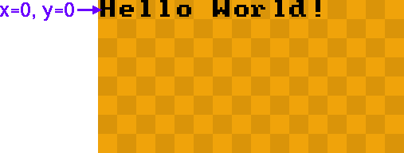
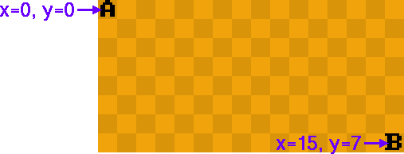
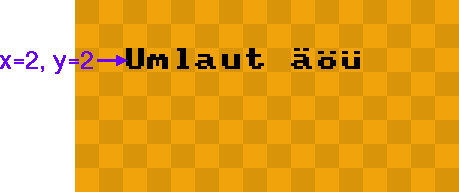
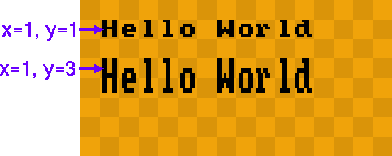
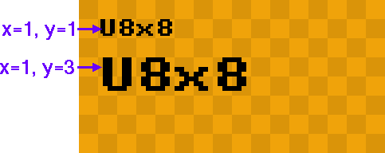
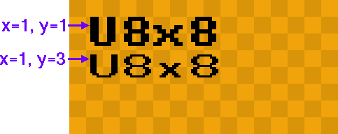
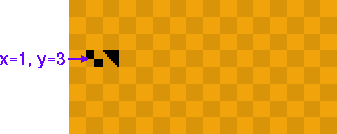
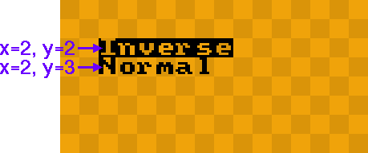

[tocstart]: # (toc start)

  * [C++ Example](#c-example)
  * [Reference](#reference)
    * [begin](#begin)
    * [clear](#clear)
    * [clearDisplay](#cleardisplay)
    * [clearLine](#clearline)
    * [drawGlyph](#drawglyph)
    * [drawString](#drawstring)
    * [drawTile](#drawtile)
    * [drawUTF8](#drawutf8)
    * [getCols](#getcols)
    * [getRows](#getrows)
    * [getU8x8](#getu8x8)
    * [home](#home)
    * [initDisplay](#initdisplay)
    * [print](#print)
    * [refreshDisplay](#refreshdisplay)
    * [setBusClock](#setbusclock)
    * [setContrast](#setcontrast)
    * [setCursor](#setcursor)
    * [setFlipMode](#setflipmode)
    * [setFont](#setfont)
    * [setI2CAddress](#seti2caddress)
    * [setInverseFont](#setinversefont)
    * [setPowerSave](#setpowersave)

[tocend]: # (toc end)

# C++ Example

```
#include <Arduino.h>
#include <SPI.h>
#include <U8x8lib.h>

U8X8_SSD1306_128X64_4W_SW_SPI u8x8(/* clock=*/ 13, /* data=*/ 11, /* cs=*/ 10, /* dc=*/ 9, /* reset=*/ 8);

void setup(void) {
  u8x8.begin();
}

void loop(void) {
  u8x8.setFont(u8x8_font_chroma48medium8_r);
  u8x8.drawString(0,0,"Hello World!");
  delay(1000);
}
```

All available constructors are listed in the [setup guide](u8x8setupcpp).

# Reference

Version 2.25.x will include a new U8x8 font format to support fonts with bigger glyphs. 
Each glyph still has to fit into the 8x8 pixel grid and must be monospaced (all glyphs of
the font will have the same width).

## begin
  * **C++ Prototype:**
```
bool U8X8::begin(void)    
bool U8X8::begin(uint8_t menu_select_pin, uint8_t menu_next_pin, uint8_t menu_prev_pin, uint8_t menu_up_pin = U8X8_PIN_NONE, uint8_t menu_down_pin = U8X8_PIN_NONE, uint8_t menu_home_pin = U8X8_PIN_NONE)
```
  * **Description:** Simplified setup procedure of the display for the Arduino enviornment.
See the [setup guide](u8x8setupcpp) for the selection of a suitable U8x8 constructor.
This function will reset, configure, clear and disable power save mode of
the display. `begin` will call  
1. [initDisplay](u8x8reference#initdisplay)
2. [clearDisplay](u8x8reference#cleardisplay)
3. [setPowerSave](u8x8reference#setpowersave)
  * **Arguments:** -
  * **Returns:** Always returns 1/true.
  * **See also:** [initDisplay](u8x8reference#initdisplay) [setPowerSave](u8x8reference#setpowersave) [clearDisplay](u8x8reference#cleardisplay) [U8G2::begin](u8g2reference#begin)
  * **Example:**
```
void setup(void) {
  u8x8.begin();
}

void loop(void) {
  u8x8.setFont(u8x8_font_amstrad_cpc_extended_r);
  u8x8.drawString(0,0,"Hello World!");
  delay(1000);
}
```


## clear
  * **C++ Prototype:**
```
void U8X8::clear(void)
```
  * **Description:** Clears all pixel on the screen and puts the cursor for the [print](u8x8reference#print) function into the upper left corner. 
`clear` will call  
1. [home](u8x8reference#home)
2. [clearDisplay](u8x8reference#cleardisplay)
  
  * **Arguments:**
  * **Returns:** -
  * **See also:** [print](u8x8reference#print) [home](u8x8reference#home) [clearDisplay](u8x8reference#cleardisplay)

## clearDisplay
  * **C++ Prototype:**
```
void U8X8::clearDisplay(void)    
```
  * **C Prototype:**
```
void u8x8_ClearDisplay(u8x8_t *u8x8);
```
  * **Description:** Clears all pixel on the screen. This procedure is
also called from [begin](u8x8reference#begin).
  * **Arguments:**
    * `u8x8`: A pointer to the u8x8 structure.
  * **Returns:** -
  * **See also:** [begin](u8x8reference#begin) [clear](u8x8reference#clear)

## clearLine
  * **C++ Prototype:**
```
void U8X8::clearLine(uint8_t row)
```
  * **C Prototype:**
```
void u8x8_ClearLine(u8x8_t *u8x8, uint8_t row);
```
  * **Description:** Clears all pixel in one row.
  * **Arguments:**
    * `u8x8`: A pointer to the u8x8 structure.
    * `row`: The row number which should be cleared.
  * **Returns:** -
  * **See also:** [clearDisplay](u8x8reference#cleardisplay)
  * **Note:** This function will be available with v2.14.

## drawGlyph
  * **C++ Prototype:**
```
void U8X8::drawGlyph(uint8_t x, uint8_t y, uint8_t encoding)
void U8X8::draw1x2Glyph(uint8_t x, uint8_t y, uint8_t encoding)
void U8X8::draw2x2Glyph(uint8_t x, uint8_t y, uint8_t encoding)
```
  * **C Prototype:**
```
void u8x8_DrawGlyph(u8x8_t *u8x8, uint8_t x, uint8_t y, uint8_t encoding);
void u8x8_Draw1x2Glyph(u8x8_t *u8x8, uint8_t x, uint8_t y, uint8_t encoding);
void u8x8_Draw2x2Glyph(u8x8_t *u8x8, uint8_t x, uint8_t y, uint8_t encoding);
```
  * **Description:** Draw a single character. 
The character is placed in column `x` and row `y`.
A graphics display with 128x64 pixel has 16 colums and 8 rows. For such a display suitable
values for `x` are 0 to 15. In u8x8 a font may contain up to
255 characters.
The `1x2` and `2x2` variants scale up glyphs in y and x/y directions.
  * **Arguments:**
    * `u8x8`: A pointer to the u8x8 structure.
    * `x`, `y`: Column/row position of the character on the display.
    * `s`:  Text.
  * **Returns:** -
  * **Note:** Version 2.25.x supports large fonts (larger than 8x8 pixel). The width and
height of each glyph is a multiple of 8. These large fonts include `?x?` in the 
font name (1x2, 2x3, etc). The actual pixel size will be 8 times the `?x?` values, e.g. 
the chars of a 2x3 font will have a size of 16x24 pixel.
  * **See also:** [setFont](u8x8reference#setfont)   
  * **Example:**
```
u8x8.setFont(u8x8_font_amstrad_cpc_extended_r);
u8x8.drawGlyph(0, 0, 'A');
u8x8.drawGlyph(u8x8.getCols()-1, u8x8.getRows()-1, 'B');
```



## drawString
  * **C++ Prototype:**
```
void U8X8::drawString(uint8_t x, uint8_t y, const char *s)    
void U8X8::draw1x2String(uint8_t x, uint8_t y, const char *s)    
void U8X8::draw2x2String(uint8_t x, uint8_t y, const char *s)    
```
  * **C Prototype:**
```
void u8x8_DrawString(u8x8_t *u8x8, uint8_t x, uint8_t y, const char *s);
void u8x8_Draw1x2String(u8x8_t *u8x8, uint8_t x, uint8_t y, const char *s);
void u8x8_Draw2x2String(u8x8_t *u8x8, uint8_t x, uint8_t y, const char *s);
```
  * **Description:** Draw a string. The first character is placed in column `x` and row `y`.
A graphics display with 128x64 pixel has 16 colums and 8 rows. For such a display suitable
values for `x` are 0 to 15. 
Use [setFont](u8x8reference#setFont) to assign a font before 
drawing a string on the display.
To draw a character with a code greater than 127, use the C/C++ escape sequence "\xab" (hex value ab) or
"\xyz" (octal value xyz). Another option to access glyphs with code values above 127, would be to use [drawUTF8](u8x8reference#drawutf8).
The `2x2` variant draws double sized glyphs.
  * **Arguments:**
    * `u8x8`: A pointer to the u8x8 structure.
    * `x`, `y`: Column/row position of the first character.
    * `s`:  Text.
  * **Returns:** -
  * **Note:** Version 2.25.x supports large fonts (larger than 8x8 pixel). The width and
height of each glyph is a multiple of 8. These large fonts include `?x?` in the 
font name (1x2, 2x3, etc). The actual pixel size will be 8 times the `?x?` values, e.g. 
the chars of a 2x3 font will have a size of 16x24 pixel.
  * **See also:** [setFont](u8x8reference#setfont) [drawUTF8](u8x8reference#drawutf8)
  * **Example:**
```
u8x8.setFont(u8x8_font_amstrad_cpc_extended_r);
u8x8.drawString(0, 0, "Hello World");  
```

```
u8x8.setFont(u8x8_font_amstrad_cpc_extended_f);
u8x8.drawString(2, 2, "Umlaut \xe4\xf6\xfc");  
```


This is the character map of the font. The hex code can be derived from this chart:


1x2 procedure:
```
u8x8.setFont(u8x8_font_amstrad_cpc_extended_r);
u8x8.drawString(1, 1, "Hello World");  
u8x8.draw1x2String(1, 3, "Hello World");  
```


2x2 procedure:
```
u8x8.setFont(u8x8_font_amstrad_cpc_extended_r);
u8x8.drawString(1, 1, "U8x8");  
u8x8.draw2x2String(1, 3, "U8x8");  
```



2x2 scale up vs. 2x2 font:
```
u8x8.setFont(u8x8_font_amstrad_cpc_extended_r);
u8x8.draw2x2String(1, 1, "U8x8");
u8x8.setFont(u8x8_font_px437wyse700b_2x2_r);  // Version 2.25.x
u8x8.drawString(1, 3, "U8x8");
```



## drawTile
  * **C++ Prototype:**
```
void U8X8::drawTile(uint8_t x, uint8_t y, uint8_t cnt, uint8_t *tile_ptr)
```
  * **C Prototype:**
```
void u8x8_DrawTile(u8x8_t *u8x8, uint8_t x, uint8_t y, uint8_t cnt, uint8_t *tile_ptr);
```
  * **Description:** Draw one or more tiles. A tile is a 8x8 pixel bitmap. A tile has 
exactly 8 bytes. The memory layout of the tile depends on the memory 
architecture of the target display.
The character is placed in column `x` and row `y`.

For most modern display controller (SSD13xx, UC1xxx, ST7565, SH1106, etc), the 
memory layout for one tile will look like this:

| Byte 0 | Byte 1 | Byte 2 | Byte 3 | Byte 4 | Byte 5 | Byte 6 | Byte 7 |
|-----|-----|-----|-----|-----|-----|-----|-----|
| Bit 0 | Bit 0 | Bit 0 | Bit 0 | Bit 0 | Bit 0 | Bit 0 | Bit 0 | 
| Bit 1 | Bit 1 | Bit 1 | Bit 1 | Bit 1 | Bit 1 | Bit 1 | Bit 1 | 
| Bit 2 | Bit 2 | Bit 2 | Bit 2 | Bit 2 | Bit 2 | Bit 2 | Bit 2 | 
| Bit 3 | Bit 3 | Bit 3 | Bit 3 | Bit 3 | Bit 3 | Bit 3 | Bit 3 | 
| Bit 4 | Bit 4 | Bit 4 | Bit 4 | Bit 4 | Bit 4 | Bit 4 | Bit 4 | 
| Bit 5 | Bit 5 | Bit 5 | Bit 5 | Bit 5 | Bit 5 | Bit 5 | Bit 5 | 
| Bit 6 | Bit 6 | Bit 6 | Bit 6 | Bit 6 | Bit 6 | Bit 6 | Bit 6 | 
| Bit 7 | Bit 7 | Bit 7 | Bit 7 | Bit 7 | Bit 7 | Bit 7 | Bit 7 | 

  * **Arguments:**
    * `u8x8`: A pointer to the u8x8 structure.
    * `x`, `y`: Column/row position of the character on the display.
    * `cnt`:  Number of tiles
    * `tile_ptr`:  A pointer to the first tile. Total memory area are cnt*8 bytes.
  * **Returns:** -
  * **See also:** [setFont](u8x8reference#setfont) 
  * **Example:**
```
uint8_t tiles[16] = { 0x0f,0x0f,0x0f,0x0f,0xf0,0xf0,0xf0,0xf0, 1, 3, 7, 15, 31, 63, 127, 255};
u8x8.drawTile(1, 3, 2, tiles);
```



## drawUTF8
  * **C++ Prototype:**
```
void U8X8::drawUTF8(uint8_t x, uint8_t y, const char *s)    
void U8X8::draw1x2UTF8(uint8_t x, uint8_t y, const char *s)    
void U8X8::draw2x2UTF8(uint8_t x, uint8_t y, const char *s)    
```
  * **C Prototype:**
```
void u8x8_DrawUTF8(u8x8_t *u8x8, uint8_t x, uint8_t y, const char *s);
void u8x8_Draw1x2UTF8(u8x8_t *u8x8, uint8_t x, uint8_t y, const char *s);
void u8x8_Draw2x2UTF8(u8x8_t *u8x8, uint8_t x, uint8_t y, const char *s);
```
  * **Description:** Draw a string which is encoded as UTF-8. There are two
preconditions for the use of this function: (A) the C/C++ compiler must support
UTF-8 encoding (this is default for the gnu compiler, which is also used for 
most Arduino boards) and (B) the code editor/IDE must support and store the
C/C++ code as UTF-8 (true for the Arduino IDE). If these conditions are met,
you can use the character with code value greater than 127 directly in the string (of course the character must
exist in the font file). As an advantage of drawUTF8 no escape codes are required
and the source code is more readable. Disadvantage is, that the code is less portable
and the `strlen` function will not return the number of visible characters. Use 
[getUTF8Len](u8x8reference#getutf8len) instead of `strlen`.
The first character is placed in column `x` and row `y`.
A graphics display with 128x64 pixel has 16 colums and 8 rows. For such a display suitable
values for `x` are 0 to 15. 
Use [setFont](u8x8reference#setFont) to assign a font before 
drawing a string on the display.
The `2x2` variant draws double sized glyphs.
  * **Arguments:**
    * `u8x8`: A pointer to the u8x8 structure.
    * `x`, `y`: Column/row position of the first character.
    * `s`:  UTF-8 encoded text.
  * **Returns:** -
  * **See also:** [setFont](u8x8reference#setfont) [drawString](u8x8reference#drawstring)
  * **Example:**
```
u8x8.setFont(u8x8_font_amstrad_cpc_extended_f);
u8x8.drawUTF8(2, 2, "Umlaut äöü");  
```


## getCols
  * **C++ Prototype:**
```
uint8_t U8X8::getCols(void)    
```
  * **C Prototype:**
```
uint8_t u8x8_GetCols(u8x8_t *u8x8);
```
  * **Description:** Return the number of columns for the display. Usually, this is the pixel width divided by 8.
  * **Arguments:**
    * `u8x8`: A pointer to the u8x8 structure.
  * **Returns:** -
  * **See also:** [drawString](u8x8reference#drawstring)
  * **Example:**

## getRows
  * **C++ Prototype:**
```
uint8_t U8X8::getRows(void)    
```
  * **C Prototype:**
```
uint8_t u8x8_GetRows(u8x8_t *u8x8);
```
  * **Description:** Return the number of rows for the display. Usually, this is the pixel height divided by 8.
  * **Arguments:**
    * `u8x8`: A pointer to the u8x8 structure.
  * **Returns:** -
  * **See also:** [drawString](u8x8reference#drawstring)
  * **Example:**

## getU8x8
  * **C++ Prototype:**
```
void U8X8::getU8x8(void)    
```
  * **Description:** Return a pointer to the u8x8 c structure. This pointer can be used as first argument for the C functions.
  * **Arguments:** -
  * **Returns:** A pointer to the internal u8x8 structure
  * **See also:** 
  * **Example:**

## home
  * **C++ Prototype:**
```
void U8X8::home(void)
```
  * **Description:** Puts the cursor for the [print](u8x8reference#print) function into the upper left corner. 
  * **Arguments:**
  * **Returns:** -
  * **See also:** [print](u8x8reference#print) [clear](u8x8reference#clear)

## initDisplay
  * **C++ Prototype:**
```
void U8X8::initDisplay(void)    
```
  * **C Prototype:**
```
void u8x8_InitDisplay(u8x8_t *u8x8);
```
  * **Description:** Reset and configure the display. This procedure must be called
before any other procedures draw something on the display. This procedure leaves 
the display in a power save mode. In order to see something on the screen, 
disable power save mode first ([setPowerSave](u8x8reference#setpowersave)).
This procedure is called by the [begin](u8x8reference#begin) procedure. Either
[begin](u8x8reference#begin) or `initDisplay` must be called initially.
  * **Arguments:**
    * `u8x8`: A pointer to the u8x8 structure.
  * **Returns:** -
  * **See also:** [setPowerSave](u8x8reference#setpowersave) [begin](u8x8reference#begin) 
  * **Example:**


## print
  * **C++ Prototype:**
```
void U8X8::print(...)
```
  * **Description:** This is the Arduino print() function. See the description on the Arduino Web Page [here](https://www.arduino.cc/en/Reference/LiquidCrystalPrint) and [here](https://www.arduino.cc/en/Serial/Print). 
This procedure will write the text to the current cursor position with the current font, set by [setFont](u8x8reference#setfont). The cursor position is set by [home](u8x8reference#home), [clear](u8x8reference#clear) and [setCursor](u8x8reference#setcursor).
Note: UTF-8 will not work with print(). This function can print variable values and supports the F() macro.
  * **Arguments:** See link.
  * **Returns:** -
  * **See also:** [print](u8x8reference#print) [home](u8x8reference#home) [clear](u8x8reference#clear) [setCursor](u8x8reference#setcursor) [setFont](u8x8reference#setfont)
  * **Example:**
```
u8x8.setFont(u8x8_font_amstrad_cpc_extended_r);
u8x8.setCursor(0, 0);
u8x8.print("Hello World");  
```


## refreshDisplay
  * **C++ Prototype:**
```
void U8X8::refreshDisplay(uint8_t value)
```
  * **C Prototype:**
```
void u8x8_RefreshDisplay(u8x8_t *u8x8);
```
  * **Description:** Transfer the content of the display RAM to the display itself.
This is only required for e-Paper/e-Ink devices.
  * **Arguments:**
    * `u8x8`: A pointer to the u8x8 structure.
  * **Returns:** -
  * **See also:** -

## setBusClock
  * **C++/Arduino Prototype:**
```
void U8X8::setBusClock(uint32_t clock_speed);
```
  * **Description:** Arduino environment only: Assign the bus clock speed (frequency)
for I2C and SPI. Default values will be used if this function is not called.
  * **Arguments:**
    * `clock_speed`: I2C or SPI bus clock frequency (in Hz)
  * **Returns:** -
  * **Note:** Default bus speed values allow reliable use of the most slowest displays.
On the other side a specific display may support higher bus clock speed. For example
the SSD1327 defaults to 100KHz for I2C, but seems to support 400KHz in many cases.
It is a good idea to test higher bus clock values in the current application. For I2C use 
"u8g2.setBusClock(200000);"  or "u8g2.setBusClock(400000);". For SPI try values
between "u8g2.setBusClock(1000000);" and "u8g2.setBusClock(8000000);".

## setContrast
  * **C++ Prototype:**
```
void U8X8::setContrast(uint8_t value)
```
  * **C Prototype:**
```
void u8x8_SetContrast(u8x8_t *u8x8, uint8_t value);
```
  * **Description:** Set the contrast or brightness for the display (if supported).
Range for 'value': 0 (no contrast) to 255 (maximum contrast or brightness).
  * **Arguments:**
    * `u8x8`: A pointer to the u8x8 structure.
    * `value`: Contrast or brightness from 0 to 255.
  * **Returns:** -
  * **See also:** -


## setCursor
  * **C++ Prototype:**
```
void U8X8::setCursor(uint8_t x, uint8_t y)
```
  * **Description:** Define the cursor for the [print](u8x8reference#print) function. Any output of the [print](u8x8reference#print) 
function will start at this position.
  * **Arguments:**
    * `x`, `y`: Column/row position for the cursor of the [print](u8x8reference#print) function.
  * **Returns:** -
  * **See also:** -
  * **See also:** [print](u8x8reference#print) [home](u8x8reference#home)
  * **Example:**
```
u8x8.setFont(u8x8_font_amstrad_cpc_extended_r);
u8x8.setCursor(0, 0);
u8x8.print("Hello World");  
```


## setFlipMode
  * **C++ Prototype:**
```
void U8X8::setFlipMode(uint8_t is_enable)
```
  * **C Prototype:**
```
void u8x8_SetFlipMode(u8x8_t *u8x8, uint8_t is_enable);
```
  * **Description:** Some displays support a 180 degree rotation of the internal frame buffer.
This hardware feature can be controlled with this procedure. 
Important: Redraw the complete display after changing the flip mode. 
Best is to clear the display first, then change the flip mode and finally redraw
the content. Results will be undefined for any existing content on the screen.
  * **Arguments:**
    * `u8x8`: A pointer to the u8x8 structure.
    * `is_enable`: Enable (1) or disable (0) 180 degree rotation of the display content
  * **Returns:** -
  * **See also:** -

## setFont
  * **C++ Prototype:**
```
void U8X8::setFont(const uint8_t *font_8x8)
```
  * **C Prototype:**
```
void u8x8_SetFont(u8x8_t *u8x8, const uint8_t *font_8x8);
```
  * **Description:** Define a u8x8 font for the glyph and string drawing functions.
Note: u8g2 font can NOT be used. Available fonts are listed here [here](fntlist8x8).
The last character of the font name denotes the character set in the font:

| Font Name  | Description |
|-------------|-----------|
| u8x8_xxx_f | All 256 glyphs are included in the font |
| u8x8_xxx_r | Characters from 0 to 127 are included (if available) |
| u8x8_xxx_u | Numbers and uppercase letters are included |
| u8x8_xxx_n | Numbers and some extra glyphs for date and time printing are included |
  * **Arguments:**
    * `u8x8`: A pointer to the u8x8 structure.
    * `font_8x8`: Point to a u8x8 font. A list of available fonts is [here](fntlist8x8).
  * **Returns:** -
  * **See also:** [drawUTF8](u8x8reference#drawutf8) [drawString](u8x8reference#drawstring) [drawGlyph](u8x8reference#drawglyph) [List of u8x8 fonts](fntlist8x8)

## setI2CAddress
  * **C++/Arduino Prototype:**
```
void U8X8::setI2CAddress(uint8_t adr)
```
  * **C Prototype:**
```
void u8x8_SetI2CAddress(u8x8_t *u8x8, uint8_t adr)
```
  * **Description:** By default, U8x8 assumes the lowest possible I2C address of 
the display. This procedure will assign the I2C address to u8x8, if the display is configured
to a different address. Call this procedure before [begin()](u8x8reference#begin).
  * **Arguments:**
    * `u8x8`: A pointer to the u8x8 structure.
    * `adr`: I2C address multiplied with 2 (the lowest bit must be zero)
  * **Returns:** -
  * **See also:** [begin](u8x8reference#begin) 
  * **Note:** This procedure is available with U8g2 v2.6.x

## setInverseFont
  * **C++ Prototype:**
```
void U8X8::setInverseFont(uint8_t is_enable)
```
  * **C Prototype:**
```
void u8x8_SetInverseFont(u8x8_t *u8x8, uint8_t is_enable);
```
  * **Description:** Activates (`is_enable = 1`) or disables (`is_enable = 0`) inverted glyph drawing.
This will affect the procedures [drawString](u8x8reference#drawsrting) [drawGlyph](u8x8reference#drawglyph)
and [drawUTF8](u8x8reference#drawUTF8).
  * **Arguments:**
    * `u8x8`: A pointer to the u8x8 structure.
    * `is_enable`: Enable (1) or disable (0) pixel inversion of the characters.
  * **Returns:** -
  * **See also:** [drawString](u8x8reference#drawstring) [drawGlyph](u8x8reference#drawglyph) [drawUTF8](u8x8reference#drawutf8) 
```
u8x8.setFont(u8x8_font_amstrad_cpc_extended_r);
u8x8.setInverseFont(1);
u8x8.drawString(2, 2, "Inverse");
u8x8.setInverseFont(0);
u8x8.drawString(2, 3, "Normal");
```



## setPowerSave
  * **C++ Prototype:**
```
void U8X8::setPowerSave(uint8_t is_enable)
```
  * **C Prototype:**
```
void u8x8_SetPowerSave(u8x8_t *u8x8, uint8_t is_enable);
```
  * **Description:** Activates (`is_enable = 1`) or disables (`is_enable = 0`) the power save mode
of the display. With activated power save mode, nothing will be visible on the display.
The content of the RAM of the display is not changed. 
This procedure is also called from [begin](u8x8reference#begin).
  * **Arguments:**
    * `u8x8`: A pointer to the u8x8 structure.
    * `is_enable`: Enable (1) or disable (0) power save mode for the display.
  * **Returns:** -
  * **See also:** [begin](u8x8reference#begin) 
